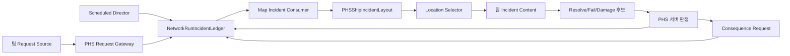

# LastJumpCrew 사건 장소·요청 트리거·콘텐츠 납품 명세 0719

- 작성일: `2026-07-19`
- 상태: `FOUNDATION_AUTHORED / RUNTIME_INTEGRATION_PENDING`
- 적용 범위: 함선 내부 사고, 외부 사건, 화재, 적 침투, 환경 사건
- 통합 담당: 박한솔
- Shop/Catalog/Display 담당: 박한솔
- 사건 콘텐츠 담당: 노석민
- 오브젝트 애니메이션 담당: 서보경
- 함선 Room/Device/Anchor 공간 Prefab·미니게임 담당: 탁현재
- 플레이어·도구·Damage/Repair 요청 계약 담당: 조한용

## 0. 목적과 우선순위

이 문서는 사건이 발생할 수 있는 장소를 박한솔 통합 계층에서 먼저 고도화하고, 팀원에게는 그 장소를 사용하는 요청 트리거와 사건 콘텐츠만 완성품으로 받기 위한 계약이다.

핵심 원칙:

1. 장소 ID, 장소 호환성, 점유, 재사용 대기시간, 선택 RNG는 박한솔이 소유한다.
2. 팀 트리거는 사건을 직접 생성하지 않고 `발생 후보 요청`만 보낸다.
3. 팀 사건 콘텐츠는 전달받은 장소에서 재생되고 결과 요청만 반환한다.
4. 사건 명령, 피해 확정, 후속 사고, 네트워크 Snapshot은 서버 통합 계층이 소유한다.
5. 최종 씬과 공용 프리팹은 박한솔만 수정한다.
6. 미니게임 접수 방식은 변경하지 않는다. 기존 `Cannon`, `PowerSync`, `WireFix` GameReady View 계약을 그대로 사용한다.

이 문서가 사건 장소·트리거·콘텐츠 접수에 관해서는 아래 0718 문서보다 우선한다.

- `Docs/LASTJUMPCREW_TEAM_PREFAB_INTAKE_SPEC_0718.md`
- `Docs/LASTJUMPCREW_TEAM_WORK_ALLOCATION_0718.md`
- `Docs/PHS_SHIP_INCIDENT_SYSTEM_DETAILED_SPEC_0718.md`

런타임 네트워크 권한은 아래 문서와 실제 `02` 구현을 우선한다.

- `Docs/LASTJUMPCREW_INTEGRATED_GAMEPLAY_NETWORK_SPEC_0718.md`
- `Assets/02. ParkHanSol_TeamLeader_Build & Multi/02. Script/Multiplayer/Incidents/`

### 0.1 0719 구현 상태

현재 코드·0715 Scene 밑작업:

- `PHSShipIncidentLayout` 기준 Zone `4`, Location `15` 배치.
- Fire Zone `4`, Fire Patch `22`와 인접 Link·Visual Socket 배치.
- Request Gateway Route `10`개 배치.
- Location 계약·Zone·Anchor·Layout 코드와 Request Source/Gateway/Inspector Adapter 추가.
- 기존 Consumer가 Command `TargetId`와 Layout 후보를 사용하도록 연결.
- `PHSNetworkShipAccidentCoordinator`에 내부 사고 Anchor `1~7` 전부 등록. 기존 누락된 Oxygen/Gravity Anchor 포함.
- 사고 타입마다 Anchor 후보를 추가할 수 있으며, 기존 `internal_*` ID는 보존하고 추가 후보는 AnchorId 기반 안정 ID로 등록한다.
- Fire Surface는 승인된 Fire Anchor가 여러 개면 Zone에 가장 가까운 Anchor를 Bridge로 선택한다.
- Legacy Location Fallback은 0715 통합 Scene에서 사용하지 않는다.

현재 수량 기준:

| 항목 | 현재 값 |
|---|---:|
| `PHSShipIncidentZone` | 4 |
| `PHSIncidentLocationAnchor` | 15 |
| `PHSFireZone` | 4 |
| `PHSFirePatch` | 22 |
| `PHSIncidentRequestRoute` | 10 |

아직 후속 구현·실행 증거가 필요한 것:

- 팀 Content Adapter와 실제 GameReady Prefab.
- Fire 점화·확산·피해 후보·소화·Cleanup 로컬 생명주기.
- Fire 후보를 검증·확정·복제하는 박한솔 Network Adapter.
- Host/Client/Late Join 실행 증거.

현재 Fire Patch 그래프는 위치·면적·인접 관계를 제공하는 데이터 밑작업이다. 그래프가 Scene에 존재한다는 사실을 실제 점화·확산·범위 피해 구현 완료로 읽으면 안 된다.

따라서 이 문서는 팀 제작 계약과 Location 접수 기준으로 사용할 수 있지만, 현재 상태를 사건 콘텐츠·Fire 런타임 완료 판정으로 읽으면 안 된다.

### 0.2 권위 ID 분류

권위 기준: [Unity ScriptableObject ID 규칙](https://app.notion.com/p/391b951310868071b661d252dd0bf43f)

ID는 다음 세 계층을 섞지 않는다.

| 계층 | 형식 | 현재 권위 범위 | 용도 |
|---|---|---|---|
| ScriptableObject 콘텐츠 ID | 4자리 숫자 | 내부 Legacy `7101~7106` | 기존 내부 Event SO 식별 |
| ScriptableObject 콘텐츠 ID | 4자리 숫자 | 외부 Scheduler `7201~7203` | 외부 사건 SO와 Scheduler 식별 |
| ScriptableObject 콘텐츠 ID | 4자리 숫자 | 환경 `7301~7304` | 환경/Zone 사건 SO 식별 |
| ScriptableObject 콘텐츠 ID | 4자리 숫자 | Map `8001~8004` | Map/Profile 식별 |
| 신규 ShipAccident 원장 `ContentId` | Wire 숫자 | `1~7` | 서버 원장 내부 사고 명령 |
| Scene/Runtime 안정 키 | `lower_snake_case` | Zone/Location/Source | Scene 참조, 요청 Route, Command Target |

내부 Legacy SO:

| SO ID | 사건 |
|---:|---|
| 7101 | Fire |
| 7102 | EnemySpawn |
| 7103 | PowerOff |
| 7104 | OxygenLeak |
| 7105 | EngineBreak |
| 7106 | MicDestroy |

외부 Scheduler:

| SO ID | 사건 |
|---:|---|
| 7201 | EnemyScout |
| 7202 | MeteorAttack |
| 7203 | EmpAttack |

환경 SO는 `7301~7304`, Map SO는 `8001~8004`만 현재 승인 범위다. 새 71xx/72xx/73xx/80xx 번호는 팀원이 임의 발급하지 않고 Manifest에 추가 요청으로 남긴다.

신규 내부 사고 원장 Wire `ContentId`는 이 문서 7장의 `1~7`이다. 예를 들어 Legacy Fire SO `7101`과 ShipAccident 원장 Fire `1`은 같은 숫자가 아니며, Adapter에서 명시적으로 매핑한다.

Zone/Location/Source ID는 숫자 SO ID를 복제하지 않는다. `room_a`, `internal_fire`, `meteor_hull_collision` 같은 안정 `lower_snake_case` 키를 사용한다.

---

## 1. 최종 구조



레이어별 책임:

| 레이어 | 소유자 | 책임 |
|---|---|---|
| Location Foundation | 박한솔 | Zone/Location 등록, ID, 호환성, 점유, Cooldown, 선택 |
| Request Gateway | 박한솔 | 요청 검증, 중복 방지, 원장 등록 |
| Incident Authority | 박한솔 | Schedule, Pressure, RNG, Command, Snapshot, 결과 확정 |
| Incident Content | 노석민 | 사건 규칙, 로컬 생명주기, VFX/Audio, 요청 출력 |
| Object Animation | 서보경 | Telegraph/Active/Resolve/Fail/Cleanup 상태 표현 |
| Player/Tool | 조한용 | 피해 대상·수리 도구의 로컬 입력과 피드백 |
| MiniGame View | 탁현재 | 기존 View/입력/Reset 납품 방식 유지 |

`Trigger` 용어는 이 문서에서 두 가지로 분리한다.

| 용어 | 의미 | 권한 |
|---|---|---|
| 물리 Trigger | `OnTriggerEnter`, 장치 고장, 충돌 등 감지 | 후보 신호만 |
| Incident Trigger | 실제 사건 생성 명령 | 박한솔 서버 계층만 |

팀원에게 받는 것은 첫 번째다. 두 번째는 받지 않는다.

---

## 2. 현재 구조에서 해결할 문제

현재 공용 Incident 원장은 `ContentId`, `Family`, `Channel`, `PressureCost`, `TargetId`를 기록할 수 있다. 그러나 기존 콘텐츠 계층은 다음 문제가 있다.

- Scheduled 사건은 `TargetId` 없이 생성되고 Scene Consumer가 나중에 장소를 고른다.
- 외부 사건은 호환성 없이 Room 배열에서 장소를 고른다.
- 내부 사고는 `PHSShipAccidentAnchor` 호환성만 확인한다.
- Fire는 면적이 아닌 다수의 점 SpawnPoint에 불을 추가한다.
- Oxygen/Enemy는 선택된 Room보다 전역 Spawn Setting에 의존한다.
- 외부 사건 Factory가 EventId별 코드 `switch`에 고정돼 있다.
- 일부 콘텐츠가 로컬에서 피해를 직접 적용한다.
- Legacy Scheduler와 신규 Director가 동시에 활성화될 위험이 있다.
- 사건별 GameReady Root, 장소 요구 조건, Reset 계약이 하나의 Registry로 묶여 있지 않다.

0719 밑작업의 목적은 콘텐츠를 더 추가하는 것이 아니다. 위 경계를 고정해 팀 콘텐츠를 교체 가능하게 만드는 것이다.

---

## 3. 박한솔 Location Foundation

### 3.1 최종 Hierarchy

최종 함선 Scene/Prefab에는 다음 구조를 사용한다.

```text
PHS_IncidentLocationRoot                     # PHSShipIncidentLayout
  Zone_CommandRoom                           # PHSShipIncidentZone
    Bounds
    Location_CommandConsole                  # PHSIncidentLocationAnchor
      InteractionSocket
      PresentationRoot
      HudMarkerSocket
    Location_CommandFireSurface_A            # PHSIncidentLocationAnchor
      HazardBounds
      PresentationRoot
        FlameSockets
        SmokeSockets
    Location_CommandEnemyIngress             # PHSIncidentLocationAnchor
      SpawnSockets
      PresentationRoot
    AlarmPresentationRoot
  Zone_Engine                                # PHSShipIncidentZone
  Zone_LifeSupport                           # PHSShipIncidentZone
  Zone_MainCorridor                          # PHSShipIncidentZone
  Zone_ExteriorHull                          # PHSShipIncidentZone
```

최종 Root와 Registry는 잠금 자산이다. 팀원은 복제하거나 자기 Prefab 안에 별도 Registry를 만들지 않는다.

0719 공용 타입:

- `PHSShipIncidentLayout`
- `PHSShipIncidentZone`
- `PHSIncidentLocationAnchor`
- `IIncidentLocation`
- `IncidentLocationQuery`
- `IncidentLocationKind`
- `IncidentLocationCapability`

### 3.2 Zone 계약

Zone은 Room보다 구체적인 사고 선택 단위다. 필수 값:

| 필드 | 규칙 |
|---|---|
| `zoneId` | 함선 안에서 유일한 정규화 ID |
| `displayName` | 비어 있으면 `zoneId` 표시 |
| `parentZone` | 선택적 상위 Zone. 순환 참조 금지 |
| `primaryModule` | 사고 피해를 받을 기본 `NetworkShipModuleId` |
| `zoneBounds` | 실제 영역을 나타내는 Trigger Collider |
| `adjacentZones` | 이동 가능한 인접 Zone만 등록 |
| `alarmPresentationRoot` | 선택적 Zone 경보 표현 Root |
| `baseRiskWeight` | 장소 선택 기본 가중치. 유한한 양수 |
| `maximumIndependentAccidents` | Zone 동시 독립 사고 한도 |
| `cooldownSeconds` | 같은 Zone 반복 방지 시간. 0 이상 |

Zone 검증:

- `zoneId` 중복 0.
- Bounds 없는 Zone 0.
- Bounds 밖 Location은 명시적 외부 위치만 허용.
- `adjacentZones` null/self/duplicate 0.
- `parentZone` 순환 참조 0.
- 같은 실제 공간을 여러 Zone Bounds가 과도하게 중첩하지 않음.
- Module과 실제 Geometry 연결이 Inspector에 보임.

### 3.3 Location 계약

Location은 실제 사건이 붙는 최소 단위다.

필수 값:

| 필드 | 규칙 |
|---|---|
| `locationId` | Registry 안에서 유일한 정규화 ID |
| `zone` | 소속 `PHSShipIncidentZone` 직접 참조 |
| `kind` | `IncidentLocationKind` |
| `capabilities` | `IncidentLocationCapability` 플래그 |
| `moduleOverride` | Zone Module 대신 사용할 선택적 Module ID |
| `allowOutsideZoneBounds` | 외부 Anchor만 명시적으로 사용 |
| `supportedChannels` | 지원 Incident Channel 목록. 비어 있으면 안 됨 |
| `supportedFamilies` | 지원 Incident Family 목록. 비어 있으면 안 됨 |
| `supportedContentIds` | 비어 있으면 Family 안의 모든 ID, 값이 있으면 명시 ID만 허용 |
| `selectionWeight` | 이 위치의 상대 선택 가중치. 유한한 양수 |
| `cooldownSeconds` | 같은 위치 반복 방지 시간. 0 이상 |
| `presentationRoot` | `Presentation` Capability가 있을 때 필수 |
| `hazardBounds` | `HazardArea` Capability가 있을 때 필수 |
| `runtimeTarget` | 기존 Device/Room/사고 Target과 연결할 선택적 `Component` Bridge |

`kind`와 `capabilities`는 역할을 분리한다.

| `IncidentLocationKind` | 용도 |
|---|---|
| `None` | 미설정. Validator 거절 |
| `Room` | 방 전체 영향 |
| `Device` | 발전기, 콘솔, 배터리, 엔진 |
| `Pipe` | 산소, 증기, 냉각 계통 |
| `HullSurface` | 운석, 선체 파손 |
| `FireSurface` | 면적 화재 |
| `EnemyIngress` | 적 침투·스폰 |
| `Terminal` | 미니게임 시작 Terminal |
| `GlobalShip` | 위치 없는 함선 전역 사건. 예외적으로만 사용 |

`GlobalShip`은 편의용 기본값이 아니다. 실제 위치를 특정할 수 없는 사건에만 사용한다.

| `IncidentLocationCapability` | 의미 |
|---|---|
| `None` | 기능 없음 |
| `Presentation` | `presentationRoot` 사용 |
| `Interaction` | 상호작용/수리 가능 |
| `HazardArea` | `hazardBounds` 사용 |
| `FirePropagation` | Fire Zone/Patch 그래프 연결 가능 |
| `EnemySpawn` | 적 Spawn Socket 제공 |
| `ExteriorImpact` | 외부 충돌 지점 |
| `RequestSource` | 요청 신호의 Target으로 사용 가능 |
| `Alarm` | Zone 경보 표현 사용 |
| `All` | 모든 플래그. 일반 Location에 사용 금지 |

검증:

- `locationId` 중복 0. `StringComparer.Ordinal` 기준.
- `zone` null 0.
- Channel/Family 값은 유효하고 중복 0.
- `supportedContentIds`는 양수이며 중복 0.
- `selectionWeight`는 유한한 양수.
- `cooldownSeconds`는 유한한 0 이상.
- 후보 반환 순서는 `locationId` Ordinal 정렬. RNG 입력 순서가 Peer마다 달라지지 않음.

### 3.4 필수 Socket

모든 Location:

- `PresentationRoot`
- `HudMarkerSocket` 또는 `notApplicable` 근거

종류별 추가 Socket:

| Location 종류 | 추가 필수 |
|---|---|
| Device | `InteractionSocket`, 실제 Device 참조 |
| Pipe | `LeakSocket`, `RepairSocket` |
| HullSurface | `ImpactSocket`, `RepairSocket`, `HazardBounds` |
| FireSurface | `HazardBounds`, `FlameSockets`, `SmokeSockets` |
| EnemyIngress | `SpawnSockets`, `EntryDirection` |
| Terminal | Terminal 참조, `InteractionSocket` |
| Room | Bounds |
| HullSurface + `ExteriorImpact` | `ImpactSocket`, 외부 법선 방향 |

빈 Transform을 임의 좌표에 두고 실제 설비 연결 없이 Anchor라고 부르면 반려한다.

### 3.5 Location 선택 규칙

먼저 부적합 위치를 제거한다.

1. 현재 Map/Stage 위치인가.
2. Channel, Family, ContentId가 호환되는가.
3. 필수 Location Kind와 Capability를 만족하는가.
4. Location과 Zone Capacity가 남아 있는가.
5. 같은 명령이나 Runtime이 이미 점유하지 않았는가.
6. 재사용 대기시간이 끝났는가.
7. 실제 Location과 필수 Socket이 활성인가.

후보 점수:

```text
baseSelectionWeight =
  zone.baseRiskWeight
  × anchor.selectionWeight
```

선택 규칙:

- 최종 선택은 서버 결정론 RNG만 사용.
- `IIncidentLocation.SelectionWeight`는 위 `baseSelectionWeight`를 반환한다.
- Module 손상, 최근 사용, Map Profile 보정은 중앙 Selector에서만 추가한다.
- 팀 콘텐츠와 클라이언트는 `UnityEngine.Random`으로 장소를 고르지 않는다.
- 명령에 유효한 `TargetId`가 있으면 그 위치를 먼저 검증한다.
- `TargetId`가 비어 있으면 Registry 후보에서 선택한다.
- 선택 결과 `locationId`를 Command Target으로 기록한다.
- 실행 종료·실패·취소 시 점유를 해제하고 Cooldown을 시작한다.
- 후속 사고는 가능한 경우 원인 사건의 Zone/Location을 상속한다.
- 상속 위치가 호환되지 않으면 같은 Zone → 인접 Zone → 전체 Registry 순서로 대체한다.

### 3.6 박한솔이 잠그는 자산

- 최종 `PHS_IncidentLocationRoot`
- Location/Zone 공용 Script
- Registry와 Validator
- 최종 Zone/Location ID
- 0715 통합 Scene 배치
- `PHS_ShipRuntime.prefab`
- `PHS_EventRuntimeSystem.prefab`
- Location 선택기와 서버 점유 상태

`PHSShipIncidentLayout` Inspector:

- `zones`
- `locations`
- `includeChildAuthoringFallback`

`includeChildAuthoringFallback`은 마이그레이션 전용이며 기본 `false`다. 최종 Prefab은 `zones`와 `locations`를 명시적으로 연결한다.

팀원이 새 장소가 필요하면 최종 씬을 직접 수정하지 않는다. 아래 요청표를 전달한다.

```text
요청 ContentId:
필요 LocationKind:
필요 Capabilities:
필요 Socket:
허용 Module/Zone:
금지 Zone:
필요 이유:
참고 이미지:
```

---

## 4. 팀 Request Source 계약

### 4.1 정의

`Request Source`는 물리 접촉이나 장치 상태를 사건 후보 신호로 변환하는 로컬 어댑터다.

예:

- 운석 Collider가 외부 Hull Sensor와 충돌.
- 발전기 내구도가 임계값 아래로 내려감.
- 특정 Device 상호작용 실패.
- Enemy Scout가 Ingress에 도달.
- 검증용 버튼으로 사건 후보를 수동 제출.

Scheduled 사건은 Request Source가 필요 없다. `PHSNetworkIncidentDirector`가 원장 요청을 만든다.

### 4.2 실제 0719 요청 계약

공용 인터페이스:

```csharp
public interface IIncidentRequestSource
{
    string IncidentSourceId { get; }
    string IncidentTargetId { get; }
}
```

팀 Trigger가 출력하는 값은 두 개뿐이다.

| 값 | 설명 |
|---|---|
| `IncidentSourceId` | 박한솔 Route와 연결할 안정 ID |
| `IncidentTargetId` | Registry의 실제 `locationId`. Route가 Target 선택을 허용하면 빈 값 가능 |

공용 Gateway:

```csharp
bool TrySubmitServer(
    IIncidentRequestSource source,
    ulong parentCommandId,
    out NetworkRunIncidentCommand command,
    out string reason);
```

`PHSIncidentRequestGateway`의 `PHSIncidentRequestRoute`가 Inspector에서 다음 최종값을 소유한다.

| Route 필드 | 소유 |
|---|---|
| `sourceId` | 박한솔 |
| `channel` | 박한솔 |
| `payloadKind` | 박한솔 |
| `incidentFamily` | 박한솔 |
| `contentId` | 박한솔 |
| `sourceKind` | 박한솔. Trigger Route는 `Device`, `Terminal`, `Consequence`만 |
| `pressureCost` | 박한솔/사용자 승인값 |
| `warpChargeMultiplier` | 박한솔/사용자 승인값 |
| `requiresTarget` | 박한솔 |
| `cooldownSeconds` | 박한솔 |

`Scheduled`는 Director 전용이다. `Validation`은 Trigger Route에 사용하지 않는다.

팀 Source가 만들지 않는 값:

- Channel/PayloadKind/Family/ContentId 최종값
- `RequestId`
- `CommandId`
- `RuntimeInstanceId`
- `parentCommandId`
- 서버 시간
- 최종 Pressure
- 최종 TargetId 보정값
- 최종 RNG Seed

`parentCommandId`는 Consequence 연결 시 박한솔 계층만 설정한다.

### 4.3 권장 Prefab Hierarchy

```text
NSM_RequestSource_<SourceName>
  TeamTrigger
  Detection
    TriggerCollider
  Presentation
    TelegraphRoot
    VfxRoot
    AudioRoot
  Debug
    LocalTestDriver

PHS_FinalIntegration
  PHSIncidentRequestSourceAdapter
  PHSIncidentRequestGateway
```

팀 Trigger 필수 Inspector/출력:

- `IncidentSourceId` 제안
- `IncidentTargetId` 또는 Target 선택을 박한솔에게 맡긴다는 선언
- Detection Collider
- UnityEvent 또는 명시적 출력 포트
- Local Test Driver 참조

박한솔 최종 연결:

- 팀 Trigger UnityEvent → `PHSIncidentRequestSourceAdapter.RequestIncident()`
- Adapter `gateway`
- Adapter `incidentSourceId`
- Adapter `incidentTargetId`
- Gateway `routes`
- `parentCommandId`는 PHS Wiring Only

팀원이 `PHSIncidentRequestGateway` Route를 직접 추가하거나 `parentCommandId`를 입력하지 않는다.

`TriggerCollider`:

- 감지만 수행.
- 피해, 사고 생성, 원장 상태 변경을 하지 않음.
- Layer와 LayerMask를 Manifest에 기록.
- 같은 접촉이 여러 Physics Callback을 내도 한 논리 요청으로 축약 가능해야 함.

### 4.4 허용

- `OnTriggerEnter/Exit`, Collision, Device 상태 감지
- 로컬 Telegraph/VFX/Audio
- 후보 요청 생성
- Local Test Driver
- 중복 신호 억제를 위한 로컬 Debounce
- Inspector에 보이는 외부 Request 포트
- 서버에서 발생하거나 서버가 검증한 신호

### 4.5 금지

- `EventManager.SpawnEvent`
- `NetworkEventCoordinator.TrySpawnEventServer`
- `PHSNetworkShipAccidentCoordinator.TrySpawnAccidentServer`
- `NetworkRunIncidentLedger.TryReserveCommandServer`
- 독립 Scheduler와 반복 Spawn Coroutine
- `NetworkObject`, `NetworkBehaviour`, RPC, `NetworkVariable`
- Request Source의 직접 Ship/Player Damage
- Request Source의 Consequence Spawn
- 클라이언트가 ContentId, TargetId, Pressure를 최종 확정
- `FindObjectOfType`, Singleton 검색으로 공용 Manager 연결

팀 Source는 요청이 거절돼도 오류 상태가 남지 않아야 한다. 다음 요청을 받을 수 있게 Reset한다.

현재 `PHSIncidentRequestSourceAdapter`는 RPC를 만들지 않는 서버 전용 Scene Bridge다. 클라이언트 입력으로 시작되는 사건은 팀 Trigger가 Adapter를 직접 호출하지 않고, 기존 박한솔 서버 요청 경로에서 검증된 뒤 Gateway로 전달한다.

---

## 5. 콘텐츠 공통 실행 계약

### 5.1 입력

통합 Adapter가 팀 콘텐츠에 전달할 논리 입력:

| 입력 | 용도 |
|---|---|
| `commandId` | 원장 명령 추적 |
| `runtimeInstanceId` | 실행 인스턴스 추적 |
| `contentId` | 사건 종류 |
| `incidentFamily` | 공통 표현·Location 호환 |
| `locationId` | 실제 발생 위치 |
| `zoneId` | HUD·후속 사고·경보 |
| `targetModule` | 함선 영향 대상 |
| `deterministicSeed` | 로컬 Variant 재현 |
| `serverStartTime` | 진행 시간 보정 |
| `state` | Telegraph/Active/Resolve/Fail/Cancel |
| `progressOrIntensity` | 수리 진행도·화재 강도 |

팀 콘텐츠는 `commandId`나 `runtimeInstanceId`를 새로 만들지 않는다.

### 5.2 출력

팀 콘텐츠가 출력할 수 있는 요청:

| 출력 | 의미 |
|---|---|
| `Started` | 로컬 실행 준비 완료 |
| `ResolveRequested` | 성공 조건 후보 |
| `FailRequested` | 실패 조건 후보 |
| `DamageCandidate` | 서버가 검증할 대상·원인·양 후보 |
| `RepairCandidate` | 서버가 검증할 도구·대상·진행 후보 |
| `ConsequenceRequested` | Definition에 선언된 후속 사고 후보 |
| `CleanupCompleted` | 로컬 정리 완료 |

출력은 결과 확정이 아니다. 박한솔 서버 Adapter가 현재 명령, 위치, 거리, 도구, 중복, Revision을 확인한 뒤 원장을 갱신한다.

### 5.3 공통 상태

```text
Dormant
  -> Telegraph
  -> Active
  -> Resolve | Fail | Cancel
  -> Cleanup
  -> Dormant
```

필수:

- 모든 상태가 화면에서 구분됨.
- Cancel은 성공/실패와 별개로 즉시 정리 가능.
- 같은 Prefab을 반복 실행해도 Transform, Material, Particle, Audio, Collider 상태가 누적되지 않음.
- 중간 Snapshot부터 시작해도 현재 상태를 표현 가능.
- Cleanup 완료 전 다음 실행을 받지 않음.

---

## 6. 외부 사건 납품 번들

### 6.1 대상

- `7201 EnemyScout`
- `7202 MeteorAttack`
- `7203 EmpAttack`
- 추후 승인된 720x

### 6.2 Bundle 구성

```text
NSM_EXTERNAL_<ContentId>_<Name>/
  Prefabs/
    NSM_ExternalEvent_<ContentId>_<Name>.prefab
    NSM_RequestSource_<Name>.prefab        # 실제 충돌형 사건만
  Data/
    NSM_ExternalEvent_<ContentId>_<Name>.asset
  Scripts/
    I...                                   # 공용 계약이 필요할 때만
    ...ContentView.cs
    ...LocalTestDriver.cs
  Audio/
  VFX/
  README.md
```

대표 Prefab:

```text
NSM_ExternalEvent_<ContentId>_<Name>
  ContentView
  TelegraphRoot
  ActiveRoot
  ResolveRoot
  FailRoot
  CleanupRoot
  PresentationRoot
    VfxRoot
    AudioRoot
    LightRoot
  HudMarkerSocket
```

### 6.3 Definition 필수 값

- ContentId와 표시 이름
- Incident Family
- 허용 `locationKind`
- 요구 `IncidentLocationCapability`
- 허용/금지 Zone 또는 Module
- Telegraph 시간
- Active 제한 시간
- 성공·실패·Expire 조건
- 피해 후보의 최대 횟수
- 후속 사고 후보와 발생 시점
- 필요한 Minigame Type
- Pressure/가중치/피해량 제안과 근거

미니게임 연결은 기존 계약 유지:

| 외부 사건 | 기존 Minigame View |
|---|---|
| EnemyScout | `PowerSync` |
| MeteorAttack | `Cannon` |
| EmpAttack | `WireFix` |

노석민은 미니게임 View를 복제하거나 새 Session 권한을 만들지 않는다. 사건 Definition에는 필요한 타입만 선언한다.

### 6.4 Location 예

| 사건 | 최초 Location | 실패 후 후보 |
|---|---|---|
| EnemyScout | `EnemyIngress`, `HullSurface + ExteriorImpact` | 같은 Zone의 EnemySpawn |
| MeteorAttack | `HullSurface + ExteriorImpact` | 같은 위치/Zone의 HullBreach |
| EmpAttack | `Device`, `Room` | 같은 Zone의 PowerFailure |

후속 사고를 직접 생성하지 않는다. `ConsequenceRequested`를 한 번 출력한다.

---

## 7. 내부 사고 납품 번들

### 7.1 대상

| Wire ID | 사고 |
|---:|---|
| 1 | Fire |
| 2 | PowerFailure |
| 3 | DeviceFailure |
| 4 | HullBreach |
| 5 | SteamLeak |
| 6 | OxygenFailure |
| 7 | GravityGeneratorFailure |

### 7.2 소유 경계

박한솔:

- canonical `PHSShipAccidentDefinitionSO`
- Wire ID
- 서버 Damage/Repair
- Catalog
- Anchor/Location 선택
- Snapshot

노석민:

- 사고 규칙 제안
- 완성된 Presentation Prefab
- VFX/Audio
- 로컬 상태와 Reset
- 필요한 Damage/Repair 후보 출력

서보경:

- 실제 Device의 상태 애니메이션

팀원이 `Assets/02.../04.Data/ShipAccidents/`의 canonical Definition을 직접 수정하지 않는다. 변경 제안은 Manifest에 기록한다.

### 7.3 대표 Prefab

```text
NSM_InternalAccident_<WireId>_<Name>
  AccidentContentView
  TelegraphRoot
  ActiveRoot
  ProgressRoot
  ResolveRoot
  FailRoot
  CleanupRoot
  PresentationRoot
    VfxRoot
    AudioRoot
    LightRoot
  RepairSocket
  HudMarkerSocket
```

필수 Manifest:

- 지원 Wire ID
- 지원 Location Kind/Capability
- 지원 Ship Module
- 필요한 도구 ItemId
- 수리 거리·진행량 제안
- 초기/주기 피해 제안
- 피해 주기 제안
- Presentation Prefab GUID
- 상태별 활성 자식
- Cleanup/Reset 방식

---

## 8. Fire 납품 번들

### 8.1 역할 분리

현재 박한솔 Location Foundation 밑작업:

- FireSurface Location
- Zone/Location ID
- Hazard Bounds
- Surface 인접 그래프 데이터
- 4개 Fire Zone, 22개 Patch와 Patch별 Visual Socket

위 항목은 점화·확산·피해 런타임이 아니다. 현재 `PHSFireZone/PHSFirePatch/Link`는 팀 Fire 콘텐츠가 사용할 면적과 인접 관계를 제공한다.

노석민 Fire Content:

- 전달받은 Fire Zone/Patch 그래프를 사용하는 GameReady 로컬 생명주기
- 점화 예고와 활성 표현
- 강도별 Flame/Smoke/Light/Audio 표현
- Telegraph/Active/Extinguish/Cleanup
- 인접 Patch 확산 후보와 범위 피해 후보 산출
- 확산·피해·소화 수치 제안과 Local Test Driver
- `DamageCandidate`, `RepairCandidate` 출력
- Pool/Reset

박한솔 후속 Network Adapter:

- 서버 점화 대상과 확산 후보 검증·확정
- Patch 점유, Tick, 중복 대상, 피해량과 소화 결과 확정
- Command/Snapshot 복제와 Late Join 복구
- 노석민 출력과 ShipAccident 원장 Wire `ContentId=1` 연결

탁현재:

- 미니게임 작업은 기존 방식 유지
- 최종 함선 Room/Device/Anchor 공간 Prefab에 Fire Surface 후보와 실제 Mesh·동선 근거 제공
- `PHSShipIncidentLayout`, 확산 권한, 피해 권한은 만들지 않음

### 8.2 Fire Content Hierarchy

```text
NSM_FireContent
  FireContentView
  TelegraphRoot
  IntensityRoots
    Intensity_1
    Intensity_2
    Intensity_3
  ExtinguishRoot
  CleanupRoot
  VfxRoot
    FlameVariants
    SmokeVariants
  AudioRoot
  LightRoot
```

FireSurface는 한 점 Transform이 아니다.

```text
Location_<FireSurfaceId>
  HazardBounds
  PresentationRoot
    FlameSockets
      FlameSocket_00
      FlameSocket_01
      FlameSocket_02
    SmokeSockets
      SmokeSocket_00
      SmokeSocket_01
```

규칙:

- 실제 면적 Trigger 사용.
- 강도에 따라 여러 Socket 조합 사용.
- 인접 Surface Link로만 확산.
- 같은 Tick에서 같은 피해 대상 한 번만 후보 제출.
- 불꽃 Particle Collider로 피해를 확정하지 않음.
- 각 Patch/불꽃에 NetworkObject를 붙이지 않음.
- 소화 후 Particle, Light, Loop Audio, Collider 상태 모두 정리.

### 8.3 Fire 증거

노석민 Sandbox 증거:

- Bounds와 실제 표면 일치 Gizmo.
- 최소 3개 Visual Socket 사용.
- 점화 → 강도 증가 → 인접 확산 → 진압 → Cleanup.
- 비인접 Surface로 확산하지 않음.
- Bounds 밖 대상 DamageCandidate 0.
- Collider가 여러 개인 같은 대상은 Tick당 후보 1회.
- 8개 활성 Surface 조건의 프레임·메모리 기록.

박한솔 통합 후 Network 증거:

- 같은 Seed 재실행 시 같은 서버 선택, 다른 Seed에서 Variant 변화.
- Host/Client Patch·강도·피해 결과 일치.
- Late Join이 현재 강도와 활성 Patch부터 복구.
- Patch별 `NetworkObject` 0.

---

## 9. Enemy 납품 번들

### 9.1 역할 분리

노석민:

- 적 콘텐츠와 상태 규칙
- Enemy Presentation
- Target 우선순위 제안
- 공격·피격·사망 로컬 표현
- Spawn Set와 Pool Reset

박한솔:

- EnemyIngress Location 선택
- 실제 Network Spawn/Despawn
- 서버 AI 권한
- 피해·사망 확정
- Snapshot과 Late Join

### 9.2 Bundle Hierarchy

```text
NSM_EnemyIncident_<ContentId>
  EnemyIncidentContent
  TelegraphRoot
  IngressPresentationRoot
  SpawnSet
    EnemyVariant_A
    EnemyVariant_B
  VfxRoot
  AudioRoot
  HudMarkerSocket
  LocalTestDriver
```

Location:

```text
Location_<EnemyIngressId>
  SpawnSockets
    Spawn_00
    Spawn_01
  EntryDirection
  PresentationRoot
  AlarmSocket
```

필수:

- 전달받은 `EnemyIngress` Spawn Socket만 사용.
- 전역 Singleton Spawn Setting 사용 금지.
- ContentId별 최대 개체 수 제안.
- Player/Device Target 우선순위와 전환 조건 기록.
- 공격 결과는 DamageCandidate.
- 사망·탈출은 Resolve/Fail 후보.
- 반복 실행 시 Pool/Animator/Target 참조 Reset.

---

## 10. Environment 사건

730x 사건도 같은 `PHSShipIncidentLayout`을 사용한다.

- Map Profile은 가중치만 제공.
- 콘텐츠는 요구 Location Kind/Capability를 선언.
- Environment Volume이 감지하더라도 Request Source 규칙을 따른다.
- Scene Load, Run Phase, Reward를 직접 변경하지 않는다.
- 함선 사고로 이어질 때 `ConsequenceRequested`만 출력한다.

P0 완료 전에는 720x/내부 1–7/Fire/Enemy를 우선한다.

---

## 11. 팀별 실제 납품 지시

### 11.1 노석민

제출:

1. 외부 사건별 `External Event Bundle`.
2. 내부 사고별 `Internal Accident Presentation Bundle`.
3. Fire Content Bundle.
4. Enemy Content Bundle.
5. 물리·장치 원인이 필요한 사건의 Request Source Bundle.
6. Definition 제안표와 Location Compatibility 표.

하지 않는 것:

- 장소 Registry와 최종 Location ID 제작
- Scheduled 사건 Trigger 제작
- NetworkObject/RPC/Scheduler
- 직접 Ship/Player Damage
- 후속 사고 직접 Spawn
- 기존 EventManager/Factory를 새 최종 권한으로 확장

### 11.2 탁현재

미니게임:

- 기존 접수 방식 유지.
- `Cannon`, `PowerSync`, `WireFix` View와 Local Test Driver 납품.
- 이 문서 때문에 미니게임 Prefab 구조를 변경하지 않음.

장소 협조:

- Room/Device/Anchor가 실제 Mesh와 결합된 최종 함선 공간 Prefab 제공.
- Device/Surface/Ingress 후보 위치, 이동 동선, 수리 접근성 근거 제공.
- 내부 공간 Prefab의 Mesh/Collider/Device/Anchor Transform과 참조는 탁현재가 완성.
- 최종 `PHSShipIncidentZone`, `PHSIncidentLocationAnchor`, ID, Layout 등록과 선택 규칙은 박한솔이 배치·확정.

### 11.3 서보경

- Location의 실제 Device 아래에 붙일 애니메이션 자식 납품.
- `Dormant/Telegraph/Active/Recover/Disabled` 상태 제공.
- Animation Event에서 피해, 사건 생성, 원장 변경 금지.
- 사건 Content와 합성할 Socket/Parameter 표 제출.

### 11.4 조한용

- 플레이어와 도구가 `DamageCandidate`/`RepairCandidate`를 만들 때 필요한 요청 계약, 로컬 입력·피드백 제공.
- Extinguisher, Wrench, Battery 등 ItemId 계약 유지.
- 도구가 사고 상태를 직접 변경하지 않음.
- 서버 Adapter가 거리, 아이템, Revision을 검증할 수 있는 대상 참조 제공.

### 11.5 박한솔

- Location/Zone 공용 타입과 Validator.
- 최종 함선 Location 배치.
- Request Gateway.
- Location Selector와 점유/Cooldown.
- Incident 원장/Director/Consumer 연결.
- Event/Accident Content Adapter와 Registry.
- 서버 피해·수리·Consequence.
- Host/Client/Late Join 검증.
- Shop/Catalog/Display 제작·통합과 최종 수치 승인.

---

## 12. Manifest 필수 스키마

사건 Bundle은 공통 Manifest에 다음 `incidentContract`를 추가한다.

```json
{
  "incidentContract": {
    "bundleType": "ExternalEvent|InternalAccident|FireContent|EnemyContent|RequestSource",
    "contentId": 7202,
    "incidentFamily": "Meteor",
    "channel": "External",
    "requiredLocationKinds": [
      "HullSurface"
    ],
    "requiredCapabilities": [
      "Presentation",
      "ExteriorImpact"
    ],
    "allowedZoneIds": [],
    "blockedZoneIds": [],
    "targetModuleProposal": "Hull",
    "requestSourceIds": [],
    "stateRoots": {
      "telegraph": "TelegraphRoot",
      "active": "ActiveRoot",
      "resolve": "ResolveRoot",
      "fail": "FailRoot",
      "cleanup": "CleanupRoot"
    },
    "outputs": [
      "ResolveRequested",
      "FailRequested",
      "DamageCandidate",
      "ConsequenceRequested",
      "CleanupCompleted"
    ],
    "consequenceProposal": {
      "contentId": 0,
      "shipAccidentWireId": 4,
      "inheritSourceLocation": true,
      "maxRequestsPerInstance": 1
    },
    "networkContract": {
      "containsNetworkObject": false,
      "containsRpc": false,
      "containsNetworkVariable": false,
      "directlyAppliesDamage": false,
      "directlySpawnsIncident": false
    }
  }
}
```

Request Source 추가 필드:

```json
{
  "requestSourceContract": {
    "incidentSourceId": "meteor_hull_collision",
    "incidentTargetId": "",
    "requiresTargetProposal": false,
    "debounceSeconds": 0.25,
    "teamOutputEvent": "OnIncidentSignal",
    "phsAdapterMethod": "PHSIncidentRequestSourceAdapter.RequestIncident"
  },
  "routeProposal": {
    "channel": "External",
    "payloadKind": "EventManagerEvent",
    "incidentFamily": "Meteor",
    "contentId": 7202,
    "sourceKind": "Device",
    "pressureCost": 1,
    "warpChargeMultiplier": 1.0,
    "cooldownSeconds": 0.25
  }
}
```

수치값은 `proposal`이다. 박한솔/사용자 승인 전 canonical 값이 아니다.

---

## 13. 필수 Inspector·정적 증거

각 Bundle의 `Evidence/Static/`:

- Root Prefab 전체 Inspector.
- 전체 Hierarchy.
- 모든 외부 포트.
- 상태 Root 연결.
- Collider/Layer/LayerMask.
- ContentId, Family, Channel.
- 지원 Location Kind/Capability.
- Location Compatibility 표.
- 모든 자산 `.meta`와 GUID.
- Missing Script 0.
- 내부 Inspector null 0.
- NetworkObject/RPC/NetworkVariable 검색 0.
- Scheduler/직접 Spawn/직접 Damage 검색 0.

각 Request Source:

- Detection Collider 위치.
- IncidentSourceId/IncidentTargetId와 Route 제안.
- 한 물리 접촉에서 요청 후보 한 번.
- 거절 뒤 Reset.

---

## 14. Sandbox 증거

각 Bundle의 `Evidence/Sandbox/`:

1. 허용 Location에서 시작 성공.
2. 금지 Location에서 시작 거절.
3. Telegraph → Active.
4. Resolve → Cleanup → Dormant.
5. Fail → Cleanup → Dormant.
6. Cancel → Cleanup → Dormant.
7. 실행 중간 Snapshot 적용.
8. 같은 Prefab 3회 반복.
9. Audio/Particle/Light/Collider 잔류 0.
10. 외부 Manager 자동 검색 없이 Inspector 포트로 실행.

Request Source:

- 정상 신호 1회 → 후보 요청 1회.
- 연속 Callback → 후보 요청 중복 억제.
- Gateway 거절 → 로컬 오류 잔류 0.
- 직접 사건 Prefab Spawn 0.

---

## 15. 통합·네트워크 수락 기준

박한솔이 수행한다.

### 15.1 단일 명령 추적

```text
Request 1
  -> Ledger Command 1
  -> Location Target 1
  -> Runtime Instance 1
  -> Terminal Outcome 1
```

검증:

- 동일 Source 신호 중복 Command 0.
- 동일 Command의 Runtime 중복 0.
- Resolve/Fail/Cancel 중 Terminal 상태 하나만.
- Consequence 최대 선언 횟수 준수.
- 종료 뒤 Location 점유 해제.

### 15.2 위치

- Host/Client의 Command TargetId 일치.
- HUD Marker가 같은 Location 표시.
- 지원하지 않는 Location 선택 0.
- 같은 Zone/Location Capacity 초과 0.
- Cooldown 중 반복 선택 0.
- 후속 사고가 원인 Zone을 유지하거나 기록된 대체 규칙 사용.

### 15.3 네트워크

- Host + Client 1.
- Late Join 1.
- 최대 인원 검증은 공용 4/8인 계획에 포함.
- 서버에서만 Damage/Repair/Consequence 확정.
- Late Join은 현재 Snapshot 상태부터 재생.
- 클라이언트가 Telegraph를 처음부터 중복 재생하지 않음.
- Scene 전환 시 Active Command가 규칙대로 유지 또는 Cancel.

### 15.4 Fire

- 활성 Surface와 강도 Snapshot 일치.
- 같은 대상 Tick 중복 피해 0.
- 비인접 Surface 확산 0.
- Patch별 NetworkObject 0.
- 진압 후 모든 Peer에서 표현 정리.

### 15.5 Enemy

- 같은 EnemyIngress와 Spawn Socket 사용.
- Server Spawn 수와 Client 표시 수 일치.
- 전역 Spawn Setting 의존 0.
- Death/Despawn 중복 0.

---

## 16. 반려 코드

| 코드 | 사유 |
|---|---|
| `E01_DIRECT_SPAWN` | 팀 Trigger/Content가 사건을 직접 생성 |
| `E02_DIRECT_DAMAGE` | 팀 Content가 서버 검증 없이 피해 적용 |
| `E03_NETWORK_AUTHORITY` | NetworkObject/RPC/NetworkVariable 포함 |
| `E04_LOCATION_BYPASS` | Registry 없이 전역/무작위 위치 선택 |
| `E05_UNDECLARED_LOCATION` | Location Kind/Capability/Socket 계약 누락 |
| `E06_DUPLICATE_REQUEST` | 한 논리 신호가 여러 요청을 출력 |
| `E07_LIFECYCLE_RESET` | Cancel/Cleanup/재사용 실패 |
| `E08_LEGACY_SCHEDULER` | Legacy Scheduler가 최종 Prefab에서 활성 |
| `E09_GLOBAL_SPAWN_SETTING` | Room/Location 대신 전역 SpawnPoint 사용 |
| `E10_POINT_FIRE` | 면적 Bounds 없이 점 Transform만 사용 |
| `E11_DIRECT_CONSEQUENCE` | 후속 사고를 직접 Spawn |
| `E12_FACTORY_EDIT_REQUIRED` | 통합자가 EventFactory switch를 직접 고쳐야만 실행 |
| `E13_MINIGAME_DUPLICATE` | 기존 미니게임 View/Session을 사건 Bundle에 복제 |
| `E14_LOCKED_ASSET_EDIT` | 최종 Scene/Prefab/Registry 직접 수정 |
| `E15_EVIDENCE_MISSING` | Static/Sandbox/Manifest 증거 누락 |

---

## 17. Legacy 마이그레이션

Legacy 자산은 즉시 삭제하지 않는다. 최종 권한에서 분리하고 Adapter 뒤에 둔다.

| Legacy | 처리 |
|---|---|
| `EventScheduler`, `ZoneEventScheduler` | 최종 Prefab에서 비활성. Director만 Scheduled 권한 |
| `EventManager`, `EventFactory` | 기존 720x 콘텐츠 Adapter로만 사용. 신규 콘텐츠 접수 경계로 사용하지 않음 |
| Legacy 7101 Fire | 내부 Accident Wire ID 1로 라우팅. 별도 권한 실행 금지 |
| Fire SpawnPoint | Visual Socket 후보로만 이관. 점화 권한 제거 |
| `OxygenLeakSpawnSetting` | `PHSShipIncidentLayout`의 Pipe/Room Target으로 교체 |
| `EnemySpawnSetting` | EnemyIngress Location/Spawn Socket으로 교체 |
| 로컬 직접 Damage | DamageCandidate → 서버 Adapter로 교체 |
| Event별 하드코딩 Consequence | Definition 제안 + ConsequenceRequested로 교체 |
| 동일 EventId 한 개만 허용 | Command/Runtime Instance 기준으로 추적하도록 이관 |

마이그레이션 순서:

1. Legacy Scheduler 비활성 확인.
2. 기존 ContentId와 SO GUID 보존.
3. Location Compatibility 작성.
4. Presentation/규칙을 새 Bundle Root 아래 정리.
5. 직접 Spawn/Damage/Consequence 제거.
6. Adapter로 원장 Command와 연결.
7. 동일 사건 Legacy/New 이중 실행 0 검증.
8. 검증 뒤에만 사용하지 않는 Legacy Runtime 제거 여부 결정.

---

## 18. 작업·납품 순서

### Phase A: 박한솔 밑작업

1. Location Kind, Zone/Location ID 계약 확정.
2. Registry와 Validator 구현.
3. 기존 Room/Anchor를 Location으로 이관.
4. Location Selector, 점유, Cooldown 구현.
5. Request Gateway 구현.
6. Consumer가 `TargetId`와 Registry를 사용하도록 연결.
7. Content Adapter 입력/출력 포트 제공.
8. 팀용 Sandbox Driver와 샘플 Location 제공.

### Phase B: 팀 제작

1. 노석민이 ContentId별 Compatibility 표 제출.
2. 없는 Location 요구는 박한솔에게 요청.
3. 승인된 Location 계약으로 Bundle 제작.
4. Static/Sandbox 증거 생성.
5. 자기 담당 폴더와 `Docs/Handoffs`만 포함한 Draft PR 제출.

### Phase C: 통합

1. Manifest/GUID/금지 요소 정적 검수.
2. canonical Registry 등록.
3. Final Scene/Prefab 배치.
4. `02` Network Adapter 연결.
5. Host/Client/Late Join 검증.
6. 통과 시 `ACCEPTED`, 실패 시 같은 BundleId의 다음 revision 반려.

---

## 19. 팀 전달용 요약문

### 노석민 전달

`04`에서는 사건이 실제로 붙는 장소를 새로 만들거나 최종 씬을 수정하지 않습니다. 박한솔이 제공한 LocationId/Kind/Capability/Socket을 사용해 외부 사건, 내부 사고 표현, Fire, Enemy와 필요한 Request Source를 GameReady Bundle로 완성합니다. Request Source는 사건을 직접 Spawn하지 않고 후보 요청만 출력합니다. Content는 Telegraph → Active → Resolve/Fail/Cancel → Cleanup/Reset을 완결하고 Damage/Repair/Consequence 후보만 출력합니다. NetworkObject/RPC/Scheduler, 직접 피해, 직접 후속 사고는 금지합니다.

### 탁현재 전달

미니게임은 현재 방식 그대로 `Cannon`, `PowerSync`, `WireFix` GameReady View와 Local Test Driver를 납품합니다. 사건 장소 기반 때문에 미니게임 구조를 바꾸지 않습니다. Room/Device/Anchor가 실제 Mesh와 결합된 최종 함선 공간 Prefab과 Device/Fire Surface/Enemy Ingress 위치·동선 근거를 제공합니다. 최종 PHS Location Component/ID/Layout 등록은 박한솔이 배치합니다.

### 서보경 전달

실제 Device와 사건 Location에 붙일 Object Animation Prefab을 상태별로 완성합니다. Animator/Clip/Parameter/Reset과 Telegraph/Active/Recover/Disabled 표현을 제공합니다. Animation Event에서 사건 생성, 피해, 네트워크 변경을 하지 않습니다.

### 조한용 전달

도구와 플레이어 쪽에서는 사고 대응 입력·피드백, 대상 참조, Damage/Repair 요청 계약을 제공합니다. Extinguisher/Wrench/Battery가 사고 상태를 직접 변경하지 않고 Repair/Damage 후보를 통합 Adapter가 검증할 수 있게 전달합니다.

### 박한솔 통합

`02`에서 Location Foundation, Request Gateway, Incident 원장/Director/Consumer, Target 선택, 서버 피해·수리·Consequence, Registry, Final Scene 배치와 네트워크 검증을 담당합니다. Shop/Catalog/Display도 박한솔 직접 범위입니다. 팀 Bundle 내부를 대신 완성하지 않습니다.

---

## 20. 구현 완료 정의

0719 Scene 밑작업 현재 체크포인트:

- `PHSShipIncidentLayout` 1개.
- Zone 4개, Location 15개.
- Fire Zone 4개, Fire Patch 22개.
- Request Route 10개.
- Zone/Location/Source ID는 `lower_snake_case`.
- 외부 SO `7201~7203`과 내부 원장 Wire `1~7`을 분리.

밑작업 완료 판정:

- `PHSShipIncidentLayout`과 Inspector 계약 존재.
- 기존 Room/Anchor의 안정 LocationId 매핑 존재.
- 호환되지 않는 위치 선택 거절.
- Scheduled/Triggered 요청이 같은 Ledger를 사용.
- 팀 Request Source가 직접 Spawn하지 않음.
- Command TargetId가 Host/Client에서 동일.
- Content Adapter 입력/출력 계약 존재.
- Legacy Scheduler active 0.
- Fire/Enemy/Oxygen 전역 Spawn 위치 의존 제거 계획과 Validator 존재.

현재 Fire는 첫 다섯 항목 중 Location/Patch 데이터만 충족한다. 점화·확산·범위 피해·소화·Cleanup GameReady 콘텐츠와 Network Adapter 증거가 없으면 Fire 밑작업을 런타임 완료로 승격하지 않는다.

팀 접수 시작 가능:

- 샘플 Location Prefab.
- 샘플 Request Source.
- 샘플 Content View.
- Manifest 예시.
- Local Sandbox Driver.
- Static Validator.
- 팀별 Notion 전달문.

최종 완료:

- 7201/7202/7203 실제 Location 실행.
- 내부 사고 1–7 Presentation 연결.
- Fire 면적 확산과 서버 범위 피해.
- EnemyIngress 기반 Spawn.
- 미니게임 기존 View 연결 유지.
- Host/Client/Late Join 일치.
- 한 요청당 명령·Runtime·Terminal Outcome 중복 0.
