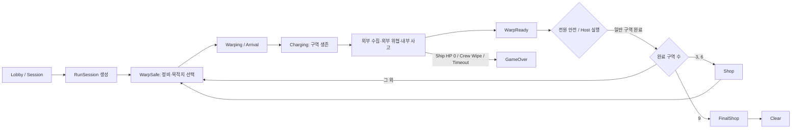
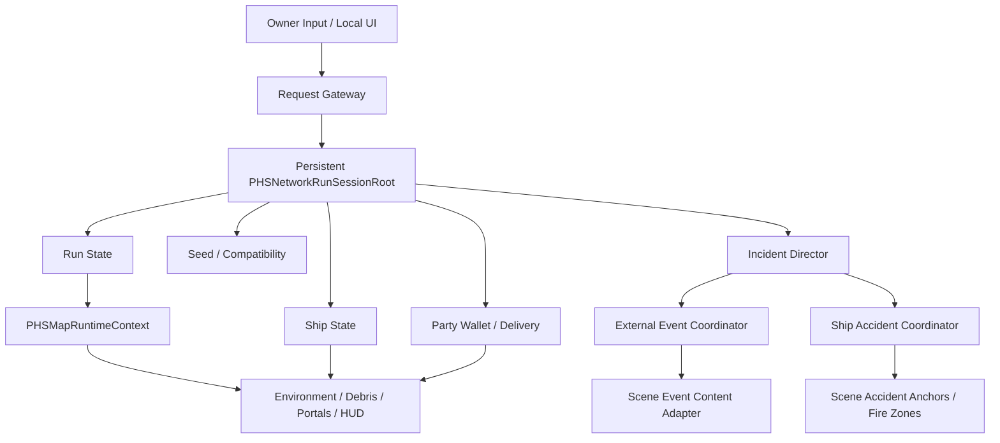

# Last Jump Crew 통합 게임플레이·네트워크 마스터 설계

- 문서 버전: `0.1`
- 작성일: `2026-07-18`
- 상태: 설계 동결 / P0 핵심 생명주기 구현 / 2인 전체 루프 검증
- 제품 기준: 4인 협동 밸런스, 기술 상한 8인
- 활성 통합 기준 씬:
  - `0715/ParkHanSol_LobbyScene`
  - `0715/PHS_Map_ver1`
  - `0715/PHS_ExteriorShopScene`
- 하위 상세문서:
  - `Docs/PHS_SHIP_INCIDENT_SYSTEM_DETAILED_SPEC_0718.md`

## 1. 목적

캐릭터, 아이템, 재화, 함선, 우주맵, 외부 사건, 내부 사고, 미니게임을 하나의 서버 권위 게임 루프로 묶는다.

이 문서가 고정하는 것:

1. 어떤 시스템이 최종 상태를 소유하는지.
2. 클라이언트가 요청할 수 있는 것과 서버가 검증할 것.
3. 씬이 바뀌어도 유지되어야 하는 Run 상태.
4. 팀별 구현 경계와 공유 계약.
5. 기존 중복 시스템 중 무엇을 활성 경로로 남길지.
6. 통합 완료를 증명할 테스트 기준.

## 2. 현재 확인된 사실

### 2.1 Unity와 빌드

- Unity: `6000.5.2f1`.
- 현재 Unity: `ParkHanSol_LobbyScene`, EditMode, Scene Dirty 없음.
- 현재 컴파일 오류: `0`.
- 현재 Build Settings 활성 씬:
  1. `ParkHanSol_LobbyScene`
  2. `PHS_Map_ver1`
  3. `PHS_ExteriorShopScene`
- `PHS_DebrisCollectionScene`과 중력 테스트 씬은 파일은 있으나 현재 빌드 경로가 아니다.

### 2.2 네트워크

- Netcode for GameObjects `2.13.0`.
- Unity Transport `6.5.0`.
- Unity Services Multiplayer `2.2.4`의 Session + Relay 경로 사용.
- 익명 Authentication 사용.
- `NetworkManager` 현재 주요 설정:
  - Tick Rate: `30`
  - Connection Approval: `On`
  - Scene Management: `On`
  - Force Same Prefabs: `On`
  - Client Connection Buffer Timeout: `10`
  - Player Prefab: `PHS_CuteWhiteGhost_Player.prefab`
- 방 생성 기본 최대 인원: `8`.
- 실제 제품 권장 인원: `4`.

### 2.3 현재 활성 플레이어 조립

활성 플레이어는 02 폴더의 `PHS_CuteWhiteGhost_Player.prefab` 한 개다.

주요 구성:

- `NetworkPlayerController`
- `TempPlayerInteractionScanner`
- `TempPlayerItemHolder`
- `NetworkPlayerItemRecord`
- `NetworkPlayerItemLifecycle`
- `NetworkPlayerCombatController`
- `NetworkPlayerKnockbackReceiver`

권위 흐름:

- Owner만 입력을 읽는다.
- 이동, 체력, 아이템 기록, 투척 충돌, 피해 결과는 서버가 확정한다.
- Held Item은 서버의 Item Record를 읽어 각 Peer가 로컬 Presentation을 재구성한다.

### 2.4 현재 Run과 맵

- 서버가 Lobby에서 `NetworkRunSessionRoot`를 한 번 Spawn하고 `Single` Scene 전환 뒤에도 유지한다.
- Root의 `NetworkRunFlowCoordinator`가 Phase, Warp Charge, 구역 수, 상점 수, Active Map, Safe 인원을 서버 쓰기 `NetworkVariable`로 보유한다.
- Root의 `NetworkShipSystemsState`가 Ship HP, Module, Power/Gravity/Battery 상태를 Scene과 Player 수명에서 분리한다.
- `PHSMapRuntimeContext`가 Active Map Profile을 읽고 환경, Skybox, 외부 사건, 내부 사고, Debris, Shop Portal을 적용한다.
- Map Profile ID는 `8000~8999`.
- 선택 가능 맵은 `8001~8004`.
- 현재 4개 맵은 이름과 사건 가중치는 다르지만 같은 빈 Environment Placeholder와 같은 Skybox를 사용한다.
- `StageTimeLimitSeconds`와 `AdvancesStageTime`은 `NetworkRunStageClock`에 연결했다.
- `Difficulty`와 `ClearRewardCredits`는 아직 실제 게임 규칙에 연결되지 않았다.
- 2026-07-18 새 Development Build에서 2 Peer, 9구역, Shop 3회, `FinalShop -> Clear` 자동 루프를 통과했다.

### 2.5 현재 함선과 사건

- 함선 상태:
  - Ship HP
  - Power
  - Gravity
  - Battery
  - Power/Gravity/LifeSupport/Engine Module HP와 Fault
- 외부 사건 권위:
  - `PHSNetworkEventScheduler`
  - `NetworkEventCoordinator`
  - 04의 Legacy Event 콘텐츠 Adapter
- 내부 사고 권위:
  - `PHSNetworkShipAccidentCoordinator`
  - Fire, PowerFailure, DeviceFailure, HullBreach, SteamLeak, OxygenFailure, GravityGeneratorFailure
- Legacy 04의 `EventScheduler`, `ZoneEventScheduler`, 710x 내부 이벤트는 활성 스케줄 권위를 가지면 안 된다.

### 2.6 현재 아이템과 경제

- World Item:
  - 서버 Spawn/Despawn
  - 서버 Rigidbody
  - 서버 거리·Scene·Catalog·Revision 검증
- Party Credit:
  - 03 `IWallet`을 02 `ShopEconomyWalletAdapter`가 서버 권위로 감싼다.
- 구매 가격:
  - `ShopProductData.PurchasePrice`
- 판매 가격:
  - `UtilityItemPrefabData.Price`
- 현재 데이터가 세 갈래다:
  - String ItemId 기반 Utility Item
  - OfferId 기반 Shop Product
  - 03의 int ItemData

## 3. 현재 P0 구조 결함

### 3.1 Run 상태의 씬·Player 종속 — 1차 해소

- `NetworkRunFlowCoordinator`는 Player Prefab에서 Persistent Root로 이동했다.
- `NetworkShipSystemsState`와 외부 사건 Impact Adapter는 Map Ship Runtime에서 Persistent Root로 이동했다.
- Root는 Server-Owned NetworkObject이며 `destroyWithScene=false`로 한 세션 동안 유지된다.
- Scene Local Ship Runtime, HUD, Gravity, Accident View는 Root Snapshot에 다시 바인딩한다.
- Stage Deadline은 `NetworkRunStageClock`으로 Root 수명에 연결했다.
- Party Wallet과 Delivery Queue는 `NetworkRunEconomyLedger`로 Root 수명에 연결했다.
- Delivery Entry는 개별 `PurchaseId`를 보존하여 Shop 재진입 뒤 부분·순서 변경 재시도의 중복 결제를 차단한다.
- Run Seed와 의미 Scope RNG는 `NetworkRunRandomLedger`로 Root 수명에 연결했다.
- Map Choice는 `MapChoice=100` Stream과 다음 구역 번호 Scope를 사용한다.
- Compatibility는 아직 Root 수명과 접속 승인에 연결되지 않았다.

결론:

- Run/Ship 이동은 완료했다.
- Incident/Compatibility도 같은 수명 경계 안에서 상태별 OOP 컴포넌트로 연결한다.

### 3.2 게임 규칙 원장이 두 개

- 03 `GameLoopState`:
  - 9구역
  - 4구역마다 상점
  - 제한시간 300초 고정
- 메인 기획과 기존 통합 검증:
  - 9구역
  - 3구역마다 상점
- 02 `PHSMapProfileSO`:
  - Map별 제한시간, 난이도, 보상 보유
  - 실제 GameLoop에 미연결

결론:

- 최종 계약은 `9구역 / 3구역마다 상점 / 3사이클 / FinalShop / Clear`.
- 제한시간과 보상은 Active Map Profile이 공급한다.
- 03은 순수 규칙을 소유하고, 02 Network Adapter가 서버 상태를 복제한다.

### 3.3 Stage Timer가 클라이언트에서 불일치

- Host의 `LocalGameSession`만 실제 게임을 시작하고 Timer를 감소시킨다.
- HUD는 각 프로세스의 로컬 `IGameStateProvider.StageTimeRemaining`을 직접 읽는다.
- Client Timer가 0 또는 Host와 다른 값일 수 있다.

결론:

- Stage Deadline 또는 Remaining Time을 서버 권위 Snapshot으로 복제한다.
- Client는 로컬 Timer를 실행하지 않고 Server Time 기준으로 표시만 보간한다.

2026-07-18 구현:

- `NetworkRunStageClock`이 Map Profile 제한시간과 Stage Sequence를 소유한다.
- 상태 전환 때만 단일 Snapshot을 복제하고 Running Remaining은 NGO Server Time으로 계산한다.
- 워프 승인 시 Pause, 점프 거절 시 Resume, 구역 종료·Shop·Clear·GameOver 시 Stop한다.
- `RunFlowHudBinder`는 Local `GameCore` fallback 없이 Persistent Root Stage Clock만 읽는다.

### 3.4 상점 진입이 Phase를 우회

- Inspector는 Shop Phase 요구지만 `keepShopPortalAlwaysActive=true`가 전환 모드를 `None`으로 바꾼다.
- 플레이 중에도 Shop Scene으로 `Single` 이동할 수 있다.
- Timer, 사건, 사고, Debris가 정상 종료되지 않은 채 Map이 unload될 수 있다.
- 복귀 후 World Reset, Ship Repair, 사건 제거를 악용할 수 있다.

결론:

- Shop Portal은 `Shop` 또는 `FinalShop`에서만 서버가 승인한다.
- 자유 방문형 상점은 P0에서 금지한다.

### 3.5 외부 수집 공간과 Warp 안전 계약 단절

- 현재 Debris 수집은 별도 씬이 아니라 `PHS_Map_ver1` 내부 외부 플랫폼으로 서버 Teleport한다.
- 외부 플랫폼에 `NetworkDebrisCollectionZone`과 `NetworkDebrisSafeVolume` 연결이 없다.
- RunFlow의 `debrisPlayerIds`, Safe 인원, Warp 시 외부 잔류자 규칙이 실제 공간과 연결되지 않았다.

결론:

- 현재 Map 내부 수집 방식을 정식 경로로 사용한다.
- `PHS_DebrisCollectionScene`은 P0 Legacy/Reference로 명시한다.
- 외부 플랫폼에 Collection/Safe/Danger/Death Volume을 직접 배치한다.

### 3.6 판매 트랜잭션 부분 커밋

- Held Item Record를 먼저 소비하고 Credit 추가를 나중에 한다.
- Wallet 추가 실패 시 Item Record 복구가 없다.

결론:

- 판매는 `Validate -> Reserve -> Credit Commit -> Item Commit` 순서로 원자 처리한다.
- Commit 실패 시 Reservation을 해제한다.
- 동일 SaleId 재요청은 Idempotent하게 거절한다.

### 3.7 사건 권위 중복

- 02 NGO 외부 스케줄러와 04 Legacy Local Scheduler가 동시에 켜질 수 있는 구조가 남아 있다.
- 외부 Event Start 피해와 Fail Consequence 피해가 중복될 수 있다.
- 내부 Fire/Oxygen/Enemy Legacy와 새 Ship Accident가 의미상 겹친다.

결론:

- 외부 720x: `NetworkEventCoordinator` 단일 권위.
- 내부 기계 사고: `PHSNetworkShipAccidentCoordinator` 단일 권위.
- 적 침투: 외부 사건 실패가 만드는 Combat Incident로 유지.
- Legacy Scheduler는 콘텐츠 실행 Adapter로만 사용하고 Update 기반 자동 Spawn을 금지한다.

### 3.8 미니게임 결과 신뢰 부족

- 미니게임 UI와 성공 판정은 Client Local이다.
- 서버는 Event, Terminal Type, Player 연결, 4m 거리만 확인한다.
- Server-issued Session, Nonce, Occupancy Lock이 없다.

결론:

- 서버가 MiniGame Session을 발급하고 결과를 한 번만 받는다.
- Session Key:
  - EventInstanceId
  - TerminalId
  - PlayerId
  - Nonce
  - StartedAt
  - ExpiresAt
- 같은 Terminal은 P0에서 한 명만 점유한다.

### 3.9 Prefab과 데이터 중복

- Player Prefab이 02/06/Final 경로에 중복 존재한다.
- Network Prefab List도 두 경로가 존재한다.
- Item 구매/판매/경제 데이터 가격이 서로 다르다.
- 고급 Utility Item 5종은 Placeholder 동작이다.

결론:

- 활성 Player GUID와 Network Prefab List를 하나로 동결한다.
- 구매/판매/아이템 정의의 각 책임을 분리한다.
- 고급 아이템은 동작 구현 전 Shop Catalog에 노출하지 않는다.

## 4. 목표 게임 루프

### 4.1 Phase 계약

| Phase | 서버 처리 | Client 처리 | 사건/사고 |
|---|---|---|---|
| Waiting | Session 준비 | Lobby UI | 정지 |
| WarpSafe | Timer 정지, 목적지 2개 생성 | 정비/HUD/선택 표시 | 신규 발생 정지, 기존 사고 수리 허용 |
| Warping | 입력 제한, 전이 예약 | Warp VFX | 정지 |
| WarpArrival | Active Map Commit | Skybox/환경 교체 | 정지 |
| Rearming | 짧은 안전시간 | 도착 연출 | 정지 |
| Charging | Stage Deadline 진행 | 플레이/HUD | 외부 위협·내부 사고 시작 |
| WarpReady | Timer 정책 고정, Safe 인원 확인 | 집결 안내 | 신규 발생 정지 권장 |
| Shop | Wallet/구매/수리 | 상점 UI | 정지 |
| FinalShop | 최종 정비 | 최종 UI | 정지 |
| Clear | Run Snapshot 동결 | 결과 화면 | 전부 종료 |
| GameOver | Run Snapshot 동결 | 실패 화면 | 전부 종료 |

### 4.2 구역 규칙

- 총 일반 구역: `9`.
- 상점: `3`, `6` 구역 완료 후.
- 9구역 완료 후 `FinalShop`.
- 같은 Map 연속 선택 금지.
- 다음 선택지 2개는:
  - 현재 Map 제외
  - Progress 조건 만족
  - 서로 다른 Map
  - Server Seed 기반 결정
- Map Profile이 제공:
  - 제한시간
  - 난이도
  - 기본 보상
  - Debris 구성
  - 외부 위협 가중치
  - 내부 사고 가중치
  - Environment Prefab
  - Skybox

## 5. 목표 아키텍처

### 5.1 Persistent `PHSNetworkRunSessionRoot`

Lobby에서 Server가 Spawn하고 Run 종료까지 유지한다.

2026-07-18 P0 1차 구현:

- 실제 클래스명은 `NetworkRunSessionRoot`.
- Lobby `NetworkManager`의 `NetworkRunSessionRootBootstrap`이 서버 시작 시 등록 Prefab을 동적 생성한다.
- `InstantiateAndSpawn(..., destroyWithScene: false)`로 `Single` Scene 전환에서도 같은 NetworkObject를 유지한다.
- `NetworkRunFlowCoordinator`는 Player Prefab에서 Root로 이동 완료.
- `NetworkShipSystemsState`와 `PHSShipEventImpactAdapter`는 Map Ship Runtime에서 Root로 이동 완료.
- Network Debris는 NGO Scene Populate 완료 뒤 서버만 Spawn하도록 생명주기를 분리했다.
- 2 Peer 전체 자동 루프에서 Root `NetworkObjectId=2`가 한 번만 생성되고 Ship State `revision=17`이 반복 Scene 전환 뒤 재바인딩됐다.
- 같은 루프에서 9구역, Shop 3회, `FinalShop -> Clear`를 완료했다.
- Stage Deadline은 `NetworkRunStageClock`으로 연결 완료.
- Party Wallet과 Delivery Queue는 `NetworkRunEconomyLedger`로 연결 완료.
- 구매 차감과 Delivery Entry 추가는 한 서버 API로 커밋하고, Entry는 `Pending → Claimed → Delivered` 상태를 복제한다.
- `NetworkRunRandomLedger`의 Seed/Algorithm Snapshot과 Stream/Scope 결정론을 연결했다.
- 첫 RNG 소비자인 Map Choice는 다른 사건 Stream 소비와 분리했다.
- Incident Pressure와 Compatibility는 후속 범위.
- 상세 구현·검증: `Docs/PHS_RUN_SESSION_ROOT_IMPLEMENTATION_0718.md`.

소유 상태:

- RunId
- Network Protocol Version
- Content Catalog Hash
- Run Phase
- Cleared Zone Count
- Shop Cycle Count
- Active Map Id
- Selected Map Id
- Stage Deadline
- Server RNG Seed와 Algorithm Version
- Ship State
- Party Credit
- Purchase Delivery Queue
- Incident Pressure State

금지:

- Player Prefab이 Run 전역 상태를 소유.
- Map Scene NetworkObject가 누적 Ship HP를 소유.
- Client LocalGameSession이 실제 Timer를 감소.

### 5.2 Scene Runtime

Scene은 상태가 아니라 View와 Anchor를 제공한다.

Scene 책임:

- Room/Device/Fire Zone/Repair Anchor
- Environment Prefab Root
- Debris Spawn Volume
- Collection/Safe/Danger Volume
- Terminal/Portal
- HUD와 Presentation Binder

Scene 진입 시:

1. Persistent Session Root 탐색.
2. Active Map Snapshot 적용.
3. Ship View를 Persistent Ship State에 Bind.
4. Event/Accident Anchor Registry 제출.
5. Presentation을 Snapshot 기준으로 Reconcile.

### 5.3 Incident Director

`PHSNetworkIncidentDirector`는 두 채널을 조율한다.

- External Threat Channel:
  - EnemyScout `7201`
  - MeteorAttack `7202`
  - EmpAttack `7203`
- Internal Accident Channel:
  - Fire
  - PowerFailure
  - DeviceFailure
  - HullBreach
  - SteamLeak
  - OxygenFailure
  - GravityGeneratorFailure
- Combat Incident:
  - EnemySpawn `7102`

P0 기본 한도:

- 외부 활성 최대 `1`.
- 내부 활성 최대 `2`.
- 총 플레이 과제 최대 `3`.
- 같은 사고 ID/Zone 중복 최대 `1`.
- Fire 사고 최대 `1`.

발생 허용 조건:

- Phase가 `Charging`.
- Active Map이 사건 생성을 허용.
- 전역 Pressure Budget 여유.
- Anchor/Terminal/Content 준비 완료.
- 같은 Instance의 Consequence가 이미 적용되지 않음.

## 6. 도메인별 상세 계약

### 6.1 캐릭터

서버 권위:

- 위치 결과
- 중력 상태
- 체력/사망/부활
- Knockback 결과
- 공격 Hit
- 외부 수집 구역 상태

로컬:

- 입력
- Camera
- Screen Shake
- Audio Listener
- Animation 보간
- Hit/VFX 표시

필수 추가:

- Character Snapshot에 Life Revision.
- 사망 중 Item Drop 정책.
- Scene 전환 중 입력 Lock.
- Safe/Danger Volume 서버 등록.
- 2/4/8인 Spawn Point 검증.

### 6.2 아이템

정식 흐름:

`Server Spawn -> Owner Pickup Request -> Server CAS Record -> World Despawn -> Held View -> Use/Drop/Throw/Sell Request -> Server Commit`

서버 검증:

- Sender가 Player Owner.
- 같은 Scene.
- 거리.
- LOS.
- Item Catalog 등록.
- Item Record Revision.
- Request Sequence.
- 현재 Phase.
- 대상 Instance 활성.

ID 계약:

- `lower_snake_case`.
- 최대 64 bytes.
- 예:
  - `wrench`
  - `fire_extinguisher`
  - `battery_pack`
  - `foam_sealant_gun`

데이터 책임:

| 데이터 | 최종 책임 |
|---|---|
| ItemId, Held/Dropped Prefab, 판매가격 | `UtilityItemPrefabData` |
| 구매가격, 재고정책, OfferId | `ShopProductData` |
| Wallet, 보상, 영구 Profile | 03 Economy |
| NGO Spawn/Despawn/Ownership | 02 Network Integration |

### 6.3 경제와 상점

서버만:

- Credit 증감
- Purchase 검증
- Sale 검증
- Delivery Queue
- Dock Repair 결제
- Reward 지급

원자성:

- Purchase:
  - 전체 검증
  - Stock 예약
  - Wallet 차감
  - Delivery Commit
  - 실패 시 Wallet/Stock Rollback
- Sale:
  - Item 예약
  - Wallet 지급
  - Item 소비
  - 실패 시 예약 해제

중복 방지 키:

- PurchaseId
- SaleId
- DeliveryId
- RewardGrantId

### 6.4 함선

Persistent 상태:

- Ship HP
- Module HP/Fault
- Power
- Gravity
- LifeSupport
- Engine
- Last Damage Cause
- Revision

Scene View:

- 실제 Generator/Battery/Engine/Panel
- Light/Gravity/Audio/VFX
- Repair Anchor

규칙:

- Scene reload로 HP/Fault를 초기화하지 않는다.
- Device Failure 해결 시 실제 Device 상태와 Module 상태를 함께 복구한다.
- Power/Gravity/LifeSupport/Engine은 하나의 Module당 하나의 Canonical 상태만 가진다.

### 6.5 외부 사건

External Event는 경고와 대응 미니게임을 가진다.

| 외부 사건 | 대응 | 실패 Consequence |
|---|---|---|
| MeteorAttack | Cannon | HullBreach 사고 요청 |
| EnemyScout | PowerSync | EnemySpawn Combat Incident |
| EmpAttack | WireFix | PowerFailure 사고 요청 |

피해 시점은 사건 정의마다 하나만 선택:

- OnStart
- OnFail
- OnExpire

한 사건에서 Start Damage와 Fail Damage를 동시에 사용하지 않는다.

### 6.6 내부 사고

내부 사고 상세는 하위 문서를 따른다.

공통 계약:

- 사고 위치는 실제 Room/Device/Surface Anchor.
- 서버가 Spawn/Spread/Damage/Repair/Resolve를 확정.
- Client는 Snapshot 기반 VFX/HUD만 실행.
- Legacy 710x Fire/Oxygen Scheduler는 비활성.
- EnemySpawn은 기계 사고가 아니라 Combat Incident.

### 6.7 화재

P0 고정:

- Fire Incident 최대 `1`.
- Zone당 활성 Patch 최대 `8`.
- Patch는 점이 아니라 면적 Collider.
- 인접 링크로만 확산.
- Spread Tick `2.5초`.
- Tick당 확산 시도 `2`.
- Tick당 신규 점화 최대 `1`.
- Damage Tick `1초`.
- 동일 대상 Collider 중복 피해 제거.
- Patch마다 NetworkObject를 만들지 않는다.
- Server는 Patch State/Heat만 복제.
- Client는 미리 배치된 VFX/Audio를 Reconcile.

### 6.8 미니게임

05가 소유:

- UI
- 입력
- 퍼즐 생성 View
- 성공/실패 연출

02가 소유:

- Session 발급
- Terminal 점유
- Event Instance 연결
- Nonce/Expiry
- 결과 1회 Commit
- 거리/Phase/활성 Event 재검증

P0 매핑:

- Cannon -> MeteorAttack
- PowerSync -> EnemyScout
- WireFix -> EmpAttack
- DoorKeypad -> P0 제외 또는 별도 Door Device 기능으로 분리

### 6.9 우주맵과 Debris

P0 정식 모델:

- 하나의 `PHS_Map_ver1` 안에서 Ship 내부/외부 플랫폼을 사용.
- Map Profile이 Environment와 Spawn 구성을 교체.
- 별도 Debris Scene은 Legacy.

Debris 생성:

- Run Seed + Map Id + Visit Sequence로 결정론적 Seed 생성.
- Spawn Volume 전체에 분산.
- 같은 지점 최소 간격 적용.
- 서버만 NetworkObject Spawn.
- Client Random 금지.

현재 구현·검증된 생명주기:

- Scene Seed의 `UtilityItemPrefabData.DroppedPrefab`을 생성 원본으로 사용한다.
- 서버의 해당 Map `OnLoadComplete` 뒤 Scene으로 이동시키고 `Spawn(true)`한다.
- Scene unload 시 생성 Debris도 함께 정리된다.
- 다섯 Dropped Debris Prefab은 `NetworkItemPhysicsAuthority.targetRigidbody`를 Inspector로 명시 연결한다.
- Validator는 `Map Seed -> Dropped Prefab -> Physics Authority -> Rigidbody` 참조를 검사한다.
- 2인 자동 루프에서 Map Load `10`회, 설정 범위 `20~30` 안에서 생성, Hash 중복과 Physics Authority 실패 `0`.

아직 남음:

- Run Seed + Map Id + Visit Sequence 기반 결정론.
- Spawn 최소 간격과 Map별 Volume 차별화.

외부 플랫폼:

- Collection Volume
- Safe Volume
- Danger Warning Volume
- Death Boundary
- Ship Return Portal
- Warp 시 잔류자 처리 규칙

## 7. 네트워크 설정 명세

### 7.1 인원

- 권장 밸런스 인원: `4`.
- 최소 시작 인원: `2`.
- 기술 최대 인원: `8`.
- 테스트: `2`, `4`, `8`.

### 7.2 Session

- Unity Services Multiplayer Session + Relay 유지.
- 공개 Room Name에 사용자 ID를 넣지 않는다.
- Run 시작 후 신규 참가를 막는다.
- Session Property:
  - GameId
  - ProtocolVersion
  - ContentHash
  - RunState
  - PlayerCount
  - HasPassword
- P0 중간 참가: 금지.
- P1 재접속: 동일 PlayerId + Grace Period 방식 검토.

### 7.3 Connection Approval

Approval Payload:

- Protocol Version
- Build Version
- Content Catalog Hash
- Player Session Token

서버 거절:

- Full
- Run Already Started
- Protocol Mismatch
- Content Mismatch
- Invalid Token

### 7.4 Tick와 전송 빈도

| 상태 | 권장 |
|---|---:|
| Network Tick | 30 Hz |
| Player Input 제출 | 20~30 Hz |
| Enemy 위치 Snapshot | 10 Hz |
| Fire Damage | 1 Hz |
| Fire Spread | 0.4 Hz |
| Stage Timer | Deadline 1회 + Phase/Revision 변경 |
| HUD/Wallet/Incident | 상태 변화 시 |

### 7.5 RPC 공통 검증

모든 게임 상태 변경 RPC:

1. Sender 연결 상태.
2. Sender Player 존재.
3. Ownership 또는 명시적 권한.
4. Scene/Phase 일치.
5. 대상 NetworkObject/Instance 존재.
6. 거리.
7. LOS.
8. ItemId/Revision.
9. Request Sequence/Nonce.
10. Rate Limit.
11. Idempotency Key.

### 7.6 Late Join과 복구

P0는 Run 중 참가 금지지만 Snapshot은 복원 가능해야 한다.

필수 Snapshot:

- Run
- Active Map
- Ship
- Wallet
- Held Item
- External Event
- Internal Accident
- Fire Patch
- MiniGame Terminal Occupancy

### 7.7 Network Prefab

- 활성 Network Prefab List 한 개.
- 활성 Player Prefab GUID 한 개.
- 등록 대상:
  - Player
  - Dropped Item
  - Debris
  - Persistent Session Root
  - 실제 Network Spawn이 필요한 Enemy/Projectile
- 등록 금지:
  - Fire Patch VFX
  - Audio
  - HUD
  - Scene Anchor

## 8. 공유 인터페이스

인터페이스 파일은 항상 `I`로 시작한다.

기존 우선 재사용:

- `IInteractable`
- `IItemHolder`
- `IHoldableItem`
- `IUsableItem`
- `IUtilityAttackTarget`
- `IDamageable`
- `IMiniGameTarget`
- `IGameStateProvider`
- `IGameCommands`
- `IWallet`
- `IShipStatus`

추가 후보:

| 인터페이스 | 소유 | 목적 |
|---|---|---|
| `INetworkRunSessionState` | 02 | Run Snapshot 읽기 |
| `IMapRuleProvider` | 02/03 계약 | 제한시간·보상·진행 규칙 |
| `IExternalIncidentRuntime` | 02 | 외부 사건 서버 권위 |
| `IExternalIncidentContent` | 04 | 사건 콘텐츠 실행 |
| `IShipAccidentRuntime` | 02 | 내부 사고 서버 권위 |
| `IMiniGameSessionService` | 02 | Session/Nonce/점유 |
| `IMiniGameView` | 05 | 로컬 퍼즐 UI |
| `IIncidentConsequencePolicy` | 02/04 | 단일 결과표 |
| `IAtomicSaleService` | 02/03 | 판매 원자 처리 |

원칙:

- 공용 Interface는 최소 계약만 둔다.
- 팀원 원본 클래스 직접 참조를 금지한다.
- NGO 타입을 03/04/05/06 순수 도메인 Interface에 노출하지 않는다.
- Scene/Prefab 연결은 Inspector에서 드러나야 한다.

### 8.1 팀 완성품과 네트워크 조립 경계

- 03/04/05/06 담당자는 자기 구역의 내부 참조와 전체 로컬 생명주기가 끝난 GameReady Prefab을 제출한다.
- 팀 제출 Prefab/Script에는 `NetworkObject`, `NetworkBehaviour`, `NetworkVariable`, RPC를 넣지 않는다.
- 상태 입력과 요청 출력은 `I`로 시작하는 순수 계약과 데이터로 노출하고 Sandbox Local Driver로 증명한다.
- 02는 완성품 내부를 수정하지 않고 Scene 배치, 선언 포트 연결, Network Adapter, Registry/Network Prefab 등록만 수행한다.
- 내부 Hierarchy, Collider, Animator, VFX/Audio, 로컬 규칙 또는 Reset 보완이 필요하면 통합하지 않고 원 담당자에게 revision 반려한다.
- 세부 접수·반려 기준은 `Docs/LASTJUMPCREW_TEAM_PREFAB_INTAKE_SPEC_0718.md`를 따른다.

## 9. 우선순위

### P0 구조 안정화

1. Persistent `PHSNetworkRunSessionRoot`. — 1차 완료
2. Run/Ship/Wallet/RNG Scene 독립. — Map Choice RNG까지 완료
3. Stage Timer 서버 복제. — `NetworkRunStageClock` 구현 완료
4. 9구역/3구역 상점 규칙 통일. — 2인 Runtime 계약 통과, Map 시간·보상 Adapter 남음
5. Shop Phase 우회 제거.
6. Active Map 상점 경계 Commit 수정.
7. 외부 수집 Volume 연결.
8. Sale 원자성.
9. Legacy Scheduler 비활성 Validator.
10. 외부/내부 사건 Consequence 중복 제거.
11. MiniGame Session/Nonce/점유.
12. Player/Network Prefab 단일화.
13. 미추적 Network Item 핵심 파일 소유권 확정.

### P1 플레이 품질

1. Fire Patch 확산·범위 피해.
2. 8001~8004 실제 Environment 차별화.
3. Debris 결정론적 분산.
4. Enemy Health/State/Target/Death 복제.
5. 고급 Utility Item 실제 효과.
6. Item LOS와 RPC Rate Limit.
7. Map 보상·상점 가격 밸런스.
8. 사건 HUD/함선 지도 Late Join 복원.

### P2 확장

1. Run 중 재접속.
2. 통신 장비 고장과 Vivox Gate.
3. 산소 농도·문 상태·풍향 기반 Fire.
4. Map별 환경 Hazard 730x 정식 이관.
5. 전용 서버 대응.

## 10. 완료 검증

### 2026-07-18 현재 증거

- Unity `6000.5.2f1`, Compile Error `0`.
- `PHS_0715_VALIDATE_OK errors=0 scenes=3 prefabs=11`.
- `PHS_0717_VALIDATION_BUILD_OK path=Builds/PHS0717Validation/LastJumpCrew.exe size=345187300`.
- 새 Development Build에서 `PHS_P0_RESULT PASS ... zones=9 shopCycles=3 runPhase=Clear`.
- Stage Clock sequence `1~9`의 MapId가 Active Map과 일치했고 Host/Client Remaining 최대 차는 `0.054초`였다.
- Warp Pause 뒤 `1.5초` 동안 Remaining 변화는 `0.000초`였고, Shop 복귀 전 선택 Map Commit 뒤 sequence `5`를 시작했다.
- Debris 판매 후 2 Peer가 같은 `SaleCredit` 거래와 `credits=553`을 수신했다.
- 구매 실패는 Economy revision/Delivery count 변화 없이 거절됐고, 성공은 `pending=1`로 복제됐다.
- Map 복귀 상자 적용 뒤 2 Peer가 `credits=443`, `pending=0`, `claimed=0`, `delivered=1`을 수신했다.
- Root RNG Snapshot은 2 Peer에서 `seed=12137645481030649992`, `algorithm=1`, `revision=1`로 일치했다.
- 9회 Map Choice의 실제 좌·우 MapId가 같은 Seed/Stream/Scope 재생값과 모두 일치했고, `ExternalThreat` Stream 소비 전후 결과도 같았다.
- Runner 표준 Health `PHS_P0_LOG_HEALTH_OK`.
- 정확한 Debris 중복 등록 예외, `SceneEventInProgress`, `PHS_NETWORK_ITEM_PHYSICS_FAILED`, `PHS_DEBRIS_STREAM_SETUP_FAILED`는 Host/Client 모두 `0`.
- Headless NullGfx에서만 발생하던 MiniGame Lamp Shader 속성 오탐을 분리했고, 실제 Material의 `_EMISSION`을 활성화했다.
- `PHS_MINIGAME_INDICATOR_SLOT_INVALID`와 `PHS_MINIGAME_INDICATOR_SETUP_INVALID`도 Host/Client 모두 `0`.
- 4/8인, Late Join Stage Clock/Economy/RNG 복원, 짧은 Timeout 단발 시나리오는 아직 미검증.
- 배송 상자에 배치했지만 플레이어가 수령하지 않은 Item의 Map → Shop → Map 복원은 `Boxed/Collected` 상태 분리 전까지 P1 미검증이다.

### Editor

- Compile Error `0`.
- Build Scene 누락 `0`.
- Missing Script/Reference `0`.
- Network Prefab GUID 중복 `0`.
- Legacy Scheduler active `0`.
- Map/Incident/Item ID 중복 `0`.

### Host + Client

- 2인:
  - Lobby -> Map
  - 이동/아이템/사고/상점
- 4인:
  - 권장 플레이 전체 루프
- 8인:
  - 연결/Spawn/부하/Fire 대상 중복 제거

### Run

- 1~9구역 Active Map/Profile 일치.
- 3/6구역 후 Shop.
- 9구역 후 FinalShop/Clear.
- Scene 전환 후 Ship HP/Module/Wallet 유지.
- Client Timer가 Host와 일치.
- Play 중 Shop 진입 거부.
- 같은 Map 연속 선택 없음.

### 외부 활동

- 외부 플랫폼 입장 등록.
- Safe 복귀 등록.
- Warp 시 외부 잔류 정책 적용.
- Debris 중복 판매 없음.
- Wallet 실패 시 Item 유실 없음.

### 사건

- 외부 사건 한 번당 Consequence 한 번.
- 내부 사고와 Legacy 사건 이중 생성 없음.
- MiniGame 결과 Replay/원거리/중복 거절.
- Fire가 인접 면으로만 확산.
- Fire 범위 대상 서버 피해.
- Late Join Snapshot 재구성.

## 11. 구현 금지사항

- Client가 HP, Wallet, Item Record, Incident 결과 직접 변경.
- Player Prefab에 Run 전역 원장 추가.
- Scene reload로 Ship 상태 초기화.
- Legacy Scheduler 재활성.
- Fire Patch마다 NetworkObject 생성.
- 런타임 `Find`로 누락 Inspector 참조를 조용히 보강.
- 팀원 폴더 원본을 통합 편의 때문에 직접 이동/삭제.
- Network Prefab List를 팀별로 따로 확장.
- `git add -A`로 현재 dirty worktree 전체 Stage.

## 12. 설계 동결 결정

이 문서 기준 P0 결정:

1. 제품 밸런스 4인, 기술 상한 8인.
2. 9구역, 3구역마다 상점.
3. 현재 Map 내부 외부 플랫폼이 정식 Debris 경로.
4. Shop은 Phase Gate 필수.
5. Run/Ship/Wallet/RNG는 Persistent Server Session Root.
6. 외부 사건과 내부 사고는 별도 채널이지만 하나의 Incident Budget을 공유.
7. 외부 720x는 NetworkEventCoordinator.
8. 내부 기계 사고는 PHSNetworkShipAccidentCoordinator.
9. Legacy 710x Scheduler는 비활성.
10. MiniGame은 Client View, Server Session/Result Authority.
11. Fire는 Zone/Patch 면적 그래프.
12. 공유 Scene과 Network Prefab은 박한솔 통합 단일 소유.
13. 팀원은 GameReady 로컬 완성품을 제출하고 박한솔은 네트워크와 최종 조립만 수행.
