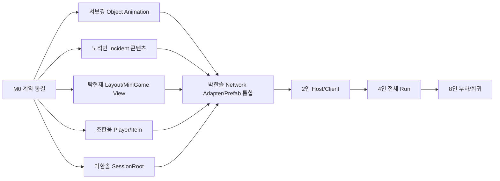

# Last Jump Crew 통합 작업 배분표

- 작성일: `2026-07-18`
- 기준 문서: `LASTJUMPCREW_INTEGRATED_GAMEPLAY_NETWORK_SPEC_0718.md`
- 프리팹 접수 기준: `LASTJUMPCREW_TEAM_PREFAB_INTAKE_SPEC_0718.md`
- 사건 장소·트리거 기준: `LASTJUMPCREW_EVENT_LOCATION_TRIGGER_HANDOFF_SPEC_0719.md`
- 상태: 중간 작업 진행 / 0715 Scene 사건 Zone `4`·Location `15`·Fire Patch `22`·Request Route `10`·내부 사고 Anchor `7` 전부 등록 / Fire 서버 런타임 코드 구현 / Compile Error `0`·0719 Migration·전체 0715 Validator·Direct local Host Fire flow smoke 통과 / 원격 Client·Late Join 미검증 / Fire 최종 Presentation 납품 대기 / 전체 Host clean 미주장
- 변경 이력: 기존 0718 배분과 완료 증거는 보존하고 Fire 역할·납품·검증 상태만 현재 구현 기준으로 정정.
- 배분 원칙:
  - 기존 담당 폴더와 Notion 담당을 유지한다.
  - 팀원은 자기 담당 구역의 게임 투입 가능한 GameReady 최종 완성 Prefab을 납품한다.
  - 조각 Prefab이나 미연결 기능은 받지 않는다. 실제 게임에 넣을 최종 완성품 하나와 그 종속 SO/자산만 접수한다.
  - 공용 씬, NetworkManager, Network Prefab, Build Settings는 통합 담당자만 수정한다.
  - NetworkObject/NetworkBehaviour/RPC와 네트워크 권위는 `02` 통합 계층에만 둔다.
  - 팀 Prefab에는 게임플레이 상태를 소유·변경하는 로직을 넣지 않는다.
  - 박한솔은 팀 Presentation을 대신 완성하지 않고 배치·선언 포트·게임플레이 권위·Network Adapter·Registry·검증을 담당한다.

## 1. 최종 소유권

| 담당 | 최종 소유 | 폴더 |
|---|---|---|
| 박한솔 | 온라인 세션, NGO 권위, Run/Ship 지속 상태, Incident Location/Request Gateway, Fire 점화·Heat·확산·피해·소화 검증·Snapshot, 통합 씬, Network Prefab, Validator, Build | `Assets/02. ParkHanSol_TeamLeader_Build & Multi/` |
| 서보경 | 오브젝트 애니메이션 Prefab/Controller/Clip과 상태 표현 | `Assets/03. SeoBoGyeong_Game Economy/` |
| 박한솔/사용자 | Network Economy 원장 통합, 가격·보상·재고·확률 최종 밸런스 승인 | `Assets/02. ParkHanSol_TeamLeader_Build & Multi/` |
| 박한솔 | Shop/Catalog/Display 제작·통합, 가격·재고·보상 최종 승인 | `Assets/02. ParkHanSol_TeamLeader_Build & Multi/` |
| 노석민 | 외부 사건 콘텐츠, 내부 사고 표현, Request Source 신호, Enemy 콘텐츠, Fire 최종 VFX/Audio/Telegraph/Cleanup/Reset Presentation, 사건 SO/Pool/Outcome | `Assets/04. NohSeokMin_Game Event/` |
| 탁현재 | 함선 Room/Device/Anchor 최종 공간 Prefab과 장소 후보 근거, Map 환경, 미니게임 View, Warp 연출 | `Assets/05. TakHyunJae_Map & MiniGame/` |
| 조한용 | 플레이어 전투/체력/넉백, 아이템 공격·사용·투척, 도구 UX | `Assets/06. JoHanYong_PlayerSystem/` |

### 1.1 한 사람 한 구역·완성품 경계

| 담당 | 자기 구역에서 끝내서 줄 최종 완성품 | 박한솔이 마지막에 할 일 |
|---|---|---|
| 서보경 | Door/Console/Generator/Repair/Shop Object Animation Prefab, Animator/Clip/Parameter, 상태 전환과 Reset | 서버 Snapshot을 상태 입력 포트에 연결하고 실제 Device 아래 배치 |
| 노석민 | 외부 사건·내부 사고 표현·Request Source·Enemy Prefab, SO/Outcome. Fire는 VFX/Audio/Telegraph/Cleanup/Reset Presentation Prefab | Location Target, Incident Director 명령, Fire 점화·Heat·확산·피해·소화 검증·Snapshot 연결 |
| 탁현재 | Ship Room/Device/Anchor 최종 공간 Prefab, Minigame View, Map Environment/Warp Prefab | 최종 Location Component/ID, Scene Parent, Minigame Session, 서버 Seed/Result 연결 |
| 조한용 | Player Combat/Health/Knockback Module, Held/Dropped Tool Prefab, 사용·투척·피드백·Reset | 기존 Player NetworkObject, RPC/소유권/Spawn, 서버 판정 연결 |
| 박한솔 (Shop) | Shop Display/Catalog Presentation Prefab, 상품 표시·선택·피드백·Reset | Economy Ledger, 승인 Catalog, 구매/배송 네트워크 연결과 최종 Shop Scene 검증 |

최종 완성품 기준:

- 내부 Inspector 참조, Collider, Layer, Animator, Material, VFX, Audio, Data가 모두 연결돼 있다.
- 담당자 Sandbox에서 나타남 → 작동 → 성공/실패/취소 → Cleanup/Reset까지 실행된다.
- 외부에 남기는 것은 Manifest에 적은 상태 입력, 요청 출력, Scene Anchor, Registry 항목뿐이다.
- `NetworkObject`, `NetworkBehaviour`, `NetworkVariable`, RPC는 포함하지 않는다.
- 점화, Heat, 확산, 피해, 수리/소화 성공, 원장 변경 등 게임플레이 상태 로직은 포함하지 않는다.
- 박한솔이 내부 자식·Clip·Collider·로컬 규칙을 추가해야 하면 완성품이 아니므로 원 담당자에게 반려한다.

## 2. 공유 파일 잠금

아래 파일은 박한솔 통합자만 직접 수정한다.

- `Assets/02. ParkHanSol_TeamLeader_Build & Multi/01. Scene/0715/ParkHanSol_LobbyScene.unity`
- `Assets/02. ParkHanSol_TeamLeader_Build & Multi/01. Scene/0715/PHS_Map_ver1.unity`
- `Assets/02. ParkHanSol_TeamLeader_Build & Multi/01. Scene/0715/PHS_ExteriorShopScene.unity`
- `Assets/02. ParkHanSol_TeamLeader_Build & Multi/03. Prefab/PlayerPrefab/PHS_CuteWhiteGhost_Player.prefab`
- `Assets/01. MainGame/02. Final_Prefab/01. Prefab_ParkHanSol_TeamLeader/Prefab/DefaultNetworkPrefabs.asset`
- `Assets/DefaultNetworkPrefabs.asset`
- `Assets/01. MainGame/02. Final_Prefab/PHS_ShipRuntime.prefab`
- `Assets/01. MainGame/02. Final_Prefab/01. Prefab_ParkHanSol_TeamLeader/Prefab/Integration0716/PHS_EventRuntimeSystem.prefab`
- `Assets/01. MainGame/03. Common_Script/Interfaces/`
- `ProjectSettings/EditorBuildSettings.asset`
- `Packages/manifest.json`
- `Packages/packages-lock.json`

팀원 납품 방식:

1. 자기 폴더에서 GameReady Root Prefab과 필요한 SO/Script/표현 자산을 완성한다.
2. 외부 통합 포트를 제외한 모든 Inspector 참조를 연결한다.
3. 같은 최종 Prefab을 Sandbox Scene에서 전체 생명주기로 증명한다.
4. Manifest/README에 외부 통합 포트와 실제 자산 GUID를 기록한다.
5. 박한솔은 Final Prefab/0715 Scene에 배치하고 `02` Network Adapter만 연결한다.
6. 내부 기능 보완이 필요한 제출물은 박한솔이 수정하지 않고 원 담당자에게 revision 반려한다.

## 3. 공용 계약 동결

### M0에서 먼저 확정할 것

- 활성 Player Prefab GUID 하나.
- 활성 Network Prefab List 하나.
- ItemId `lower_snake_case`.
- MapId `8000~8999`.
- ScriptableObject ID:
  - 내부 Legacy `7101~7106`
  - 외부 Scheduler `7201~7203`
  - 환경 `7301~7304`
  - Map `8001~8004`
- 신규 Ship Accident 원장 Wire `ContentId` `1~7`.
- Zone/Location/Source ID는 `lower_snake_case`.
- InstanceId와 Revision 사용 규칙.
- 9구역 / 3구역마다 Shop.
- 제품 4인 / 기술 상한 8인.
- Run 중 신규 참가 금지.
- Shop Phase Gate.

### 3.1 사건 ID 권위 경계

권위 기준: [Unity ScriptableObject ID 규칙](https://app.notion.com/p/391b951310868071b661d252dd0bf43f)

| 분류 | 승인 값 |
|---|---|
| 내부 Legacy SO | `7101 Fire`, `7102 EnemySpawn`, `7103 PowerOff`, `7104 OxygenLeak`, `7105 EngineBreak`, `7106 MicDestroy` |
| 외부 Scheduler SO | `7201 EnemyScout`, `7202 MeteorAttack`, `7203 EmpAttack` |
| 환경 SO | `7301~7304` |
| Map SO | `8001~8004` |
| 신규 ShipAccident 원장 | Wire `ContentId 1~7` |
| Scene/Runtime 키 | Zone/Location/Source `lower_snake_case` |

Legacy Fire SO `7101`과 신규 ShipAccident Fire `ContentId=1`은 Adapter에서 매핑한다. 같은 ID 공간으로 취급하지 않는다. 팀원은 새 숫자 ID를 임의 발급하지 않고 Manifest에 요청한다.

승인된 Room/Device Anchor 후보는 사고 타입별로 여러 개 납품할 수 있다. 박한솔 Authoring/Validator가 기존 canonical ID를 보존하고 추가 AnchorId 기반 Location을 등록한다.

### 공유 인터페이스 담당

박한솔이 골격을 만들고 각 담당자가 자기 계약만 검토한다.

| 계약 | 검토 담당 |
|---|---|
| `INetworkRunSessionState` | 박한솔 |
| `IMapRuleProvider` | 박한솔, 사용자 |
| `IExternalIncidentRuntime` | 박한솔 |
| `IExternalIncidentContent` | 노석민 |
| `IShipAccidentRuntime` | 박한솔, 노석민 |
| `IIncidentLocation` / `IncidentLocationQuery` | 박한솔 |
| `IIncidentRequestSource` | 박한솔 골격, 노석민 신호 계약 검토 |
| `IIncidentRequestGateway` | 박한솔 |
| `IMiniGameSessionService` | 박한솔 |
| `IMiniGameView` | 탁현재 |
| `IIncidentConsequencePolicy` | 노석민 |
| `IAtomicSaleService` | 박한솔 |
| `IUtilityAttackTarget` 확장 여부 | 노석민, 조한용 |

## 4. 박한솔 배정

### PHS-P0-01 Persistent RunSessionRoot

상태: `Stage Clock·Economy·RNG·Incident 원장 통합 및 2 Peer P0 검증 완료 / 4·8인·Late Join 검증 대기`

완료:

- 서버 소유 `NetworkRunSessionRoot`와 Lobby Bootstrap 제작.
- 활성 Network Prefab List 등록과 Inspector 연결.
- `NetworkRunFlowCoordinator` Player Prefab 분리.
- `NetworkShipSystemsState` Map Ship Runtime 분리.
- External Event Impact Adapter Root 이동.
- Compile 0, 0715 Validator 0, Lobby -> Map 및 Lobby -> Shop 상태 유지 확인.
- NGO Scene Populate 완료 전 Debris Spawn으로 발생하던 `GlobalObjectIdHash` 중복 원인 수정.
- 다섯 Debris Prefab의 Rigidbody Inspector 참조와 Validator 계약 추가.
- 새 Development Build에서 2인, 9구역, Shop 3회, `FinalShop -> Clear` 자동 루프 통과.
- 같은 루프에서 Root `NetworkObjectId=2` 단일 생성과 Ship State `revision=17` 재바인딩 확인.
- Headless 시각 검증 오탐 제거, MiniGame Lamp 발광 Material과 Inspector Validator 수정.
- Map Profile 기반 서버 권위 `NetworkRunStageClock`과 Host/Client HUD 단일 조회 연결.
- 2인 전체 루프에서 Stage Clock sequence `1~9`, Shop 복귀 Commit, Remaining 최대 차 `0.065초`, Pause 안정 `0.000초` 검증.
- `NetworkRunEconomyLedger`에서 Wallet과 Delivery Queue를 Root 수명으로 통합.
- 구매 차감+Delivery 추가 단일 커밋, 판매 거래 ID 중복 방지, 수리 결제/환불 원장 기록 연결.
- 개별 PurchaseId 영속 중복 차단, Root 늦은 Spawn 재바인딩, Snapshot/Delivery revision 관찰 순서 보강.
- 미수령 배송품의 Scene 왕복 보존은 `Boxed/Collected + EntryId/Slot + 서버 수령` 계약으로 후속 분리.
- 2인 전체 루프에서 구매 실패 무변경, `pending=1`, Map 복귀 `delivered=1` Peer 동기화 검증.
- `NetworkRunRandomLedger`의 Seed/Algorithm Snapshot과 8개 고정 Stream ID 계약 구현.
- Map Choice를 다음 구역 Scope 기반 결정론 RNG로 전환하고 다른 Stream 소비와 격리.
- 2인 9구역 루프에서 실제 Map Choice를 원장 재생 기대값과 9회 대조하고, 다른 Stream 소비 비간섭과 `algorithm=1` golden vector를 검증.
- Persistent `NetworkRunIncidentLedger`, `PHSNetworkIncidentDirector`, Map `PHSMapIncidentCommandConsumer` 코드 구현.
- Incident Pressure `3`, 외부 `1`, 내부 `2`와 External/Internal/Anchor 결정론 RNG Stream 계약 구현.
- 기존 자율 Scheduler 정지, WarpSafe 신규 발행 정지·기존 수리 유지, 점프 승인 후 WarpArrival/Terminal Runtime 종료와 Stage Cancel 생명주기 구현.
- Incident Migration·Compile·Validator·Build와 2 Peer 원장 수명주기 검증 완료. Command `4`, revision `14`, Host/Client signature `6ED83C1DA5F496F4`.

남음:

- Compatibility/Session Approval.
- 4/8인과 Late Join.

구현 문서:

- `Docs/PHS_RUN_SESSION_ROOT_IMPLEMENTATION_0718.md`

목표:

- Run/Ship/Wallet/RNG/Incident가 Scene과 Player 생명주기에 종속되지 않게 한다.

작업:

- Server-Owned Persistent NetworkObject 생성.
- `NetworkRunFlowCoordinator`를 Player Prefab에서 분리.
- `NetworkShipSystemsState`를 Map Scene 상태에서 분리.
- Stage Deadline, Active Map, Cleared Zone, Shop Cycle 복제.
- Party Wallet/Delivery Queue 지속성 연결. — 완료
- Scene View 재바인딩 계약 추가.

완료 기준:

- Map -> Shop -> Map 후 Ship HP, Module Fault, Wallet 유지.
- Host Player 교체와 Player Despawn 뒤에도 Run 유지.
- Client HUD Timer/Phase 일치.

### PHS-P0-02 Run 규칙 통합 Adapter

작업:

- 03의 `IGameStateProvider/IGameCommands`를 Server Adapter로 연결.
- 9구역/3구역 Shop 규칙 적용.
- Map Profile의 제한시간/보상/Advance 규칙 사용.
- Shop 경계에서도 Active Map Commit.
- 같은 Map 연속 선택 방지.
- Server Seed 기반 선택지 2개.

완료 기준:

- 3/6 구역 후 Shop.
- 9구역 후 FinalShop/Clear.
- ActiveMap과 CurrentProfile이 모든 Peer에서 일치.

### PHS-P0-03 Network 설정

작업:

- 제품 4인, 기술 상한 8인 적용.
- Run 시작 후 Session Join 잠금.
- Approval Payload에 Protocol/Build/Content Hash.
- Connection Reject Reason 표준화.
- Network Prefab List 단일화.
- 중복 Player Prefab 등록 제거.

완료 기준:

- 2/4/8인 연결.
- Protocol/Content mismatch 거절.
- Run 중 신규 참가 거절.

### PHS-P0-04 Item/거래 권위

작업:

- 현재 미추적 핵심 파일의 소유권과 제출 범위 확정:
  - `INetworkItemPickupRequester`
  - `NetworkPlayerItemLifecycle`
  - `NetworkItemPhysicsAuthority`
  - `UtilityItemCatalogSO`
- Pickup/Drop/Throw에 LOS와 Rate Limit.
- Sale를 원자 트랜잭션으로 변경.
- Purchase/Sale/Delivery Idempotency 검증.
- Held/Dropped Prefab과 Network Prefab 등록 검증.

완료 기준:

- Wallet 실패 시 Item 유지.
- Replay 판매/구매 거절.
- 벽 너머 Pickup 거절.

### PHS-P0-05 Incident Network Authority

구현 완료:

- Persistent 외부/내부 Incident 공용 Pressure Budget과 Command 원장.
- Pressure `3`, External `1`, Internal `2` 기본 한도.
- External/Internal/Anchor 결정론 RNG Stream과 Schedule RequestId.
- Map Scene Consumer의 Event/Ship Accident 실행과 Runtime 완료 보고.
- Legacy 자율 Scheduler 정지와 `startSchedulerOnServerSpawn=false` Validator.
- WarpSafe 신규 발행 정지·기존 수리 유지, 점프 승인 후 WarpArrival/Terminal Runtime 종료와 Stage Cancel.

검증 완료:

- Unity Migration·Compile·0715 Validator·Windows Build.
- Host+Client Command 발행/Claim/Active/Complete/Cancel, Pressure `3`, multiplier `0..1`, 경계값 무변경 거절과 exact signature 복제.
- `PHS_P0_RESULT PASS ... incidentCommands=4 incidentRevision=14 incidentPeers=2`.
- `PHS_P0_LOG_HEALTH_OK`, Incident Stage 대기 실패 `0`.

검증 대기:

- 팀 GameReady Incident/Enemy Prefab과 Fire Presentation Prefab 수령 뒤 Director → Consumer 실제 콘텐츠 자동 실행.
- Legacy/New Fire 이중 발생 `0`.
- 새 Fire 런타임의 원격 Client Snapshot 동기화와 Late Join 복구.
- Direct local Host smoke에서 함께 관찰된 Fire 외 Settings `MissingReference` 1건과 EMP `power_already_off` 2건의 원인 분리.

Fire 확장 구현 상태:

- `PHSNetworkFireCoordinator` 서버 점화·Heat/Intensity·인접 확산·Tick·종료 구현.
- `PHSFireAreaDamageGateway` 범위 피해와 동일 Tick 대상 중복 제거 구현.
- `PHSFirePatchRuntimeTarget` Extinguisher Hit 전달 경계 구현.
- Extinguisher `ItemId`, `Attacker`, `RequestSequence`, 서버 Held Item Record, 거리, Patch 상태 검증 구현. 현재 서버 Item Revision은 Replay Scope Key에 사용.
- `NetworkFirePatchSnapshot`과 `NetworkList` 복제 구현.
- Unity `6000.5.2f1` Compile Error `0` 확인.
- Migration `PHS_0719_INCIDENT_LOCATION_MIGRATION_OK zones=4 locations=15 fireZones=4 firePatches=22 routes=10` 통과.
- 전체 Validator `PHS_0715_VALIDATE_OK errors=0 scenes=3 prefabs=11` 통과.
- Direct local Host 0715 smoke에서 점화 `instance=2`, `fire_surface_room_a`, Patch `103`, Heat `70/Medium`, Target/Light 활성화 확인.
- 자연 확산 Patch `4`, Heat `176/122/68/39`, 활성 Target/Light `4`, 재생 Particle `28`; 범위 피해 Host Health `100 -> 0`.
- 소화/Containment Hit `24`, Patch `0`, failure 없음, 최종 Fire `0`, Accident `2=false`.
- 원격 Client와 Late Join은 아직 미검증. 같은 Host run의 Fire 외 오류 3건 때문에 전체 Host clean은 주장하지 않음.

후속 작업:

- External 720x만 NGO Scheduler에 허용.
- 내부 1~7은 Ship Accident Coordinator만 허용.
- Consequence 단계별 Idempotency.
- MiniGame Session/Nonce/Occupancy/Expiry.
- Fire 최종 Presentation 연결과 런타임 검증.
- 산소 `0` 자동 진화. P1 후속.

완료 기준:

- 외부 사건 한 번당 Consequence 한 번.
- Legacy/New Fire 이중 발생 없음.
- MiniGame Replay/원거리/동시 점유 거절.

### PHS-P0-05A Incident Location Foundation·Request Gateway

기준: `LASTJUMPCREW_EVENT_LOCATION_TRIGGER_HANDOFF_SPEC_0719.md`

박한솔 소유:

- `PHSShipIncidentLayout`
- `PHSShipIncidentZone`
- `PHSIncidentLocationAnchor`
- `IIncidentLocation`, `IncidentLocationQuery`
- `PHSIncidentRequestGateway`
- `PHSIncidentRequestSourceAdapter`
- Location ID/호환성/선택/점유/Cooldown
- 팀 UnityEvent → 요청 Adapter 최종 연결

팀 Trigger는 `IncidentSourceId`, `IncidentTargetId` 후보만 출력한다. Channel, PayloadKind, Family, ContentId, Pressure, Warp Multiplier와 서버 원장 등록은 박한솔 Route가 소유한다.

0719 현재 Scene 배치:

- `PHSShipIncidentLayout` 1.
- `PHSShipIncidentZone` 4.
- `PHSIncidentLocationAnchor` 15.
- `PHSFireZone` 4, `PHSFirePatch` 22.
- `PHSIncidentRequestRoute` 10.
- 0715 통합 Scene의 Legacy Location Fallback 비활성.

Fire Zone/Patch 위치·면적·인접 Link 기반 위에 박한솔 서버 점화·Heat/Intensity·확산·범위 피해·소화 검증·Snapshot 코드가 구현됐다. Compile Error `0`, 0719 Migration, 전체 0715 Validator와 Direct local Host Fire flow smoke를 통과했다. 노석민에게 받는 Fire 범위는 최종 VFX/Audio/Telegraph/Cleanup/Reset Presentation Prefab뿐이다. 원격 Client와 Late Join은 아직 미검증이며 전체 Host clean은 주장하지 않는다.

### PHS-P0-06 Scene 통합

작업:

- Shop Portal을 Shop/FinalShop Phase로 제한.
- Map 내부 외부 플랫폼에 Collection/Safe/Danger/Death Volume 배치.
- `PHS_DebrisCollectionScene`을 Legacy로 Validator에 명시.
- 팀 납품 Prefab을 0715 Scene에 Inspector 연결.
- Build Settings 3씬 정책 재검증.

완료 기준:

- Play 중 Shop 진입 거부.
- 외부 잔류자가 Safe 인원 계산에 반영.
- Scene Missing Reference 0.

### PHS-P0-07 Shop 최종 소유

담당 경계:

- 박한솔이 Shop/Catalog/Display, 가격·재고·보상 승인, 구매·배송 네트워크와 최종 Shop Scene을 소유한다.
- 서보경은 Shop 오브젝트의 Animator/Clip/상태 표현만 독립 Object Animation 번들로 납품한다.
- 기존 `03` 경제 자산은 GUID와 이력을 보존하고, 필요한 자산은 인터페이스/어댑터로 연결한다.

완성 기준:

- 상품 진열 → 선택 → 구매 요청 → 성공/실패 → 품절/정리 → 다음 방문 Reset이 동작한다.
- Catalog의 OfferId, ItemId, 가격, 재고와 Display가 일치한다.
- ScrollRect/Dropdown은 1920×1080과 1280×720에서 끝 항목 접근, 작은 Content 고정, 닫힌 뒤 Raycast 해제를 만족한다.
- 구매·배송·지갑 변경은 서버 권위에서만 확정한다.
- 팀원 납품 대기 항목이 아니라 박한솔 직접 제작·통합 범위로 관리한다.

### PHS-P1-01 Validator/빌드

완료:

- Contract Validator.
- 2인 Runtime Validation.
- 9구역 전체 Loop 자동 검증.
- 기존 Shop/Item 자동 회귀 검증.
- Debris Hash/Physics/Scene Event/MiniGame Indicator 오류를 Runner Health 실패 조건에 추가.

남음:

- Incident 신규 원장·Director·Consumer 자동 회귀 검증.
- Fire Patch 확산·범위 피해 회귀 검증.
- 4/8인 Runtime Validation.
- Late Join/복구 검증.

### 박한솔이 직접 하지 않는 것

- 미니게임 UI 로직 제작.
- 적 AI 콘텐츠 제작.
- Fire VFX 직접 제작.
- Map Geometry와 Room 배치 제작.
- 플레이어 공격 감각과 도구 애니메이션 제작.
- 상품 가격/보상 수치 단독 결정.
- 팀 완성품의 누락 Hierarchy/Collider/Animator/VFX/Audio/로컬 기능 보완.

## 5. 서보경 배정

최신 사용자 지시로 신규 담당을 `오브젝트 애니메이션`으로 변경한다. 기존 03 경제 코드와 자산은 이력·GUID를 보존하지만, 새 경제/밸런스 작업을 자동 배정하지 않는다.

### SBG-P0-01 오브젝트 애니메이션 표현 번들

대상:

- 함선 Door/Console/Generator/Power Device.
- 사고 Telegraph/Active/Resolve/Cleanup 표현.
- 상점 진열대·버튼·배송 상자의 동작 표현.
- 수리 성공/실패와 고장/복구 상태 표현.

납품:

- GameReady 독립 Prefab.
- Animator Controller와 사용 Clip.
- Parameter 표.
- 시작/Loop/복구/종료 상태표.
- Animation Event 목록.
- 샌드박스 실행 캡처.
- Prefab/SO/Controller/Clip의 `.meta`.
- 외부 상태 입력 포트를 구동하는 Local Test Driver.

필수 계약:

- Animator와 시각 자식은 Network 상태를 소유하지 않는다.
- NetworkVariable, ServerRpc, ClientRpc, Scheduler, Ship HP 직접 변경을 넣지 않는다.
- 게임 결과는 박한솔 통합 Adapter가 확정하고, 애니메이션은 전달받은 상태만 표시한다.
- 제안 View 계약 이름은 `IObjectAnimationView`이며 실제 공용 인터페이스 추가 전 `[확인 필요]`다.
- Telegraph/Active/Cleanup이 눈에 보이게 분리돼야 한다.

완료 기준:

- 상태별 Clip 누락 0.
- Loop에서 Resolve/Cleanup으로 정상 이탈.
- Animator Warning 0.
- Prefab 비활성→활성→정리 재사용 가능.
- 실제 Device에 배치하기 전 내부 추가 작업 0.

### SBG-P1-01 오브젝트 세트 확장

- Door/Engine/Gravity/Power/Repair/Shop 계열을 같은 Parameter 계약으로 확장.
- 사건별 전용 연출은 노석민 VFX/사건 Prefab과 합성 가능한 시각 자식으로 제출.
- 활성 Ship/Map/Shop 씬과 Final Prefab은 직접 수정하지 않는다.

### 경제·밸런스 재배정

- Network Wallet/Delivery 거래 원장은 박한솔이 통합한다.
- 가격, 보상, 재고, 확률의 최종값은 박한솔/사용자가 승인한다.
- 신규 Shop/Catalog/Display 콘텐츠와 최종 밸런스는 박한솔이 담당한다.
- 기존 03 경제 자산 수정이 필요하면 변경 목록을 먼저 합의하고 별도 번들로 받는다.

### 서보경이 건드리지 않는 것

- NetworkObject.
- ServerRpc/ClientRpc.
- Network Prefab List.
- 0715 통합 씬.
- Player Prefab.
- Event Scheduler.
- Wallet/Delivery Root 원장.
- 가격·보상·확률 최종값.

## 6. 노석민 배정

### NSM-P0-01 사건 Source of Truth 정리

0719 추가 계약:

- 사건별 지원 `IncidentLocationKind`와 `IncidentLocationCapability` 표 제출.
- 물리·장치 원인이 필요한 사건만 Request Source 제출.
- Request Source는 후보 신호만 출력. 직접 Spawn/Reserve/Damage 금지.
- Scheduled 사건용 Trigger는 만들지 않음.

작업:

- 7201 EnemyScout.
- 7202 MeteorAttack.
- 7203 EmpAttack.
- 사건별 Start/Success/Fail/Expire 표 작성.
- 피해 시점 하나만 선택.
- Fail Consequence를 Ship Accident Request로 표현.

완료 기준:

- 사건당 피해/Child Incident 최대 1회.
- EventInstanceId 기반 결과 추적.
- 사건별 GameReady Root Prefab에서 Telegraph → Active → Resolve/Fail/Expire → Cleanup 재현.

### NSM-P0-02 Legacy Scheduler 격리

대상:

- `EventScheduler`
- `ZoneEventScheduler`
- Legacy 710x Fire/Oxygen/Enemy

작업:

- 자체 Update Spawn 경로를 통합 Prefab에서 비활성.
- Legacy Event는 콘텐츠 Adapter로 호출될 때만 실행.
- Fire/Oxygen의 직접 Ship Damage 중복 제거.
- 기존 Pool과 SO를 삭제하지 않고 콘텐츠 계층으로 유지.

완료 기준:

- 통합 씬에서 Legacy Scheduler active 0.
- 서버 한 곳에서만 사건 생성.

### NSM-P0-03 Fire Presentation

작업:

- `PHSFireZone.PatchPresentationPrefab`에 연결할 최종 Fire Presentation Prefab.
- 강도별 Flame/Smoke/Light와 Loop/One-shot Audio.
- Telegraph/Active/Extinguish/Cleanup/Reset 표현.
- Cancel/비활성화/재사용 뒤 Particle/Light/Audio 잔류 `0`.
- Presentation Local Test Driver, Manifest, 자산 GUID.

권위 제한:

- Location Foundation, `PHSFireZone/Patch/Link`, 최종 Surface 배치, 점화, Heat/Intensity, 확산, 피해, 소화 판정, Snapshot은 박한솔 소유.
- NetworkObject, NetworkBehaviour, NetworkList, NetworkVariable, RPC는 넣지 않는다.
- 점화/Heat/확산/피해/소화 성공/원장 변경 등 게임플레이 상태 로직은 넣지 않는다.

완료 기준:

- Fire Presentation Prefab의 VFX/Audio/Telegraph/Cleanup/Reset 내부 연결 완료.
- Local Test Driver의 강도 1~3 외부 입력을 시각·음향으로 구분.
- 3회 재사용 뒤 Particle/Light/Audio 잔류 `0`.
- Network/게임플레이 상태 Component 검색 `0`.

현재 박한솔 Runtime Target은 Prefab 전체 활성/비활성과 활성 Socket 수만 제어한다. 숫자 강도와 Telegraph/Extinguish/Cleanup을 명시적으로 전달하는 Presentation Adapter는 박한솔 통합 미구현 항목이며 노석민이 Network/게임플레이 상태를 대신 만들지 않는다.

박한솔 Fire Runtime 소유:

- 서버 점화와 결정론 RNG.
- Heat/Intensity 증가와 인접 Patch 확산.
- Hazard Bounds 범위 피해와 동일 Tick 중복 제거.
- Extinguisher ItemId/Attacker/RequestSequence, 서버 Held Item Record, 거리, Patch 상태 검증과 Heat 감소.
- Client expected Item Revision 전달·mismatch 비교는 P1 후속.
- Snapshot/Network/Client Presentation reconcile/Late Join 복구.
- 산소 `0` 자동 진화는 P1 후속.

### NSM-P0-04 적 침투 콘텐츠

작업:

- EnemySpawn 콘텐츠.
- Player/Device 우선순위.
- Health/State/Target/Death Snapshot에 필요한 읽기 계약.
- 서버 AI와 Client Presentation 분리.

### NSM-P1-01 환경 사건

- 730x Zone 이벤트를 Map Profile용 콘텐츠로 정리.
- Map 환경별 위협 가중치/연출 제공.

### 노석민이 건드리지 않는 것

- NetworkManager.
- NGO Scheduler 권위.
- 0715 통합 씬.
- Player Inventory.
- Wallet.
- MiniGame 결과 확정.

## 7. 탁현재 배정

### THJ-P0-01 함선 Incident Layout

작업:

- 실제 Room/Device/Anchor가 Mesh·Collider와 결합된 최종 공간 Prefab 제공.
- 실제 Generator/Battery/Engine/Panel 위치와 Socket 제안.
- Fire Surface/Enemy Ingress 후보 Mesh와 동선 근거 제공.
- Repair 접근 동선 검토.

납품:

- GameReady 함선 Geometry Prefab.
- Device/Surface/Ingress 후보 위치표.
- Room ID 표.
- Fire Surface 인접 근거표.

완료 기준:

- Generic 빈 Box Anchor 없음.
- 실제 설비 또는 표면에 사고 발생.
- Presentation Root 위치 오류 없음.
- Room/Device/Anchor 공간 Prefab 내부 참조 null 0.
- 최종 `PHSShipIncidentZone`, `PHSIncidentLocationAnchor`, Location ID와 `PHSShipIncidentLayout` 등록은 박한솔이 배치·확정.

### THJ-P0-02 MiniGame View

0719 확인: 미니게임 접수 방식 변경 없음.

작업:

- Cannon.
- PowerSync.
- WireFix.
- `IMiniGameView` 구현.
- Server Session이 제공한 Seed/Nonce를 사용.
- 결과는 View가 확정하지 않고 Session Service에 제출.
- Terminal Occupied UI.

완료 기준:

- EventInstance와 TerminalInstance를 표시 가능.
- Timeout/Cancel/Disconnect 처리.
- DoorKeypad는 P0 Event 매핑에서 제외.
- 각 GameReady View Prefab이 Local Test Driver로 Start/Progress/Success/Fail/Timeout/Cancel/Reset을 모두 재현.

### THJ-P0-03 Warp/Map Presentation

작업:

- 기존 WarpManager의 로컬 Phase 권위 제거.
- `IWarpTransitionView` 기반 VFX/Audio만 제공.
- Map Environment Prefab 교체 구조.

### THJ-P1-01 4개 Map 차별화

| Map | 필수 차이 |
|---|---|
| 8001 폐기물 궤도 | 많은 Debris, 낮은 외부 위협 |
| 8002 소행성 지대 | Meteor 빈도/시각 장애 |
| 8003 파손 위성군 | Device/EMP 위험 |
| 8004 성운 잔해지대 | 시야/미니맵 방해 |

납품:

- Map별 GameReady Environment Prefab.
- Skybox/Lighting.
- Debris Spawn Volume.
- 위험 Volume.

### 탁현재가 건드리지 않는 것

- Run Phase.
- Scene Load.
- NetworkVariable.
- Event Spawn 권위.
- Network Prefab List.
- Wallet/Reward.

## 8. 조한용 배정

### JHY-P0-01 플레이어 Source of Truth

작업:

- 06의 Player Prefab 복사본을 활성 Prefab으로 사용하지 않는다.
- Player Combat/Health/Knockback GameReady Module Prefab.
- 로컬 입력·피격·넉백·사망/복구 표현.
- 활성 02 Player Prefab에 붙일 완성 Module Prefab과 Socket Manifest 납품.

완료 기준:

- 이동 권위는 02 `NetworkPlayerController` 하나.
- 전투/체력/넉백은 중복 Component 없음.
- Local Test Driver에서 공격→피격→넉백→사망/복구→Reset 완료.
- 내부 Animator/VFX/Audio/Collider/Layer 참조 null 0.

### JHY-P0-02 기본 도구

작업:

- Wrench.
- Fire Extinguisher.
- Battery.
- Use/Throw/Impact.
- Held ItemId 검증.
- Cooldown/Range/Continuous Use Rate 순수 규칙.
- Held/Dropped 전환 표현과 Local Test Driver.

완료 기준:

- ItemId/Range/Cooldown/연속 사용 규칙 테스트 통과.
- Frame마다 무제한 요청 Event/VFX 생성 없음.
- Wrong Item/원거리/연속 요청 거절 기대값 제공.
- Extinguisher Hit의 `ItemId`, `Attacker`, `RequestSequence` 요청 경계를 유지.
- 실제 서버 Held Item/Owner Record, 거리, Replay, Patch 상태 검증은 박한솔 Network Adapter 검증 항목으로 전달.
- 현재 서버 Item Revision은 Replay Scope Key에만 사용한다. Client expected Revision 전달·비교는 P1 후속.

### JHY-P0-03 사고 대응 연결

작업:

- Wrench -> Device/Steam/Oxygen/Gravity Repair.
- Extinguisher -> Fire Patch `IUtilityAttackTarget` Hit와 `ItemId`, `Attacker`, `RequestSequence` 전달.
- Battery -> Power Socket.
- Foam Sealant -> Hull Breach.
- 입력은 하나의 Utility Attack 경로로 통합.
- 도구가 Heat를 직접 감소시키거나 Fire 상태를 직접 변경하지 않음.

완료 기준:

- F 수리와 LMB 수리가 같은 사고에 이중 Progress를 주지 않는다.
- 사고별 공식 입력 방식이 하나다.

### JHY-P1-01 고급 도구

대상:

- Auto Repair Kit.
- Foam Sealant Gun.
- Futuristic Adjustable Wrench.
- Futuristic Canister.
- Tripo Fire Extinguisher.

작업:

- Placeholder 로그를 실제 효과로 교체.
- 내구도 또는 횟수 정책.
- 기본 도구 대비 성능 차이.

### JHY-P1-02 외부 수집 UX

- 무중력 이동/충돌.
- Debris 들기/던지기.
- Safe/Danger 피드백.
- 사망 시 Held Item 처리.

### 조한용이 건드리지 않는 것

- NetworkManager.
- RunFlow.
- Wallet.
- Shop 가격.
- Event Scheduler.
- 0715 통합 씬.

## 9. 의존성 순서

### M0 계약 동결

- 코드 착수 전.
- 공용 ID와 Interface Signature만 확정.
- 공유 Scene 수정 금지.

### M1 팀별 독립 납품

- 팀 폴더 안에서 작업.
- GameReady 최종 Prefab을 같은 Sandbox Scene에서 기능 증명.
- 내부 기능·표현·참조·Reset까지 완성.
- NGO 권위 없이 순수 Domain/View와 선언된 통합 포트만 납품.

### M2 통합

- 박한솔이 Final Player/Ship/Event/Map Prefab 조립.
- Network Prefab 등록.
- 0715 Scene Inspector 연결.
- Validator 실행.

### M3~M5 검증

- 2인 기능 계약.
- 4인 전체 게임 루프.
- 8인 연결/부하/동시 사고.

## 10. 팀별 제출 체크리스트

각 팀원:

- [ ] 자기 폴더만 수정.
- [ ] Interface 파일명 `I` 시작.
- [ ] Inspector 참조 Null 없음.
- [ ] 자동 `Find` fallback 없음.
- [ ] GameReady 최종 Root Prefab 제공.
- [ ] SO/Data 제공.
- [ ] 선언 포트 외 Inspector 참조 null 0.
- [ ] Animator/Collider/VFX/Audio/Reset 내부 완성.
- [ ] 같은 최종 Prefab으로 전체 생명주기 Sandbox 증명.
- [ ] NetworkObject/NetworkBehaviour/NetworkVariable/RPC 없음.
- [ ] 입력/출력 계약 기록.
- [ ] 실패 로그 이유 기록.
- [ ] Compile Error 0.
- [ ] 통합자가 수정할 파일 목록 기록.

통합자:

- [ ] 팀원 원본 파일을 이동/삭제하지 않음.
- [ ] GUID 유지.
- [ ] Network Prefab 중복 없음.
- [ ] Scene Missing Reference 0.
- [ ] Build Settings 검증.
- [ ] MCP/AI 설정 파일 Stage 안 됨.
- [ ] 범위 밖 Unity 자동 변경 Stage 안 됨.

## 11. 완료 정의

팀 배분 작업 완료는 코드 작성이 아니라 아래 결과까지다.

1. 팀별 GameReady 최종 Prefab/SO/Script 납품.
2. 공용 계약 준수.
3. 0715 통합 씬 연결.
4. Host+Client 실제 실행.
5. 4인 전체 Run 9구역.
6. Scene 전환 뒤 Run/Ship/Wallet 유지.
7. 사건/사고/미니게임 단일 권위.
8. 문서와 실제 Inspector 상태 일치.

## 12. 박한솔 현재 직접 할당 요약

새 기능 배정은 더 추가하지 않는다. 박한솔은 기존 공용 권위·통합 범위만 끝낸다.

완료된 선행 작업:

1. Persistent RunSessionRoot와 Run/Ship 상태의 Scene 독립.
2. Debris NGO Scene Load 생명주기와 Rigidbody 참조 수정.
3. 2인 9구역/Shop 3회/FinalShop/Clear 자동 검증.
4. Wallet/Delivery Economy 원장, 구매 원자 커밋, Map 복귀 Delivery 동기화.
5. Run RNG 원장과 Map Choice 결정론적 Stream/Scope 연결.
6. Incident 원장·Director·Scene Consumer와 Pressure/RNG/Phase 생명주기 구현 및 2 Peer P0 검증.

현재 직접 남음:

1. Debris/Shop RNG 소비자 연결.
2. Compatibility와 Session Approval 계약.
3. Run 규칙/Active Map Commit의 남은 통합 검증.
4. 외부 수집 Safe/Danger의 남은 통합.
5. 구현된 Fire 점화·Heat·확산·피해·소화·Containment의 원격 Client/Late Join을 검증하고 최종 Fire Presentation Prefab 연결.
6. Legacy Scheduler 차단과 MiniGame Session Authority.
7. 팀 납품 Prefab의 최종 Scene/Inspector 조립.
8. 4/8인과 Late Join 검증.
9. 산소 `0` Fire 자동 진화. P1 후속.

박한솔이 기다려야 하는 입력:

- 서보경: Object Animation GameReady Prefab/Controller/Clip/Parameter/Reset 완성본.
- 노석민: Incident/Request Source/Enemy GameReady Prefab과 Outcome/SO·Location Compatibility, Fire VFX/Audio/Telegraph/Cleanup/Reset Presentation Prefab 완성본.
- 탁현재: Room/Device/Anchor 최종 공간 Prefab, 장소 후보 근거, 기존 방식 MiniGame View, Map Environment GameReady 완성본.
- 조한용: Player Combat/도구/투척 GameReady Module/Prefab과 Damage/Repair 요청 계약 완성본.

Shop Display/Catalog/Presentation은 박한솔 직접 영역이므로 팀원 납품 대기 목록에서 제외한다.

즉, 각 팀원에게서는 자기 구역의 게임 투입용 GameReady 최종 완성품만 받는다. 박한솔은 완성품 내부를 고치지 않고 공용 권위, 배치, 선언 포트, Network Adapter, Registry와 검증만 맡는다.

## 13. 팀 배포용 요약문

### 서보경 전달

`03`의 신규 담당은 오브젝트 애니메이션입니다. Door/Console/Generator/Repair/Shop별로 내부 참조가 모두 연결된 GameReady Prefab, Animator Controller, Clip, Parameter/상태표, Local Test Driver, 전체 Reset 증거를 함께 제출해주세요. NetworkObject/NetworkBehaviour/NetworkVariable/RPC/Scheduler/게임 결과 판정은 넣지 않습니다. 박한솔은 상태 입력 포트와 실제 Device 배치만 연결합니다. 기존 경제 자산은 GUID와 이력을 유지하며 별도 합의 없이 이동하거나 재작성하지 않습니다.

### 노석민 전달

`04`에서 외부 사건, 내부 사고 표현, Enemy와 필요한 Request Source를 기존 GameReady 계약으로 완성합니다. Fire는 최종 VFX/Audio/Telegraph/Active/Extinguish/Cleanup/Reset Presentation Prefab만 냅니다. Fire 점화, Heat/Intensity, 인접 확산, 범위 피해, 소화 판정, Snapshot/Network는 박한솔 범위입니다. 팀 Prefab에는 NetworkObject/NetworkBehaviour/NetworkVariable/RPC와 게임플레이 상태 로직을 넣지 않습니다. 상세 기준은 `LASTJUMPCREW_EVENT_LOCATION_TRIGGER_HANDOFF_SPEC_0719.md`입니다.

### 탁현재 전달

미니게임 접수 방식은 변경하지 않습니다. `05`에서 `Cannon/PowerSync/WireFix` 전체 UI·입력·성공/실패/취소·Reset과 Warp/Map 연출을 GameReady Prefab으로 완성합니다. 함선은 Room/Device/Anchor가 실제 Mesh·Collider와 결합된 최종 공간 Prefab으로 내고, Device/Fire Surface/Enemy Ingress 위치와 동선 근거를 함께 냅니다. 최종 `PHSShipIncidentZone`, `PHSIncidentLocationAnchor`, Location ID와 `PHSShipIncidentLayout` 등록은 박한솔이 배치합니다. NetworkObject/NetworkBehaviour/RPC, Run Phase·Scene Load·결과 확정은 넣지 않습니다.

### 조한용 전달

`06`에서 Player Combat/Health/Knockback Module과 Wrench/Extinguisher/Battery Held/Dropped Tool을 GameReady Prefab으로 완성합니다. Extinguisher는 기존 `UtilityAttackHit`의 `ItemId`, `Attacker`, `RequestSequence` 경계를 유지합니다. Heat를 직접 줄이거나 Fire 상태를 바꾸지 않습니다. NetworkObject/NetworkBehaviour/NetworkVariable/RPC는 넣지 않고 06 Player 복사본을 활성본으로 만들지 않습니다. 박한솔은 서버 Held Item/Owner Record, 거리, Replay, Patch 상태와 Heat 감소를 확정합니다. 현재 서버 Item Revision은 Replay Scope Key에만 사용하며 Client expected Revision 전달·비교는 P1 후속입니다.

### 박한솔 통합

`02`에서 Shop/Catalog/Display, Persistent RunSessionRoot, Run/Ship/Wallet/RNG/Incident 원장, Incident Location Foundation, Request Gateway, Fire 점화·Heat·확산·피해·소화 검증·Snapshot, Network 설정, Scene/Prefab 조립, Registry, Validator와 네트워크 검증을 맡습니다. 팀원 Presentation Prefab 내부는 수정하지 않고 배치, 선언된 포트와 최종 Inspector 연결만 담당합니다. 새 Fire 코드는 Compile Error `0`, 0719 Migration, 전체 0715 Validator와 Direct local Host Fire flow smoke를 통과했습니다. 원격 Client/Late Join은 아직 미검증이며, 같은 Host run의 Fire 외 오류 때문에 전체 Host clean은 주장하지 않습니다.
