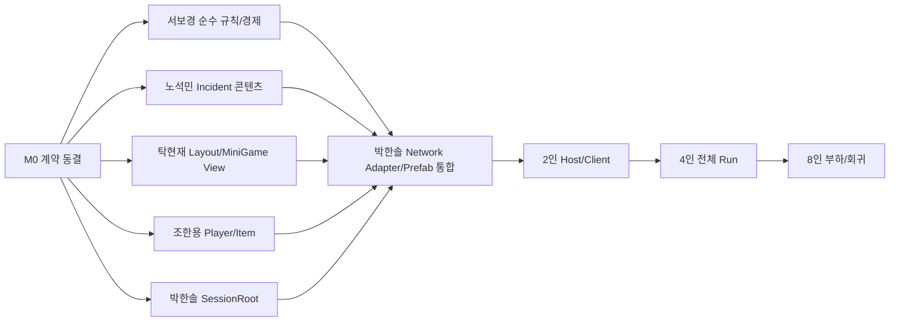

# Last Jump Crew 통합 작업 배분표

- 작성일: `2026-07-18`
- 기준 문서: `LASTJUMPCREW_INTEGRATED_GAMEPLAY_NETWORK_SPEC_0718.md`
- 상태: 팀 배포 전 검토본
- 배분 원칙:
  - 기존 담당 폴더와 Notion 담당을 유지한다.
  - 팀원은 기능 프리팹과 순수 도메인을 납품한다.
  - 공용 씬, NetworkManager, Network Prefab, Build Settings는 통합 담당자만 수정한다.
  - 네트워크 권위는 02 통합 계층에 모은다.

## 1. 최종 소유권

| 담당 | 최종 소유 | 폴더 |
|---|---|---|
| 박한솔 | 온라인 세션, NGO 권위, Run/Ship 지속 상태, 통합 씬, Network Prefab, Validator, Build | `Assets/02. ParkHanSol_TeamLeader_Build & Multi/` |
| 서보경 | 게임 규칙, 제한시간, 보상, Wallet, 가격, 재고, 상점 도메인 | `Assets/03. SeoBoGyeong_Game Economy/` |
| 노석민 | 외부 사건 콘텐츠, 내부 사고 규칙, 적, 사건 SO/Pool/Outcome | `Assets/04. NohSeokMin_Game Event/` |
| 탁현재 | 함선 공간, Room/Device 배치, Map 환경, Fire 표면, 미니게임 View, Warp 연출 | `Assets/05. TakHyunJae_Map & MiniGame/` |
| 조한용 | 플레이어 전투/체력/넉백, 아이템 공격·사용·투척, 도구 UX | `Assets/06. JoHanYong_PlayerSystem/` |

## 2. 공유 파일 잠금

아래 파일은 박한솔 통합자만 직접 수정한다.

- `Assets/02. ParkHanSol_TeamLeader_Build & Multi/01. Scene/0715/ParkHanSol_LobbyScene.unity`
- `Assets/02. ParkHanSol_TeamLeader_Build & Multi/01. Scene/0715/PHS_Map_ver1.unity`
- `Assets/02. ParkHanSol_TeamLeader_Build & Multi/01. Scene/0715/PHS_ExteriorShopScene.unity`
- `Assets/02. ParkHanSol_TeamLeader_Build & Multi/03. Prefab/PlayerPrefab/PHS_CuteWhiteGhost_Player.prefab`
- `Assets/01. MainGame/02. Final_Prefab/01. Prefab_ParkHanSol_TeamLeader/Prefab/DefaultNetworkPrefabs.asset`
- `Assets/DefaultNetworkPrefabs.asset`
- `Assets/01. MainGame/02. Final_Prefab/PHS_ShipRuntime.prefab`
- `Assets/01. MainGame/02. Final_Prefab/01. Prefab_ParkHanSol_TeamLeader/Prefab/Integration0716/PHS_EventRuntimeSystem.prefab`
- `Assets/01. MainGame/03. Common_Script/Interfaces/`
- `ProjectSettings/EditorBuildSettings.asset`
- `Packages/manifest.json`
- `Packages/packages-lock.json`

팀원 납품 방식:

1. 자기 폴더의 Prefab/SO/Script 작성.
2. Inspector 연결 완료.
3. 테스트 Prefab 또는 Test Scene 제공.
4. 필요한 통합 연결점을 짧은 README로 기록.
5. 박한솔이 Final Prefab과 0715 Scene에 조립.

## 3. 공용 계약 동결

### M0에서 먼저 확정할 것

- 활성 Player Prefab GUID 하나.
- 활성 Network Prefab List 하나.
- ItemId `lower_snake_case`.
- MapId `8000~8999`.
- EventId:
  - 내부 Legacy `710x`
  - 외부 `720x`
  - 환경 `730x`
- Ship Accident Wire Id `1~7`.
- InstanceId와 Revision 사용 규칙.
- 9구역 / 3구역마다 Shop.
- 제품 4인 / 기술 상한 8인.
- Run 중 신규 참가 금지.
- Shop Phase Gate.

### 공유 인터페이스 담당

박한솔이 골격을 만들고 각 담당자가 자기 계약만 검토한다.

| 계약 | 검토 담당 |
|---|---|
| `INetworkRunSessionState` | 박한솔, 서보경 |
| `IMapRuleProvider` | 서보경 |
| `IExternalIncidentRuntime` | 박한솔 |
| `IExternalIncidentContent` | 노석민 |
| `IShipAccidentRuntime` | 박한솔, 노석민 |
| `IMiniGameSessionService` | 박한솔 |
| `IMiniGameView` | 탁현재 |
| `IIncidentConsequencePolicy` | 노석민 |
| `IAtomicSaleService` | 박한솔, 서보경 |
| `IUtilityAttackTarget` 확장 여부 | 노석민, 조한용 |

## 4. 박한솔 배정

### PHS-P0-01 Persistent RunSessionRoot

상태: `P0 핵심 생명주기·2인 전체 루프 완료 / 후속 상태 연결 남음`

완료:

- 서버 소유 `NetworkRunSessionRoot`와 Lobby Bootstrap 제작.
- 활성 Network Prefab List 등록과 Inspector 연결.
- `NetworkRunFlowCoordinator` Player Prefab 분리.
- `NetworkShipSystemsState` Map Ship Runtime 분리.
- External Event Impact Adapter Root 이동.
- Compile 0, 0715 Validator 0, Lobby -> Map 및 Lobby -> Shop 상태 유지 확인.
- NGO Scene Populate 완료 전 Debris Spawn으로 발생하던 `GlobalObjectIdHash` 중복 원인 수정.
- 다섯 Debris Prefab의 Rigidbody Inspector 참조와 Validator 계약 추가.
- 새 Development Build에서 2인, 9구역, Shop 3회, `FinalShop -> Clear` 자동 루프 통과.
- 같은 루프에서 Root `NetworkObjectId=2` 단일 생성과 Ship State `revision=17` 재바인딩 확인.
- Headless 시각 검증 오탐 제거, MiniGame Lamp 발광 Material과 Inspector Validator 수정.

남음:

- Party Wallet/Delivery Queue.
- Server RNG/Compatibility.
- Stage Deadline.
- 4/8인과 Late Join.

구현 문서:

- `Docs/PHS_RUN_SESSION_ROOT_IMPLEMENTATION_0718.md`

목표:

- Run/Ship/Wallet/RNG가 Scene과 Player 생명주기에 종속되지 않게 한다.

작업:

- Server-Owned Persistent NetworkObject 생성.
- `NetworkRunFlowCoordinator`를 Player Prefab에서 분리.
- `NetworkShipSystemsState`를 Map Scene 상태에서 분리.
- Stage Deadline, Active Map, Cleared Zone, Shop Cycle 복제.
- Party Wallet/Delivery Queue 지속성 연결.
- Scene View 재바인딩 계약 추가.

완료 기준:

- Map -> Shop -> Map 후 Ship HP, Module Fault, Wallet 유지.
- Host Player 교체와 Player Despawn 뒤에도 Run 유지.
- Client HUD Timer/Phase 일치.

### PHS-P0-02 Run 규칙 통합 Adapter

작업:

- 03의 `IGameStateProvider/IGameCommands`를 Server Adapter로 연결.
- 9구역/3구역 Shop 규칙 적용.
- Map Profile의 제한시간/보상/Advance 규칙 사용.
- Shop 경계에서도 Active Map Commit.
- 같은 Map 연속 선택 방지.
- Server Seed 기반 선택지 2개.

완료 기준:

- 3/6 구역 후 Shop.
- 9구역 후 FinalShop/Clear.
- ActiveMap과 CurrentProfile이 모든 Peer에서 일치.

### PHS-P0-03 Network 설정

작업:

- 제품 4인, 기술 상한 8인 적용.
- Run 시작 후 Session Join 잠금.
- Approval Payload에 Protocol/Build/Content Hash.
- Connection Reject Reason 표준화.
- Network Prefab List 단일화.
- 중복 Player Prefab 등록 제거.

완료 기준:

- 2/4/8인 연결.
- Protocol/Content mismatch 거절.
- Run 중 신규 참가 거절.

### PHS-P0-04 Item/거래 권위

작업:

- 현재 미추적 핵심 파일의 소유권과 제출 범위 확정:
  - `INetworkItemPickupRequester`
  - `NetworkPlayerItemLifecycle`
  - `NetworkItemPhysicsAuthority`
  - `UtilityItemCatalogSO`
- Pickup/Drop/Throw에 LOS와 Rate Limit.
- Sale를 원자 트랜잭션으로 변경.
- Purchase/Sale/Delivery Idempotency 검증.
- Held/Dropped Prefab과 Network Prefab 등록 검증.

완료 기준:

- Wallet 실패 시 Item 유지.
- Replay 판매/구매 거절.
- 벽 너머 Pickup 거절.

### PHS-P0-05 Incident Network Authority

작업:

- 외부/내부 Incident 공용 Pressure Budget.
- Legacy Scheduler 활성 0개 Validator.
- External 720x만 NGO Scheduler에 허용.
- 내부 1~7은 Ship Accident Coordinator만 허용.
- Consequence 단계별 Idempotency.
- MiniGame Session/Nonce/Occupancy/Expiry.

완료 기준:

- 외부 사건 한 번당 Consequence 한 번.
- Legacy/New Fire 이중 발생 없음.
- MiniGame Replay/원거리/동시 점유 거절.

### PHS-P0-06 Scene 통합

작업:

- Shop Portal을 Shop/FinalShop Phase로 제한.
- Map 내부 외부 플랫폼에 Collection/Safe/Danger/Death Volume 배치.
- `PHS_DebrisCollectionScene`을 Legacy로 Validator에 명시.
- 팀 납품 Prefab을 0715 Scene에 Inspector 연결.
- Build Settings 3씬 정책 재검증.

완료 기준:

- Play 중 Shop 진입 거부.
- 외부 잔류자가 Safe 인원 계산에 반영.
- Scene Missing Reference 0.

### PHS-P1-01 Validator/빌드

완료:

- Contract Validator.
- 2인 Runtime Validation.
- 9구역 전체 Loop 자동 검증.
- Incident/Shop/Item 자동 회귀 검증.
- Debris Hash/Physics/Scene Event/MiniGame Indicator 오류를 Runner Health 실패 조건에 추가.

남음:

- Fire Patch 확산·범위 피해 회귀 검증.
- 4/8인 Runtime Validation.
- Late Join/복구 검증.

### 박한솔이 직접 하지 않는 것

- 미니게임 UI 로직 제작.
- 적 AI 콘텐츠 제작.
- Fire VFX 직접 제작.
- Map Geometry와 Room 배치 제작.
- 플레이어 공격 감각과 도구 애니메이션 제작.
- 상품 가격/보상 수치 단독 결정.

## 5. 서보경 배정

### SBG-P0-01 게임 규칙 원장 정리

대상:

- `GameLoopState`
- `GameLoopController`
- `IGameStateProvider`
- `IGameCommands`

작업:

- `SHOP_INTERVAL=3`.
- `TOTAL_ZONES=9`.
- 고정 300초 제거.
- `IMapRuleProvider`에서 제한시간과 보상을 받는다.
- Stage Timer를 Deadline 기반으로 표현 가능하게 한다.
- Shop/FinalShop/CloseShop 전이를 명시한다.

납품:

- NGO 의존 없는 순수 규칙.
- 단위 테스트 또는 Test Driver.

완료 기준:

- 3/6 Shop, 9 FinalShop.
- Map별 시간값 적용.
- Pause/Resume 후 시간 손실 없음.

### SBG-P0-02 Wallet과 원자 거래

작업:

- `IWallet`의 실패 조건 명시.
- Credit Add/Spend의 Transaction 결과 타입 제공.
- Sale/Purchase Rollback에 필요한 예약 계약 제공.
- RewardGrantId 중복 방지 정책.

완료 기준:

- 같은 TransactionId 두 번 반영 안 됨.
- 부분 성공 없음.

### SBG-P0-03 가격/상품 Source of Truth

작업:

- 구매가격은 `ShopProductData`.
- 판매가격은 `UtilityItemPrefabData`.
- 03 int ItemData는 메타/프로토타입 또는 Adapter 입력으로 제한.
- 같은 상품의 3중 가격표 제거.
- 미구현 고급 도구는 Shop 노출 금지.

완료 기준:

- Catalog 검증에서 가격 충돌 0.
- Buy/Sell 가격표 문서 제공.

### SBG-P1-01 Map 보상과 Shop 밸런스

작업:

- Difficulty별 Clear Reward.
- Debris 판매 기대값.
- 3구역 Shop 구매력.
- Dock Repair 가격.
- 4인 기준 공유 Wallet 소비량.

### 서보경이 건드리지 않는 것

- NetworkObject.
- ServerRpc/ClientRpc.
- Network Prefab List.
- 0715 통합 씬.
- Player Prefab.
- Event Scheduler.

## 6. 노석민 배정

### NSM-P0-01 사건 Source of Truth 정리

작업:

- 7201 EnemyScout.
- 7202 MeteorAttack.
- 7203 EmpAttack.
- 사건별 Start/Success/Fail/Expire 표 작성.
- 피해 시점 하나만 선택.
- Fail Consequence를 Ship Accident Request로 표현.

완료 기준:

- 사건당 피해/Child Incident 최대 1회.
- EventInstanceId 기반 결과 추적.

### NSM-P0-02 Legacy Scheduler 격리

대상:

- `EventScheduler`
- `ZoneEventScheduler`
- Legacy 710x Fire/Oxygen/Enemy

작업:

- 자체 Update Spawn 경로를 통합 Prefab에서 비활성.
- Legacy Event는 콘텐츠 Adapter로 호출될 때만 실행.
- Fire/Oxygen의 직접 Ship Damage 중복 제거.
- 기존 Pool과 SO를 삭제하지 않고 콘텐츠 계층으로 유지.

완료 기준:

- 통합 씬에서 Legacy Scheduler active 0.
- 서버 한 곳에서만 사건 생성.

### NSM-P0-03 Fire 도메인

작업:

- `PHSFireZone`.
- `PHSFirePatch`.
- `PHSFirePatchLink`.
- Heat/Intensity 전이.
- 인접 확산 후보 계산.
- 범위 피해 대상 수집 규칙.
- 산소/문/풍향은 P1 Hook만 제공.

권위 제한:

- 순수 계산과 Scene Authoring Component를 제공.
- NetworkList, ServerRpc, NetworkObject Spawn은 소유하지 않는다.

완료 기준:

- 점이 아닌 면적 Patch.
- 인접하지 않은 Patch 확산 없음.
- 동일 대상 Collider 중복 피해 제거 가능.

### NSM-P0-04 적 침투 콘텐츠

작업:

- EnemySpawn 콘텐츠.
- Player/Device 우선순위.
- Health/State/Target/Death Snapshot에 필요한 읽기 계약.
- 서버 AI와 Client Presentation 분리.

### NSM-P1-01 환경 사건

- 730x Zone 이벤트를 Map Profile용 콘텐츠로 정리.
- Map 환경별 위협 가중치/연출 제공.

### 노석민이 건드리지 않는 것

- NetworkManager.
- NGO Scheduler 권위.
- 0715 통합 씬.
- Player Inventory.
- Wallet.
- MiniGame 결과 확정.

## 7. 탁현재 배정

### THJ-P0-01 함선 Incident Layout

작업:

- 실제 Room/Device 기준 Incident Zone 제작.
- 실제 Generator/Battery/Engine/Panel 위치에 Anchor.
- Fire 표면 Patch와 Neighbor Link 배치.
- Presentation Root와 Collider 연결.
- Repair 접근 동선 검토.

납품:

- 함선 Layout Prefab.
- Anchor ID 표.
- Room ID 표.
- Fire Patch Link 표.

완료 기준:

- Generic 빈 Box Anchor 없음.
- 실제 설비 또는 표면에 사고 발생.
- Presentation Root 위치 오류 없음.

### THJ-P0-02 MiniGame View

작업:

- Cannon.
- PowerSync.
- WireFix.
- `IMiniGameView` 구현.
- Server Session이 제공한 Seed/Nonce를 사용.
- 결과는 View가 확정하지 않고 Session Service에 제출.
- Terminal Occupied UI.

완료 기준:

- EventInstance와 TerminalInstance를 표시 가능.
- Timeout/Cancel/Disconnect 처리.
- DoorKeypad는 P0 Event 매핑에서 제외.

### THJ-P0-03 Warp/Map Presentation

작업:

- 기존 WarpManager의 로컬 Phase 권위 제거.
- `IWarpTransitionView` 기반 VFX/Audio만 제공.
- Map Environment Prefab 교체 구조.

### THJ-P1-01 4개 Map 차별화

| Map | 필수 차이 |
|---|---|
| 8001 폐기물 궤도 | 많은 Debris, 낮은 외부 위협 |
| 8002 소행성 지대 | Meteor 빈도/시각 장애 |
| 8003 파손 위성군 | Device/EMP 위험 |
| 8004 성운 잔해지대 | 시야/미니맵 방해 |

납품:

- Map별 Environment Prefab.
- Skybox/Lighting.
- Debris Spawn Volume.
- 위험 Volume.

### 탁현재가 건드리지 않는 것

- Run Phase.
- Scene Load.
- NetworkVariable.
- Event Spawn 권위.
- Network Prefab List.
- Wallet/Reward.

## 8. 조한용 배정

### JHY-P0-01 플레이어 Source of Truth

작업:

- 06의 Player Prefab 복사본을 활성 Prefab으로 사용하지 않는다.
- `NetworkPlayerCombatController`.
- `NetworkPlayerHealth`.
- `NetworkPlayerKnockbackReceiver`.
- 활성 02 Player Prefab에 붙일 Component Prefab 또는 구성표 납품.

완료 기준:

- 이동 권위는 02 `NetworkPlayerController` 하나.
- 전투/체력/넉백은 중복 Component 없음.

### JHY-P0-02 기본 도구

작업:

- Wrench.
- Fire Extinguisher.
- Battery.
- Use/Throw/Impact.
- Held ItemId 검증.
- Server Cooldown.
- Continuous Use 전송 Rate 제한.

완료 기준:

- 서버가 ItemId/Revision/Range를 검증.
- Frame마다 무제한 RPC/VFX 송신 없음.
- Wrong Item/원거리/Replay 거절.

### JHY-P0-03 사고 대응 연결

작업:

- Wrench -> Device/Steam/Oxygen/Gravity Repair.
- Extinguisher -> Fire Patch Heat 감소.
- Battery -> Power Socket.
- Foam Sealant -> Hull Breach.
- 입력은 하나의 Utility Attack 경로로 통합.

완료 기준:

- F 수리와 LMB 수리가 같은 사고에 이중 Progress를 주지 않는다.
- 사고별 공식 입력 방식이 하나다.

### JHY-P1-01 고급 도구

대상:

- Auto Repair Kit.
- Foam Sealant Gun.
- Futuristic Adjustable Wrench.
- Futuristic Canister.
- Tripo Fire Extinguisher.

작업:

- Placeholder 로그를 실제 효과로 교체.
- 내구도 또는 횟수 정책.
- 기본 도구 대비 성능 차이.

### JHY-P1-02 외부 수집 UX

- 무중력 이동/충돌.
- Debris 들기/던지기.
- Safe/Danger 피드백.
- 사망 시 Held Item 처리.

### 조한용이 건드리지 않는 것

- NetworkManager.
- RunFlow.
- Wallet.
- Shop 가격.
- Event Scheduler.
- 0715 통합 씬.

## 9. 의존성 순서

### M0 계약 동결

- 코드 착수 전.
- 공용 ID와 Interface Signature만 확정.
- 공유 Scene 수정 금지.

### M1 팀별 독립 납품

- 팀 폴더 안에서 작업.
- Test Prefab/Test Scene으로 기능 증명.
- NGO 권위 없이 순수 Domain/View 납품.

### M2 통합

- 박한솔이 Final Player/Ship/Event/Map Prefab 조립.
- Network Prefab 등록.
- 0715 Scene Inspector 연결.
- Validator 실행.

### M3~M5 검증

- 2인 기능 계약.
- 4인 전체 게임 루프.
- 8인 연결/부하/동시 사고.

## 10. 팀별 제출 체크리스트

각 팀원:

- [ ] 자기 폴더만 수정.
- [ ] Interface 파일명 `I` 시작.
- [ ] Inspector 참조 Null 없음.
- [ ] 자동 `Find` fallback 없음.
- [ ] 기능 Prefab 제공.
- [ ] SO/Data 제공.
- [ ] 입력/출력 계약 기록.
- [ ] 실패 로그 이유 기록.
- [ ] Compile Error 0.
- [ ] 통합자가 수정할 파일 목록 기록.

통합자:

- [ ] 팀원 원본 파일을 이동/삭제하지 않음.
- [ ] GUID 유지.
- [ ] Network Prefab 중복 없음.
- [ ] Scene Missing Reference 0.
- [ ] Build Settings 검증.
- [ ] MCP/AI 설정 파일 Stage 안 됨.
- [ ] 범위 밖 Unity 자동 변경 Stage 안 됨.

## 11. 완료 정의

팀 배분 작업 완료는 코드 작성이 아니라 아래 결과까지다.

1. 팀별 Prefab/SO/Script 납품.
2. 공용 계약 준수.
3. 0715 통합 씬 연결.
4. Host+Client 실제 실행.
5. 4인 전체 Run 9구역.
6. Scene 전환 뒤 Run/Ship/Wallet 유지.
7. 사건/사고/미니게임 단일 권위.
8. 문서와 실제 Inspector 상태 일치.

## 12. 박한솔 현재 직접 할당 요약

새 기능 배정은 더 추가하지 않는다. 박한솔은 기존 공용 권위·통합 범위만 끝낸다.

완료된 선행 작업:

1. Persistent RunSessionRoot와 Run/Ship 상태의 Scene 독립.
2. Debris NGO Scene Load 생명주기와 Rigidbody 참조 수정.
3. 2인 9구역/Shop 3회/FinalShop/Clear 자동 검증.

현재 직접 남음:

1. Wallet/Delivery Queue 지속화 Adapter.
2. Stage Deadline 서버 복제.
3. Server RNG/Compatibility와 Session Approval 계약.
4. Run 규칙/Active Map Commit의 남은 통합 검증.
5. 외부 수집 Safe/Danger와 Sale 원자성 통합.
6. Incident Budget/Legacy Scheduler 차단과 MiniGame Session Authority.
7. 팀 납품 Prefab의 최종 Scene/Inspector 조립.
8. 4/8인과 Late Join 검증.

박한솔이 기다려야 하는 입력:

- 서보경: 순수 규칙, Wallet/가격 계약.
- 노석민: Incident Outcome과 Fire/Enemy 콘텐츠.
- 탁현재: Layout/Fire Patch/MiniGame View/Map Prefab.
- 조한용: Player Combat/도구/투척 Component.

즉, 박한솔 작업을 더 추가하는 단계가 아니라 공용 권위와 통합만 맡고 콘텐츠 구현은 팀에 넘겨야 한다.

## 13. 팀 배포용 요약문

### 서보경 전달

`03`에서 게임 규칙과 경제 원장을 맡습니다. P0는 9구역/3구역 상점 규칙, Map Profile 기반 제한시간·보상, Wallet 원자 거래, 구매/판매 가격 Source of Truth 정리입니다. NGO/공용 씬은 수정하지 말고 순수 규칙·Interface·Test Driver로 납품해주세요.

### 노석민 전달

`04`에서 외부 사건, 내부 사고 규칙, Fire, Enemy 콘텐츠를 맡습니다. P0는 720x 사건 Outcome 표, Legacy Scheduler 비활성화, Fire Zone/Patch/Link 도메인, Enemy 상태 읽기 계약입니다. 사건 자동 Spawn과 네트워크 권위는 02가 담당하므로 Local Update Scheduler와 직접 Ship Damage 중복은 넣지 않습니다.

### 탁현재 전달

`05`에서 함선 공간, 실제 사고 위치, Fire 표면, 미니게임 View, Warp/Map 연출을 맡습니다. P0는 실제 Device/Room Anchor, Fire Patch 링크, Cannon/PowerSync/WireFix `IMiniGameView`입니다. Run Phase·Scene Load·결과 확정은 하지 않고 Prefab/Inspector 연결본으로 납품해주세요.

### 조한용 전달

`06`에서 Player Combat/Health/Knockback과 도구 사용·투척을 맡습니다. P0는 Wrench/Extinguisher/Battery 서버 검증, Continuous Use Rate 제한, 사고 대응 입력 단일화입니다. 이동 권위와 활성 Player Prefab은 02 한 개를 사용하고 06 Player Prefab 복사본을 새 활성본으로 만들지 않습니다.

### 박한솔 통합

`02`에서 Persistent RunSessionRoot, Run/Ship/Wallet 지속화, Network 설정, Scene/Prefab 조립, Incident/MiniGame Session 권위, Validator와 2·4·8인 검증을 맡습니다. 팀원 콘텐츠를 직접 대신 구현하지 않고 Interface/Adapter와 최종 Inspector 연결만 담당합니다.
