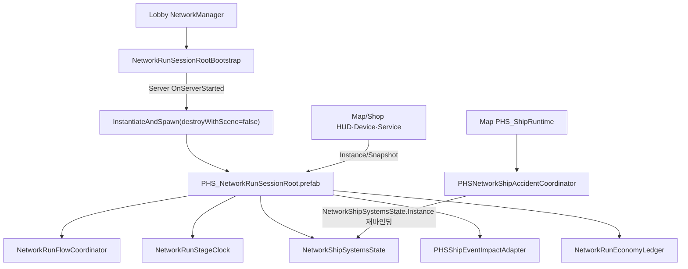

# PHS Network RunSessionRoot 설계·제작 명세

- 작성일: `2026-07-18`
- 구현 단계: `P0 핵심 생명주기·Stage Clock·Economy 원장 완료 / RNG 이후 원장 연결 중`
- 담당: 박한솔 / `Assets/02. ParkHanSol_TeamLeader_Build & Multi/`

## 1. 목적

`RunSessionRoot`는 한 판 동안 유지되어야 하는 서버 권위 상태를 Player와 개별 Scene의 생명주기에서 분리한다.

현재 1차 구현이 해결한 문제:

- Player마다 `NetworkRunFlowCoordinator`가 생기던 구조 제거.
- `Single` Scene 전환 때 Ship HP와 Module 상태가 초기화될 수 있던 구조 제거.
- Host Player 유무에 RunFlow 생성이 종속되던 구조 제거.
- 외부 사건 결과 피해가 Persistent Ship State에 적용되도록 Impact Adapter 이동.

## 2. 런타임 구조

Root Prefab:

`Assets/02. ParkHanSol_TeamLeader_Build & Multi/03. Prefab/Integration/PHS_NetworkRunSessionRoot.prefab`

구성:

- `NetworkObject`
- `NetworkRunFlowCoordinator`
- `NetworkRunStageClock`
- `NetworkShipSystemsState`
- `PHSShipEventImpactAdapter`
- `NetworkRunSessionRoot`
- `NetworkRunEconomyLedger`

Bootstrap:

- Lobby `NetworkManager` GameObject에 `NetworkRunSessionRootBootstrap` 배치.
- Root Prefab을 Inspector로 직접 연결.
- 서버의 `OnServerStarted`에서 한 번만 생성.
- `NetworkSpawnManager.InstantiateAndSpawn(..., destroyWithScene: false)` 사용.
- Root는 서버 소유이며 Player Object가 아니다.

## 3. 상태 소유권

### 1차 구현 완료

| 상태 | 최종 소유자 |
|---|---|
| Run Phase | `NetworkRunFlowCoordinator` |
| Warp Charge | `NetworkRunFlowCoordinator` |
| Cleared Zone Count | `NetworkRunFlowCoordinator` |
| Shop Cycle Count | `NetworkRunFlowCoordinator` |
| Active/Selected Map Id | `NetworkRunFlowCoordinator` |
| Warp Safe Player Count | `NetworkRunFlowCoordinator` |
| Stage Deadline/Remaining/Sequence | `NetworkRunStageClock` |
| Ship HP | `NetworkShipSystemsState` |
| Module HP/Fault | `NetworkShipSystemsState` |
| Power/Gravity/Battery | `NetworkShipSystemsState` |
| Last Damage Cause/Revision | `NetworkShipSystemsState` |
| Party Credits/Wallet Revision | `NetworkRunEconomyLedger` |
| Purchase Delivery Entry/State | `NetworkRunEconomyLedger` |

### 후속 구현

- Server RNG Seed/Sequence.
- Protocol Version/Content Catalog Hash.
- Incident Pressure/Budget.

후속 상태도 Root에 같은 GameObject로 무조건 몰아넣지 않는다. 상태별 OOP 컴포넌트를 두고 `NetworkRunSessionRoot`는 수명과 조립 경계만 담당한다.

### Stage Clock 계약

- `PHSMapProfileSO.StageTimeLimitSeconds`가 구역별 제한시간 원본이다.
- 서버만 `Start / Pause / Resume / Stop / Expire` 전환을 실행한다.
- `MapId / StageSequence / Revision / State / DeadlineServerTime / FrozenRemainingSeconds`를 하나의 Snapshot으로 복제한다.
- Running 중에는 매 프레임 값을 쓰지 않고 각 Peer가 NGO Server Time과 Deadline 차이로 Remaining을 계산한다.
- 워프 요청이 승인되는 순간 Pause하고, 점프 거절 때만 Resume한다.
- 성공한 점프·Shop·Clear·GameOver에서 Stop하며, Expire 결과 피해와 GameOver는 Sequence별 한 번만 처리한다.
- 구형 `LocalGameSession` Stage Timer는 구역 선택 직후 Pause하고 HUD fallback으로 사용하지 않는다.

### Economy 계약

- 시작 파티 크레딧은 Root Prefab Inspector의 `startingCredits=500`이다.
- 서버만 판매·보상·수리·구매 거래를 커밋한다.
- 일반 거래는 안정적인 `transactionId`로 중복 커밋을 차단한다.
- 구매는 `TryCommitPurchaseServer` 하나에서 잔액 차감과 Delivery Entry 추가를 함께 처리한다.
- 각 Delivery Entry에 개별 `PurchaseId`를 보존하여 Shop 씬 재생성 뒤 순서 변경·부분 재시도도 중복 결제하지 않는다.
- Delivery Entry는 삭제하지 않고 `Pending → Claimed → Delivered` 상태와 revision을 남긴다.
- 상자 적용 실패는 `Claimed → Pending`으로 복구하고, 성공한 경우만 `Delivered`로 확정한다.
- Delivery 변경 알림은 같은 revision의 Economy Snapshot이 도착한 뒤 공개한다.
- Shop Wallet Adapter는 Root가 늦게 Spawn되어도 `InstanceAvailable` 신호로 다시 바인딩한다.
- `ShopEconomyWalletAdapter`와 `SessionPurchaseDeliveryService`는 씬 상태 소유자가 아니라 Root 원장의 어댑터다.
- Network Session에서는 `GameCore`의 로컬 `CreditWallet`과 static Delivery Queue를 사용하지 않는다.
- 개인 로비 꾸미기 크레딧은 파티 Economy 원장과 분리한다.

### Economy P1 잔여 경계

- 현재 `Delivered`는 “배송 상자/Overflow에 배치 완료” 의미이며 “플레이어가 실제 수령 완료” 의미가 아니다.
- 미수령 물건을 둔 채 Shop으로 이동했다가 Map으로 돌아오면 Scene Local 슬롯·Overflow가 초기화되므로 재구축되지 않는다.
- 해결 시 상태를 `Pending → Boxed → Collected`로 분리하고, `EntryId ↔ Slot` 할당을 복제해야 한다.
- 실제 수령은 플레이어 Held Item 서버 할당 성공 뒤에만 확정하고, Map Scene 종료 시 미수령 `Boxed` Claim을 반환해야 한다.
- 이 변경은 슬롯 상호작용의 서버 RPC 경로와 Held Item rollback이 함께 필요하므로 Economy 원장 PR 뒤 별도 통합 작업으로 둔다.

## 4. Scene 책임

Persistent:

- Run 상태.
- Ship 상태.
- 외부 사건 실패 피해 중복 방지 기록.

Scene Local:

- 함선 Room/Device/Accident Anchor.
- `PHSNetworkShipAccidentCoordinator`.
- Fire/Steam/Oxygen Presentation.
- HUD와 실제 Device View.

`PHSNetworkShipAccidentCoordinator`는 Map Scene의 Anchor를 소유하므로 Root로 이동하지 않는다. 서버 명령 실행 시 `NetworkShipSystemsState.Instance`를 재바인딩한다.

## 5. Network와 Local 분리

서버 처리:

- Root 생성/소유.
- Run Phase와 Map Commit.
- Stage Clock 시작·정지·일시정지·만료 판정.
- Ship/Module 피해·수리.
- 사건 결과 적용.
- 파티 크레딧·구매 Delivery 거래 커밋.

클라이언트 처리:

- NetworkVariable/NetworkList Snapshot 읽기.
- 동기화된 Server Deadline으로 Stage Remaining 표시.
- Economy Snapshot과 Delivery 상태 표시.
- HUD, VFX, Audio, Device 표시.
- Root 생성 또는 상태 직접 변경 금지.

Local 전용:

- Camera.
- 입력.
- Screen/UI Animation.
- Audio Listener.

## 6. Prefab·Scene 변경

- 활성 Player Prefab에서 `NetworkRunFlowCoordinator` 제거.
- `PHS_ShipRuntime.prefab`에서 `NetworkShipSystemsState`와 `PHSShipEventImpactAdapter` 제거.
- Root Prefab을 활성 `DefaultNetworkPrefabs.asset`에 등록.
- Lobby `NetworkManager`에 Bootstrap과 Root Prefab Inspector 참조 연결.
- `PHS0715IntegrationValidator`를 Player/Map 소유 검사에서 Root 소유 검사로 변경.
- `PHSShipDockRepairService`는 Root Singleton을 실행 시점에 조회하도록 변경.
- Root Prefab의 마지막 `NetworkBehaviour`로 `NetworkRunEconomyLedger`를 추가해 기존 NGO Behaviour 인덱스를 보존.
- 활성 Map/Shop의 `PHS_PurchaseSessionState`에서 `SessionPurchaseStateRoot`만 제거하고 Delivery Adapter는 유지.
- Shop 구매의 결제 차감과 Delivery Queue 등록을 단일 원장 API로 교체.

## 7. 검증 결과

Editor:

- Unity `6000.5.2f1`.
- Compile Error `0`.
- `PHS_0715_VALIDATE_OK errors=0 scenes=3 prefabs=11`.
- `PHS_0717_VALIDATION_BUILD_OK path=Builds/PHS0717Validation/LastJumpCrew.exe size=345165983`.

Host Runtime:

- Lobby에서 Root 정확히 `1`개.
- Server Owner `0`.
- `DestroyWithScene=false`.
- Root의 RunFlow/ShipState가 Singleton과 동일 인스턴스.
- Lobby에서 Ship HP `100 -> 93` 적용 후 Map 진입:
  - Root `NetworkObjectId=2` 유지.
  - Ship HP `93` 유지.
- 별도 세션에서 Lobby Ship HP `100 -> 89` 적용 후 Shop 진입:
  - Root `NetworkObjectId=2` 유지.
  - Ship HP `89` 유지.

2026-07-18 Host + Client 전체 자동 루프:

- Root 생성 로그는 `READY 1회`, `SPAWNED 1회`, `NetworkObjectId=2`.
- Ship State `revision=17`이 반복 Map/Shop 전환 뒤 Scene HUD와 Gravity View에 재바인딩됨.
- 2 Peer로 `9`구역, Shop `3`회, `FinalShop -> Clear` 완료.
- Stage Clock sequence `1~9`에서 모든 Peer의 MapId/State/Revision이 일치했다.
- Running Remaining 최대 차는 `0.054초`, Warp Pause 뒤 `1.5초` 안정 변화는 `0.000초`였다.
- 첫 Shop 복귀에서 선택 Map을 Active Map으로 선행 Commit한 뒤 sequence `5`를 시작했다.
- 외부 사건 `3`종, MiniGame API Outcome `6`, 원격 Item 소유권, Debris 판매·재진입 통과.
- Debris 판매 후 2 Peer가 `credits=553`, `revision=2`, 동일 `SaleCredit` 거래 ID를 수신.
- 구매 잔액 부족 요청은 Wallet/Delivery revision 변화 없이 거절.
- 구매 성공 시 2 Peer가 `credits=443`, `pending=1`, `PurchaseDebit` 거래를 수신.
- Map 복귀 상자가 Entry를 적용한 뒤 2 Peer가 `pending=0`, `claimed=0`, `delivered=1`을 수신.
- Map Scene을 `10`회 로드했고 매번 Network Debris가 설정 범위 `20~30` 안에서 서버 생성됨.
- 최종 로그:
  - `PHS_P0_RESULT PASS ... zones=9 shopCycles=3 runPhase=Clear`.
  - `PHS_P0_LOG_HEALTH_OK`.
- 금지 로그 `0`:
  - `ScenePlacedObjects which already contains`.
  - `same GlobalObjectIdHash`.
  - `PHS_NETWORK_ITEM_PHYSICS_FAILED`.
  - `PHS_DEBRIS_STREAM_SETUP_FAILED`.
  - `SceneEventInProgress`.
  - `PHS_MINIGAME_INDICATOR_SLOT_INVALID`.
  - `PHS_MINIGAME_INDICATOR_SETUP_INVALID`.

미검증:

- 실제 원격 Client Late Join.
- 4/8인.
- RNG/Compatibility.
- Late Join Stage Clock/Economy 복원과 짧은 Timeout 단발 시나리오.
- 미수령 배송품의 Map → Shop → Map 재구축과 실제 수령 확정.

## 8. Debris Scene Load 차단점 해결

원인:

- 다섯 Dropped Debris Prefab의 `GlobalObjectIdHash` 자체는 서로 달랐다.
- `PHSRandomDebrisStream.Awake()`가 NGO의 `PopulateScenePlacedObjects()` 처리 중 Scene Seed를 복제·Spawn했다.
- 복제본이 Scene-Placed 상태를 상속해 같은 Prefab Hash가 Scene Object Dictionary에 중복 등록됐다.
- `NetworkItemPhysicsAuthority.Awake()`의 `??=`는 Unity fake-null 직렬화 참조를 복구하지 못해 Rigidbody 누락 로그도 만들었다.

수정:

- Network Debris는 서버의 해당 Scene `OnLoadComplete` 뒤에만 초기화한다.
- Scene Seed 복제가 아니라 `UtilityItemPrefabData.DroppedPrefab`을 생성 원본으로 사용한다.
- 생성 Object를 Map Scene으로 옮긴 뒤 `NetworkObject.Spawn(true)`로 Scene 수명에 귀속한다.
- Client는 Debris 생성과 이동을 수행하지 않는다.
- 다섯 Debris Prefab의 `targetRigidbody`를 Inspector 참조로 명시했다.
- `PHS0715IntegrationValidator`가 Map Debris Source의 Dropped Prefab, Physics Authority, Rigidbody 참조를 검사한다.

결과:

- 정적 Validator 통과.
- 새 Development Build의 2인 전체 자동 루프 통과.
- Map `10`회 Load와 Shop `3`회 왕복 동안 Hash 중복, Physics Authority 실패, Scene Event 잔류 `0`.

## 9. 다음 작업 순서

1. Run RNG 원장과 Map Choice 소비자 연결.
2. Incident Pressure/Budget 원장 연결.
3. Debris/Shop RNG 소비자 연결.
4. Compatibility Gate/Protocol/Catalog Hash 연결.
5. 4/8인과 Late Join 검증.
