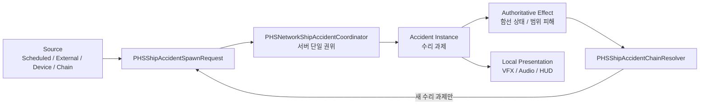

# PHS 함선 사고 통합 시스템 상세설계 및 기능 명세

- 문서 버전: `0.2`
- 작성일: `2026-07-18`
- 대상 프로젝트: `LastJumpCrew`
- 대상 씬: `Assets/02. ParkHanSol_TeamLeader_Build & Multi/01. Scene/0715/PHS_Map_ver1.unity`
- 구현 담당 기본 경로: `Assets/02. ParkHanSol_TeamLeader_Build & Multi/`
- 상태: 통합 마스터 설계 반영. 구현 전 계약 검토 필요.
- 상위 문서: `Docs/LASTJUMPCREW_INTEGRATED_GAMEPLAY_NETWORK_SPEC_0718.md`

## 1. 목적

함선 내부에서 발생하는 사고를 하나의 서버 권위 시스템으로 통합한다.

필수 목표:

1. 사고가 실제 함선 구획과 설비에서 발생한다.
2. 외부 위협, 설비 파괴, 자연 고장, 연쇄 사고가 같은 사고 생성 경로를 사용한다.
3. 사고 원인, 수리 대상, 공간 증상, 연쇄 사고를 분리한다.
4. 화재는 임의 점 생성이 아니라 실제 표면을 따라 인접 확산한다.
5. 화재 범위 안 플레이어와 설비가 서버 판정 피해를 받는다.
6. Host, Client, Late Join이 같은 사고 상태와 연출을 본다.
7. 프리팹·씬 Inspector 참조를 위치 권위로 사용한다.

## 2. 용어와 강제 수준

- `MUST`: 필수. 완료 기준에 포함한다.
- `SHOULD`: 권장. 제외 시 이유를 기록한다.
- `MAY`: 선택 기능.
- `Source`: 사고가 시작된 원인.
- `Accident`: 플레이어가 해결해야 하는 수리 과제.
- `Effect`: 사고 때문에 나타나는 정전, 무중력, 화염, 연기, 흡입력, 피해 범위.
- `Chain`: 기존 사고가 별도의 새 수리 과제를 만든 경우.
- `Zone`: Bridge, MainHall 같은 함선 구획.
- `Anchor`: 실제 수리 위치와 상호작용 위치.
- `Patch`: 화재 한 건 안에서 타고 있는 하나의 표면 영역.

## 3. 범위

### 3.1 포함

- 신형 함선 사고 7종 통합.
- 외부 이벤트 `7201/7202/7203` 실패 결과 연결.
- 실제 구획·설비 기반 사고 위치.
- 서버 권위 사고 선택, 피해, 수리, 연쇄.
- 화재 표면 확산, 범위 피해, 소화.
- 사고 HUD, 함선 지도 마커, 3D 연출 계약.
- 레거시 내부 이벤트 단계적 제거.
- Editor/PlayMode/Host-Client/Late Join 검증.

### 3.2 제외

- 완전한 유체 기반 화재 시뮬레이션.
- 불꽃 하나마다 `NetworkObject` 생성.
- 런타임 무작위 좌표 또는 `Find` 기반 위치 보강.
- 새 플레이어 산소 수치 시스템의 즉시 도입.
- 적 침입 전투 시스템 전체 리팩터링.
- 다른 팀원 소유 에셋의 범위 밖 수정.

## 4. 현재 구조 기준선

### 4.1 신형 사고

현재 사고 ID:

| ID | 사고 | 현재 모듈 | 현재 수리 |
|---:|---|---|---|
| 1 | Fire | LifeSupport | 소화기 5회 |
| 2 | PowerFailure | Power | 배터리팩 4회 |
| 3 | DeviceFailure | Engine | 렌치 5회 |
| 4 | HullBreach | LifeSupport | 폼 실란트 5회 |
| 5 | SteamLeak | Engine | 렌치 5회 |
| 6 | OxygenFailure | LifeSupport | 렌치 5회 |
| 7 | GravityGeneratorFailure | Gravity | 렌치 5회 |

현재 주요 문제:

- `NetworkShipAccidentSnapshot`에 원인, 구획, 부모 사고, 시드, 심각도가 없다.
- `PHSShipAccidentDefinitionSO.TargetModule`이 고정이다.
- `PHSShipAccidentAnchor.Supports()`가 정의 모듈과 앵커 모듈의 일치를 강제한다.
- 모든 사고 정의의 `presentationPrefab`이 비어 있다.
- NetworkList 값 변경 때 모든 Presentation을 지우고 다시 만든다.
- `maximumActiveInternalAccidents=0`이라 활성 사고 상한이 없다.
- 장치 파괴 호출은 일반 스케줄의 phase/cap 계약을 우회할 수 있다.
- 사고 해결과 실제 Power/Gravity/Fault 상태가 어긋날 수 있다.
- 사고 피해와 외부 피해가 같은 모듈 HP에 섞이며 소유 기록이 없다.

### 4.2 구형 내부 이벤트

구형 화재 `7101`:

- `ShipRoom.fireSpawnPoints` 중 임의의 빈 점을 선택한다.
- 최초 1개 후 10초마다 임의 점에 화재를 추가한다.
- 인접 화재, 거리, 벽, 설비, 가연성 계산이 없다.
- 현재 0715 씬에 4개 Room, 총 156개 점이 있다.
- 각 화재는 Trigger 안 `IDamageable`에 개별 피해를 준다.

구형 산소 누출 `7104`:

- 실제 사고 Anchor가 아닌 전역 SpawnSetting 점을 사용한다.
- 외부 Meteor 실패 후 구형 child event로 생성될 수 있다.

외부 이벤트:

- `7201 EnemyScout`, `7202 Meteor`, `7203 EMP`는 유지 대상이다.
- 외부 이벤트와 내부 사고의 lifecycle은 합치지 않는다.
- 외부 결과만 통합 사고 시스템에 전달한다.

## 5. 목표 아키텍처



핵심 규칙:

1. `PHSNetworkShipAccidentCoordinator`만 사고 Instance를 만든다.
2. Source는 사고 상태를 직접 변경하지 않는다.
3. Effect는 자동으로 새 사고가 아니다.
4. Chain은 새 수리 대상이 생길 때만 사용한다.
5. 위치는 Zone과 Anchor의 Inspector 참조가 결정한다.
6. 서버만 선택, 확산, 피해, 수리 완료를 결정한다.
7. Client는 Network Snapshot을 읽고 연출만 갱신한다.

## 6. 도메인 데이터 명세

### 6.1 `PHSShipAccidentSourceKind`

신규 enum:

```csharp
public enum PHSShipAccidentSourceKind : byte
{
    Scheduled = 0,
    EquipmentDestroyed = 1,
    ExternalImpact = 2,
    Chained = 3,
    Debug = 4
}
```

규칙:

- `Debug`는 Editor 또는 Development Build에서만 허용한다.
- `EquipmentDestroyed`는 정확한 Source/Anchor를 요구한다.
- `Chained`는 `ParentInstanceId`를 요구한다.

### 6.2 `PHSShipAccidentSeverity`

신규 enum:

```csharp
public enum PHSShipAccidentSeverity : byte
{
    Minor = 1,
    Major = 2,
    Critical = 3
}
```

심각도는 다음에 사용한다.

- 피해 배율.
- 화재 최대 Patch 수.
- HUD 색상·아이콘.
- 연쇄 사고 최소 조건.
- 로컬 VFX 강도.

### 6.3 `PHSShipAccidentSpawnRequest`

신규 readonly struct. 서버 명령 데이터다.

필수 필드:

| 필드 | 형식 | 설명 |
|---|---|---|
| `AccidentId` | `PHSShipAccidentId` | 생성할 사고 |
| `SourceKind` | `PHSShipAccidentSourceKind` | 원인 종류 |
| `SourceId` | `FixedString64Bytes` 또는 `string` | 장치, 외부 이벤트 Instance, 스케줄 식별자 |
| `RequestedZoneId` | `FixedString32Bytes` 또는 `string` | 선택 구획. 빈 값 허용 |
| `RequestedAnchorId` | `FixedString64Bytes` 또는 `string` | 정확한 Anchor. 빈 값 허용 |
| `ParentInstanceId` | `uint` | 연쇄 부모. 일반 사고는 0 |
| `Seed` | `uint` | 서버 선택·확산 재현 시드 |
| `Severity` | `PHSShipAccidentSeverity` | 시작 심각도 |
| `ChainDepth` | `byte` | P0 최대 1 |

검증:

- `AccidentId=None` 거부.
- `Chained`인데 Parent가 없으면 거부.
- 요청 Zone과 Anchor의 Zone이 다르면 거부.
- Map Profile에서 비활성 사고면 거부.
- Debug 외에는 Run phase와 maintenance 상태를 검사한다.

기존 API:

```csharp
TrySpawnAccidentServer(PHSShipAccidentId, string, ...)
```

이 API는 P0 동안 `SourceKind=Debug` 또는 `Scheduled` wrapper로 유지한다. 모든 실제 호출자 이관 후 제거한다.

### 6.4 `NetworkShipAccidentSnapshot`

기존 필드 유지:

- `InstanceId`
- `AccidentId`
- `AnchorId`
- `RepairProgress`
- `RequiredRepairProgress`
- `Revision`

신규 필수 필드:

| 필드 | 목적 |
|---|---|
| `ZoneId` | HUD 지도, 3D 알람, 위치 검증 |
| `TargetModule` | Scene 불일치 방어, HUD |
| `SourceKind` | 진단, 선택적 HUD |
| `SourceId` | 로그 상관관계 |
| `ParentInstanceId` | 연쇄 추적 |
| `Seed` | 로컬 VFX 변형, 재현 |
| `Severity` | 피해·연출 단계 |
| `StartedAtServerTime` | Late Join 연출 및 시간 조건 |

원칙:

- 서버의 전체 런타임 상태를 Snapshot에 넣지 않는다.
- 다음 피해 시간, 누적 피해 debt, pending chain은 서버 전용 record에 둔다.
- 문자열은 최대 길이를 정하고 `FixedString`을 사용한다.

### 6.5 서버 전용 `PHSShipAccidentRuntimeRecord`

신규 internal class 또는 별도 sealed class:

| 필드 | 설명 |
|---|---|
| `Snapshot` | 현재 네트워크 상태 |
| `Definition` | 사고 정의 |
| `Zone` | 실제 Zone 참조 |
| `Anchor` | 실제 Anchor 참조 |
| `NextDamageTime` | 다음 주기 피해 |
| `AccumulatedModuleDamage` | 해당 사고가 실제 적용한 피해 |
| `AccumulatedShipDamage` | 해당 사고가 실제 적용한 함선 피해 |
| `FaultClaimId` | 해당 사고 소유 fault |
| `SourceDevice` | 복원할 설비. 선택 |
| `ChildCount` | P0 최대 1 |
| `IsResolving` | 중복 해결 방지 |

## 7. Zone과 Anchor Authoring

### 7.1 `PHSShipIncidentLayout`

신규 Scene-level MonoBehaviour.

책임:

- 현재 Map의 Zone 목록을 Inspector로 보유한다.
- Coordinator가 사용할 모든 Zone과 Anchor를 명시 제공한다.
- 런타임 `FindObjectsByType`는 migration fallback으로만 허용한다.
- Zone/Anchor ID 중복과 누락을 검증한다.

권장 위치:

```text
PHS_Map_Runtime
└─ PHS_IncidentLayout [PHSShipIncidentLayout]
   ├─ Zone_CommandRoom
   ├─ Zone_Bridge
   ├─ Zone_MainHall
   ├─ Zone_AftCorridor
   ├─ Zone_EntryWingA
   └─ Zone_EntryWingB
```

### 7.2 `PHSShipIncidentZone`

신규 MonoBehaviour. 네트워크 상태를 소유하지 않는다.

직렬화 필드:

- `zoneId`
- `displayName`
- `Collider zoneBounds`
- `NetworkShipModuleId primaryModule`
- `PHSShipAccidentAnchor[] anchors`
- `PHSFireZone fireZone`
- `PHSShipIncidentZone[] adjacentZones`
- `Transform alarmPresentationRoot`
- `int maximumIndependentAccidents` 기본 `1`

검증:

- `zoneId`는 Map 안에서 유일해야 한다.
- 모든 Anchor는 Zone bounds 안 또는 명시적 예외여야 한다.
- 인접 Zone 참조는 null, self, duplicate를 허용하지 않는다.

### 7.3 `PHSShipAccidentAnchor` 확장

기존 책임 유지:

- 수리 상호작용 위치.
- 지원 사고 목록.
- Client Presentation 갱신.
- Coordinator에 수리 요청.

추가 필드:

- `PHSShipIncidentZone zone`
- `float baseRiskWeight`
- `float reuseCooldownSeconds`
- `MonoBehaviour repairableSourceDevice`
- `PHSShipAccidentPresentationBinding[] presentationBindings`
- `PHSAccidentChainLink[] outgoingChainLinks`

변경 규칙:

- 빈 좌표용 Anchor를 금지한다.
- Anchor는 실제 설비, 벽 패널, 파이프, FireZone 자식에 배치한다.
- `PresentationRoot`는 Anchor에서 5m 이상 떨어지면 Validator 오류 처리한다.
- Definition prefab Instantiate 방식은 migration fallback으로만 유지한다.

### 7.4 실제 배치 변경

| 사고 | 목표 위치 |
|---|---|
| Fire | 실제 가연 표면을 가진 각 `PHSFireZone` |
| PowerFailure | `PHS_Utility_BatteryStation` 또는 실제 PowerCore 자식 |
| DeviceFailure | `PHS_EngineCoreBlock` 본체 자식 |
| HullBreach | EntryWingA/B 실제 외벽 패널 |
| SteamLeak | Aft/Engine 실제 파이프·밸브 |
| OxygenFailure | `PHS_Utility_Oxygen` 본체 |
| GravityGeneratorFailure | `PHS_GravityGenerator` 본체 |

기존 ID는 가능한 경우 유지한다.

- `power_core`
- `engine_device`
- `oxygen_generator`
- `gravity_generator`

추가 Hull/Steam/Fire 위치는 새 ID를 사용한다.

## 8. 사고 정의 확장

### 8.1 모듈 바인딩

신규 enum:

```csharp
public enum PHSShipAccidentModuleBindingMode : byte
{
    FixedDefinition = 0,
    AnchorModule = 1
}
```

`PHSShipAccidentDefinitionSO` 변경:

- 기존 `targetModule`은 `fixedTargetModule`로 보존 이관한다.
- `moduleBindingMode` 추가.
- `allowedAnchorModules` mask 추가.
- `ResolveTargetModule(anchor.ModuleId)` 제공.

권장값:

| 사고 | Binding |
|---|---|
| Fire | `AnchorModule` |
| PowerFailure | `FixedDefinition: Power` |
| DeviceFailure | `AnchorModule` |
| HullBreach | `AnchorModule` |
| SteamLeak | `FixedDefinition: Engine` |
| OxygenFailure | `FixedDefinition: LifeSupport` |
| GravityGeneratorFailure | `FixedDefinition: Gravity` |

### 8.2 수리 방식

신규 enum:

```csharp
public enum PHSShipAccidentRepairMode : byte
{
    RepeatedToolUse = 0,
    ContinuousUtilityAttack = 1,
    ConsumableInsertion = 2
}
```

정의 필드:

- `repairMode`
- `requiredItemId`
- `requiredRepairProgress`
- `repairProgressPerUse`
- `consumeItemOnResolve`
- `minimumUseInterval`
- `maximumRepairDistance`

권장 계약:

| 사고 | RepairMode | 아이템 |
|---|---|---|
| Fire | ContinuousUtilityAttack | fire_extinguisher |
| PowerFailure | ConsumableInsertion | battery_pack 1개 |
| DeviceFailure | RepeatedToolUse | wrench |
| HullBreach | ContinuousUtilityAttack | foam_sealant_gun |
| SteamLeak | RepeatedToolUse | wrench |
| OxygenFailure | RepeatedToolUse | wrench |
| GravityGeneratorFailure | RepeatedToolUse | wrench |

PowerFailure에서 배터리팩 소지 확인만 4회 반복하는 현재 계약은 제거한다.

## 9. 사고 생성 Lifecycle

### 9.1 Spawn 검증 순서

Coordinator는 다음 순서를 MUST 사용한다.

1. 서버 권위 확인.
2. 요청 구조 검증.
3. Run phase, maintenance, teardown 상태 확인.
4. Map Profile에서 사고 활성 여부 확인.
5. global active cap 확인.
6. same AccidentId cap 확인.
7. Zone cap 확인.
8. Chain depth/child cap 확인.
9. 요청 Source와 Parent 유효성 확인.
10. 호환 Zone/Anchor 선택.
11. Anchor 점유와 cooldown 확인.
12. 함선 상태 impact 사전 검증.
13. Instance ID 할당.
14. 서버 runtime record 생성.
15. 초기 impact와 fault claim 원자 적용.
16. Network Snapshot 추가.
17. Source device 파괴 상태 commit.
18. Presentation/HUD는 Snapshot 변경을 통해 갱신.

어느 단계든 실패하면:

- Snapshot을 남기지 않는다.
- 장치를 파괴 상태로 만들지 않는다.
- 아이템을 소비하지 않는다.
- 부분 함선 피해를 남기지 않는다.

### 9.2 Scheduled 선택

후보 조건:

- Map에서 활성화된 사고.
- 사고를 지원하는 비점유 Anchor.
- Zone cap 미만.
- Anchor cooldown 종료.
- 동일 사고가 이미 활성 상태가 아님.

권장 가중치:

```text
effectiveWeight =
    mapWeight
    × anchorBaseRisk
    × moduleHealthRisk
    × recentZonePenalty
```

기본:

- `moduleHealthRisk = 1.0 ~ 1.5`
- `recentZonePenalty = 0.25` 또는 cooldown 중 제외
- 서버 시드 기반 weighted random

### 9.3 Source별 위치 결정

| Source | 위치 결정 |
|---|---|
| Scheduled | 모든 호환 Anchor 중 weighted selection |
| EquipmentDestroyed | 요청된 정확한 Anchor |
| ExternalImpact | 요청 Zone 우선, 해당 사고 호환 Anchor |
| Chained | ChainLink의 정확한 TargetAnchor |
| Debug | 명시 Anchor 우선. 없으면 일반 선택 |

## 10. 함선 상태와 피해 소유권

### 10.1 원자 Impact API

`NetworkShipSystemsState`에 서버 전용 원자 API를 추가한다.

필요 기능:

```csharp
bool TryApplyIncidentImpact(
    in PHSShipIncidentImpactRequest request,
    out PHSShipIncidentImpactResult result,
    out string reason);
```

요청:

- Instance ID
- Target module
- Module damage
- Ship damage
- Fault claim 여부
- Cause key

결과:

- 실제 적용된 module damage
- 실제 적용된 ship damage
- 생성된 fault claim ID
- 최종 revision

모듈 피해 성공 후 함선 피해 실패 같은 부분 적용을 금지한다.

### 10.2 Damage debt

각 사고는 자신이 실제 적용한 피해량을 기록한다.

해결 시:

- 해당 사고의 `AccumulatedModuleDamage` 범위만 수리한다.
- 다른 사고, 적, 외부 이벤트가 만든 피해를 수리하지 않는다.
- Definition의 `moduleRepairOnResolve`는 상한으로 사용한다.

### 10.3 Fault claim

단일 bool fault 직접 clear를 금지한다.

서버는 모듈별 fault source 집합을 관리한다.

```text
PowerEnabled =
    BasePowerEnabled
    AND PowerFaultClaims.Count == 0

GravityEnabled =
    PowerEnabled
    AND BaseGravityEnabled
    AND GravityFaultClaims.Count == 0
```

효과:

- Power 사고가 Gravity를 끄더라도 Gravity 사고를 새로 만들지 않는다.
- Gravity 사고를 수리해도 Power 사고가 남으면 무중력은 유지된다.
- Gravity 사고 Snapshot은 정상 해결할 수 있다.
- 다른 fault source가 있으면 한 사고 해결로 전체 fault가 지워지지 않는다.

## 11. 수리 Transaction

### 11.1 공통 서버 검증

모든 수리 요청은 다음을 검사한다.

- Sender가 해당 Player owner인지.
- Player가 살아 있고 조작 가능한지.
- Instance/Anchor/Revision 일치.
- Player와 수리 위치 거리.
- 필요 시 line of sight.
- 실제 held item ID와 item revision.
- 요청 sequence 중복.
- 도구별 최소 사용 간격.
- 사고가 Active 상태인지.

### 11.2 Resolve 순서

1. 마지막 수리 입력 사전 검증.
2. consumable 필요 시 소비 가능 여부 확인.
3. 함선 상태 repair/fault release 가능 여부 확인.
4. Source device 복원 가능 여부 확인.
5. 수리 progress commit.
6. 함선 상태 repair와 fault release commit.
7. Source device 복원 commit.
8. consumable commit.
9. pending chain 취소.
10. Snapshot 제거.
11. Anchor cooldown 시작.

중간 실패:

- Snapshot 유지.
- 수리 완료로 표시하지 않는다.
- consumable을 잃지 않는다.

## 12. 장치 파괴·복원

### 12.1 `EnemyDeviceTarget` 변경

현재 local `currentHealth`와 Renderer 상태를 서버 동기 상태로 변경한다.

필수:

- `NetworkVariable<int> currentHealth`
- `NetworkVariable<bool> destroyed`
- 서버만 `ApplyDamage`
- Client는 `destroyed`로 Renderer/Collider/상호작용을 갱신

### 12.2 `IShipRepairableDevice`

신규 interface:

```csharp
public interface IShipRepairableDevice
{
    string DeviceSourceId { get; }

    bool CanCommitDestroyedForAccident(
        PHSShipAccidentId accidentId,
        string anchorId,
        out string reason);

    void CommitDestroyedForAccident(uint accidentInstanceId);

    bool TryRestoreAfterAccident(
        uint accidentInstanceId,
        out string reason);
}
```

치명 피해 처리:

1. 사고 SpawnRequest 성공 여부를 먼저 결정한다.
2. 성공했을 때만 HP 0, unregister, visual off를 commit한다.
3. 사고 생성 실패 시 HP를 최소 1로 유지한다.

사고 해결:

- HP 초기화 또는 정의된 repaired HP로 복원.
- DeviceRegistry 재등록.
- Renderer/Collider 복원.
- 모든 Peer에서 같은 상태 표시.

## 13. 화재 상세설계

### 13.1 핵심 구조

화재 사고 1건이 여러 Patch를 소유한다.

금지:

- Patch마다 별도 사고 Instance 생성.
- Patch마다 `NetworkObject` 생성.
- 전체 Room의 임의 빈 점 선택.

### 13.2 `PHSFireZone`

신규 MonoBehaviour.

필드:

- `PHSShipIncidentZone incidentZone`
- `PHSShipAccidentAnchor fireAccidentAnchor`
- `PHSFirePatch[] patches`
- `byte maximumBurningPatches`
- `float spreadTickSeconds`
- `byte spreadAttemptsPerTick`
- `byte maximumNewIgnitionsPerTick`
- `float baseSpreadChance`
- `LayerMask damageableLayers`

P0 권장 초기값:

- 최대 활성 Patch: `8`
- 확산 Tick: `2.5초`
- Tick당 확산 시도: `2`
- Tick당 신규 점화: 최대 `1`
- 기본 확산 확률: `0.45`
- 피해 Tick: `1초`

### 13.3 `PHSFirePatch`

실제 가연 표면에 직접 배치한다.

필드:

- `ushort patchId`
- `Collider hazardBounds`
- `Transform presentationRoot`
- `float flammability`
- `float damageMultiplier`
- `PHSFirePatchLink[] neighbors`
- `Transform[] visualSockets`

규칙:

- Patch는 점이 아니라 면적을 가진다.
- `hazardBounds`는 실제 바닥, 벽, 설비 표면 크기에 맞춘다.
- 인접하지 않은 Patch로 직접 확산할 수 없다.
- 벽과 닫힌 구획을 넘어가는 링크를 두지 않는다.
- `visualSockets`는 로컬 불꽃 변형 위치다.

### 13.4 `PHSFirePatchLink`

직렬화 데이터:

- `PHSFirePatch target`
- `float spreadWeight`
- `byte minimumSourceIntensity`
- `bool oneWay`

검증:

- self link 금지.
- duplicate link 금지.
- target null 금지.
- 다른 Zone 링크는 명시적 방화문/통로 link만 허용.

### 13.5 화재 상태

Patch 상태:

```csharp
public enum PHSFireIntensity : byte
{
    None = 0,
    Small = 1,
    Medium = 2,
    Large = 3
}
```

신규 네트워크 Snapshot:

```csharp
public struct NetworkFirePatchSnapshot : INetworkSerializable
{
    public uint AccidentInstanceId;
    public ushort PatchId;
    public PHSFireIntensity Intensity;
    public ushort Heat;
    public uint Revision;
    public double ChangedAtServerTime;
}
```

`NetworkList<NetworkFirePatchSnapshot>` 사용.

장점:

- Late Join 자동 동기.
- Patch 변화 때만 전송.
- 불꽃 Transform 연속 동기 불필요.

### 13.6 확산 알고리즘

서버만 실행한다.

확산 Tick마다:

1. `Medium` 이상이거나 확산 Heat 임계값을 넘은 활성 Patch 수집.
2. 각 Patch의 비활성 Neighbor 수집.
3. 이미 최대 Patch 수면 종료.
4. 후보 가중치 계산.
5. Server Seeded random으로 중복 없는 후보를 최대 2개 선택.
6. 후보별 확산 확률을 roll한다.
7. Tick 전체에서 최초 성공 후보 1개만 `Small`로 활성화한다.
8. 실패 시 무한 retry 없이 다음 spread tick까지 대기.

가중치:

```text
candidateWeight =
    link.spreadWeight
    × target.flammability
    × sourceIntensityFactor
    × severityFactor
```

P0:

- 산소 농도·문 개폐·풍향은 계산하지 않는다.
- 필드는 P1 확장 가능하도록 분리한다.

### 13.7 화재 강도

권장 초기값:

- Heat 범위: `0~200`.
- `Small`: `1~69`.
- `Medium`: `70~139`.
- `Large`: `140~200`.
- 서버 Spread Tick마다 미진압 Patch Heat를 증가시킨다.
- 소화 입력은 해당 Patch Heat를 낮춘다.
- Heat가 0이 되면 Patch Snapshot을 제거한다.
- 마지막 Patch가 꺼지면 `2.5초` Containment Grace 후 다시 확인한다.
- Grace 동안 재점화가 없을 때 화재 사고를 해결한다.

### 13.8 범위 피해

`PHSNetworkFireIncidentController`가 서버에서 1초마다 실행한다.

절차:

1. 활성 Patch의 `hazardBounds`로 대상 수집.
2. `IDamageable` 기준으로 중복 제거.
3. 겹친 Patch 피해를 대상별로 합산한다.
4. 대상별 최대 피해 상한을 적용한다.
5. 서버에서 `ApplyDamage` 호출.

권장 시작값:

| 강도 | 플레이어/일반 대상 피해 | 설비 피해 |
|---|---:|---:|
| Small | 2/초 | 0~1/초 |
| Medium | 4/초 | 1/초 |
| Large | 6/초 | 2/초 |

필수:

- Client가 피해를 직접 적용하지 않는다.
- 한 Tick에 같은 대상이 여러 Collider로 중복 피해받지 않는다.
- Fire가 `EnemyDeviceTarget`을 파괴하면 장치 사고 요청을 만들 수 있다.

### 13.9 소화

기존 `IUtilityAttackTarget`과 `UtilityAttackHit` 경로를 재사용한다.

서버 검증:

- 아이템이 `fire_extinguisher`.
- Player owner와 item revision 일치.
- hit 위치가 Patch bounds 안.
- 거리와 사용 간격 유효.
- Patch가 현재 활성 상태.

소화는 클릭 상호작용보다 분사 공격 hit 누적을 기본으로 한다.

### 13.10 화재 연출

Client 책임:

- Patch별 불꽃 Particle/VFX.
- 강도별 불꽃 개수·크기.
- Point Light.
- Smoke.
- 3D loop audio.
- 구획 alarm.
- HUD 지도 마커.

규칙:

- Patch Presentation은 씬/프리팹에 비활성 상태로 미리 배치한다.
- Snapshot Add/Value/Remove를 증분 적용한다.
- 수리 progress 변경으로 다른 Patch VFX를 재시작하지 않는다.
- Seed는 불꽃 변형 선택에만 사용한다.

## 14. 나머지 6종 기능 명세

### 14.1 PowerFailure

발생:

- Scheduled electrical fault.
- EMP 실패.
- BatteryStation/PowerCore 파괴.

효과:

- Power fault claim 생성.
- `PowerEnabled=false`.
- Power 의존으로 `GravityEnabled=false`.
- 조명과 전력 장치 연출은 Client가 파생 표시.

수리:

- 실제 BatteryStation에 battery pack 1개 삽입.
- Power fault claim release.
- Base power supply 복구.
- 별도 Gravity 사고를 생성하지 않는다.

### 14.2 DeviceFailure

발생:

- EngineCore 또는 지원 설비 파괴.
- Scheduled mechanical fault.
- 화재 설비 피해.

효과:

- Anchor 모듈 피해.
- 설비 기능 중지.
- sparks, error light, audio.

수리:

- wrench 반복 사용.
- Source device 복원.
- Engine 위치에서는 SteamLeak chain 후보가 될 수 있다.

### 14.3 HullBreach

발생:

- Meteor 실패.
- Scheduled structural fault.

효과:

- Ship HP 피해.
- Anchor가 속한 인접 모듈 피해.
- P1에서 서버 권위 suction volume.
- Local air leak VFX/audio.

수리:

- foam sealant gun 연속 hit.
- 실제 외벽 Patch를 단계별로 봉합 표시.

### 14.4 SteamLeak

발생:

- Engine pipe scheduled fault.
- Engine DeviceFailure chain.

효과:

- Engine 피해.
- P1에서 방향성 hot steam damage volume.
- Local steam VFX/audio.

수리:

- 실제 valve/pipe Anchor에서 wrench.

### 14.5 OxygenFailure

발생:

- Oxygen generator 파괴.
- LifeSupport Fire/HullBreach chain.

효과:

- LifeSupport fault claim.
- module damage.
- HUD/alarm.

제약:

- 현재 별도 플레이어 산소 수치 consumer가 확인되지 않았다.
- P0에서 존재하지 않는 질식 gameplay를 주장하거나 임의 추가하지 않는다.
- P2에서 공유 player oxygen contract가 생긴 경우만 공간 질식 효과를 추가한다.

### 14.6 GravityGeneratorFailure

발생:

- Gravity generator 파괴.
- Scheduled generator fault.

효과:

- Gravity fault claim.
- Power가 살아 있어도 `GravityEnabled=false`.

수리:

- wrench 반복 사용.
- Gravity fault claim release.
- PowerFailure가 남아 있으면 무중력은 유지되지만 Gravity 사고는 정상 해결된다.

## 15. 연쇄 사고

### 15.1 P0 안전 규칙

- chain depth 최대 `1`.
- source Instance당 child 최대 `1`.
- 같은 AccidentId 동시 1개.
- Zone별 독립 사고 최대 1개.
- target Anchor 점유 시 실패 후 재시도하지 않는다.
- source 해결 시 pending chain 취소.
- WarpSafe, Map change, GameOver에서 모두 취소.

### 15.2 초기 허용 Chain

| Source | 조건 | Target |
|---|---|---|
| Fire@LifeSupport | 일정 시간 미해결, Major 이상 | OxygenFailure, 같은 Zone |
| HullBreach@LifeSupport | 일정 시간 미해결 | OxygenFailure, 같은 Zone |
| DeviceFailure@Engine | linked pipe 존재 | SteamLeak |

금지:

- PowerFailure -> GravityGeneratorFailure.
- SteamLeak <-> DeviceFailure 양방향 cycle.
- OxygenFailure -> Fire 자동 생성.
- 모든 periodic tick마다 chain roll.

### 15.3 `PHSShipAccidentChainResolver`

서버 helper. NetworkList에 직접 접근하지 않는다.

책임:

- source spawn/심각도 상승 시 outgoing link 평가.
- Seed 기반 delay와 roll 1회.
- pending chain 저장.
- due 시 source active, target free, cap, depth 검사.
- 성공 시 `PHSShipAccidentSpawnRequest(SourceKind.Chained)` 반환.
- Coordinator가 실제 spawn한다.

## 16. 외부 이벤트 이관

### 16.1 유지

- `PHSNetworkEventScheduler`
- `NetworkEventCoordinator`
- `PHSFinalMiniGameTerminal`
- External event HUD/terminal 검증
- 외부 이벤트 warp multiplier
- Enemy intrusion entity encounter

### 16.2 `IShipAccidentTrigger`

신규 interface:

```csharp
public interface IShipAccidentTrigger
{
    bool TryTriggerServer(
        in PHSShipAccidentSpawnRequest request,
        out uint instanceId,
        out string reason);
}
```

`PHSNetworkShipAccidentCoordinator`가 구현한다.

### 16.3 `PHSShipEventImpactAdapter` 목표 매핑

| 외부 결과 | 직접 결과 | 내부 사고 |
|---|---|---|
| EMP 성공 | 없음 | 없음 |
| EMP 실패 | 기존 정책의 Hull 피해 | PowerFailure |
| Meteor 성공 | 없음 | 없음 |
| Meteor 실패 | 기존 정책의 Hull 피해 | HullBreach |
| EnemyScout 성공 | 없음 | 없음 |
| EnemyScout 실패 | 기존 Hull/Engine 정책 | Enemy intrusion 유지 |

중복 금지:

- EMP 실패에서 `TryPowerOff()`와 PowerFailure를 동시에 적용하지 않는다.
- Meteor 실패에서 legacy OxygenLeak와 HullBreach를 동시에 생성하지 않는다.
- 신형 사고가 피해를 적용하면 `ApplyEffectShipImpact`의 같은 종류 피해를 제거한다.

## 17. 네트워크·로컬 책임

| 기능 | 서버 | 네트워크 데이터 | Client |
|---|---|---|---|
| 사고 선택 | 결정 | Accident Snapshot | 표시 |
| Anchor/Zone | 검증 | ID | 실제 참조 resolve |
| 초기/주기 피해 | 적용 | Ship state revision | HUD 반영 |
| Fault | claim 관리 | 집계 상태 | 전력/중력 표시 |
| 수리 | 거리·아이템·revision 검증 | progress | animation/UI |
| Chain | delay/roll/cap | child Snapshot | 표시 |
| 화재 확산 | Patch 선택 | Fire Patch Snapshot | VFX toggle |
| 화재 범위 피해 | 1초 tick | HP 결과 | 피격 연출 |
| Audio/VFX | 없음 | Seed/상태 | 재생 |

금지:

- Client 사고 Spawn.
- Client Random으로 실제 Patch 선택.
- Client 직접 HP 변경.
- ParticleSystem/AudioSource NetworkObject화.

## 18. Presentation과 HUD

### 18.1 증분 Reconcile

현재 `RefreshPresentations()` 전체 clear/recreate를 교체한다.

NetworkList event 처리:

- `Add`: 해당 Anchor 하나 Activate.
- `Value`: 같은 Instance면 progress/Severity만 Update.
- `Remove`: 해당 Anchor 하나 Deactivate.
- `Clear`: teardown에서만 전체 Deactivate.
- Late Join: 현재 Snapshot 목록으로 1회 full reconcile.

### 18.2 `PHSShipAccidentPresentationBinding`

직렬화 데이터:

- `PHSShipAccidentId accidentId`
- `PHSShipAccidentPresentationView view`

View 기능:

- `Activate(snapshot)`
- `Apply(snapshot)`
- `Deactivate()`

실제 VFX/Audio/Light는 Anchor 아래 미리 배치한다.

### 18.3 HUD

필수 표시:

- 사고 이름.
- 실제 Zone 이름.
- 심각도.
- 필요한 수리 아이템.
- 수리 진행도.
- 함선 지도 실제 Zone marker.

선택:

- SourceKind는 일반 HUD에 숨기고 Debug overlay에 표시한다.
- Parent chain icon.

## 19. Map Profile과 밸런스

### 19.1 필수 추가값

`PHSMapProfileSO`:

- `maximumActiveInternalAccidents` playable map 기본 `3`.
- `maximumAccidentsPerZone` 기본 `1`.
- `maximumChainDepth` 기본 `1`.
- `maximumChildrenPerAccident` 기본 `1`.
- `minimumCombinedWarpChargeMultiplier` 기본 `0.25`.
- `anchorReuseCooldownSeconds` 기본 `60`.

### 19.2 Warp 배율

현재 active 사고 배율 곱셈은 유지 가능하나 하한을 적용한다.

```text
combinedMultiplier =
    max(profile.minimumCombinedWarpChargeMultiplier,
        product(activeAccidentMultipliers))
```

목적:

- 사고 2~3개가 겹쳐 Warp가 사실상 정지하는 상황 방지.
- chain 도입 후 양의 피드백 폭주 방지.

## 20. 로그와 진단

모든 사고 로그 공통 필드:

```text
instance
accident
sourceKind
sourceId
parent
zone
anchor
module
severity
seed
revision
reason
```

Damage cause 문자열을 14자로 잘라 모든 사고가 `ship_accident:`로 같아지는 현재 문제를 제거한다.

권장 로그:

- `PHS_SHIP_ACCIDENT_REQUESTED`
- `PHS_SHIP_ACCIDENT_REJECTED`
- `PHS_SHIP_ACCIDENT_SPAWNED`
- `PHS_SHIP_ACCIDENT_REPAIRED`
- `PHS_SHIP_ACCIDENT_RESOLVED`
- `PHS_SHIP_ACCIDENT_CHAIN_SCHEDULED`
- `PHS_SHIP_ACCIDENT_CHAIN_CANCELLED`
- `PHS_FIRE_PATCH_IGNITED`
- `PHS_FIRE_PATCH_EXTINGUISHED`

## 21. 파일 변경 계획

### 21.1 신규 Runtime

기본 경로:

`Assets/02. ParkHanSol_TeamLeader_Build & Multi/02. Script/Multiplayer/ShipAccidents/`

신규 후보:

- `PHSShipAccidentSourceKind.cs`
- `PHSShipAccidentSeverity.cs`
- `PHSShipAccidentSpawnRequest.cs`
- `PHSShipAccidentRuntimeRecord.cs`
- `IShipAccidentTrigger.cs`
- `IShipRepairableDevice.cs`
- `PHSShipIncidentLayout.cs`
- `PHSShipIncidentZone.cs`
- `PHSShipAccidentChainResolver.cs`
- `PHSShipAccidentPresentationView.cs`
- `PHSShipAccidentPresentationBinding.cs`
- `Fire/PHSFireIntensity.cs`
- `Fire/PHSFirePatch.cs`
- `Fire/PHSFirePatchLink.cs`
- `Fire/PHSFireZone.cs`
- `Fire/NetworkFirePatchSnapshot.cs`
- `Fire/PHSNetworkFireIncidentController.cs`

### 21.2 수정 Runtime

- `PHSNetworkShipAccidentCoordinator.cs`
- `NetworkShipAccidentSnapshot.cs`
- `PHSShipAccidentDefinitionSO.cs`
- `PHSShipAccidentAnchor.cs`
- `PHSShipAccidentHudBinder.cs`
- `PHSMapShipAccidentWeight.cs`
- `PHSMapProfileSO.cs`
- `PHSMapRuntimeContext.cs`
- `NetworkShipSystemsState.cs`
- `NetworkRunFlowCoordinator.cs`
- `EnemyDeviceTarget.cs`
- `PHSShipEventImpactAdapter.cs`

### 21.3 Scene/Prefab

- `Assets/01. MainGame/02. Final_Prefab/PHS_ShipRuntime.prefab`
- `Assets/01. MainGame/02. Final_Prefab/01. Prefab_ParkHanSol_TeamLeader/Prefab/Integration0716/PHS_EventRuntimeSystem.prefab`
- `Assets/01. MainGame/02. Final_Prefab/01. Prefab_ParkHanSol_TeamLeader/Prefab/Integration0716/PHS_Final_GravityGenerator.prefab`
- `Assets/02. ParkHanSol_TeamLeader_Build & Multi/01. Scene/0715/PHS_Map_ver1.unity`
- 실제 Battery/Oxygen/Engine/파이프/선체 관련 Prefab

### 21.4 Editor

- `PHS0715IntegrationValidator.cs` 확장.
- 필요 시 `PHSShipIncidentLayoutValidator.cs` 분리.
- 단순 validator를 위해 Runtime에서 자동 보강하지 않는다.

## 22. Validator 명세

Editor 검사:

1. Zone ID unique.
2. Anchor ID unique.
3. 모든 playable map-enabled 사고에 호환 Anchor 존재.
4. Anchor Zone 참조 존재.
5. Anchor가 Zone bounds 안.
6. module binding 유효.
7. Presentation binding 존재.
8. PresentationRoot 거리 정상.
9. Fire Patch ID unique.
10. Fire Patch bounds/presentation 존재.
11. Fire link self/duplicate/null 없음.
12. Fire Patch count가 네트워크 한도 이하.
13. Chain target 지원 사고/모듈 일치.
14. Chain self/cycle 없음.
15. Equipment target의 accident/anchor/source ID 일치.
16. playable map active cap이 1~3.
17. legacy Fire SpawnPoint가 통합 모드에서 활성화되지 않음.

## 23. 테스트 명세

### 23.1 EditMode

- SpawnRequest validation.
- SourceKind별 필수 필드.
- Zone/Anchor selection.
- weighted selection deterministic seed.
- global/zone/same-type cap.
- chain depth/child cap.
- fault claim acquire/release.
- damage debt 계산.
- fire neighbor selection.
- fire duplicate target damage aggregation.
- damage cause 보존.

### 23.2 PlayMode Server

- 7종 각각 spawn/repair/resolve.
- 초기 피해 1회.
- periodic 피해 정확한 interval.
- 장치 파괴와 사고 생성 원자성.
- 사고 생성 실패 시 장치 생존.
- Power 수리 후 실제 전원 상태.
- Gravity 수리와 PowerFailure 동시 상태.
- Oxygen 해결 후 fault 잔류 없음.
- source resolve 시 pending chain 취소.
- GameOver/Map change에서 active/pending/fire clear.

### 23.3 Host + Client

- Client 사고 생성 불가.
- 두 Peer의 active Accident 목록 동일.
- Anchor/Zone/HUD 동일.
- 장치 파괴 Renderer/Collider 동일.
- Fire Patch 목록과 강도 동일.
- Client 화재 피해 직접 적용 없음.
- 수리 progress 동일.
- 다른 사고 progress 변경으로 VFX 재시작 없음.

### 23.4 Late Join

- 활성 사고 목록 재구성.
- 정확한 Zone marker.
- 현재 Fire Patch와 강도 재구성.
- elapsed presentation 정상.
- 이미 파괴된 장치 표시 정상.

### 23.5 성능

조건:

- 최대 8명.
- 활성 사고 3개.
- Fire Patch 8개.

기준:

- 사고 서버 Tick에서 매 프레임 GC allocation 없음.
- Fire Physics query는 1초 Tick.
- Network 전송은 상태 변화 시만.
- Particle/Audio NetworkObject 0개.

## 24. 단계별 구현

### P0-A: 상태 계약 안정화

- SpawnRequest와 Source metadata.
- 모든 Spawn 경로 coordinator 통일.
- active cap 3.
- damage debt/fault claim.
- Power/Gravity/Oxygen resolve 수정.
- 장치 파괴·복원 원자성/동기화.
- 증분 Presentation reconcile.

완료 조건:

- 기존 7종이 상태 불일치 없이 spawn/resolve.
- Host/Client 장치 상태 동일.

### P0-B: 위치 Authoring

- IncidentLayout과 6개 Zone.
- 7종 실제 Anchor coverage.
- PowerAnchor를 BatteryStation으로 이동.
- EngineCore 본체에 DeviceAnchor 배치.
- Hull/Steam 실제 표면 배치.
- Oxygen PresentationRoot 수정.
- Validator 강화.

완료 조건:

- 빈 좌표 Anchor 없음.
- 모든 map-enabled 사고 Anchor 검증 통과.

### P0-C: 기본 화재

- FireZone/Patch/Link.
- 서버 확산.
- 범위 피해.
- 소화.
- Network Fire Snapshot.
- Local Presentation.

완료 조건:

- 불이 인접 Patch로만 확산.
- 범위 안 대상만 피해.
- Late Join 동일 화재 표시.

### P1: 외부 이벤트와 연쇄

- EMP -> PowerFailure.
- Meteor -> HullBreach.
- 구형 child Fire/Oxygen 차단.
- 3개 단방향 chain.
- Hull suction.
- Steam damage cone.
- Zone alarm/HUD 개선.

### P2: 품질·확장

- 화재 열 누적 기반 설비 파괴.
- Smoke 시야 저하.
- 문/방화벽/산소 상태 확산 보정.
- 플레이어 산소 시스템 연동.
- Map별 FireZone 차이.
- Debug overlay와 사고 재현 명령.
- 구형 7101/7104 코드·SpawnPoint 최종 제거.

## 25. 마이그레이션과 Rollback

### 25.1 Feature gate

Map Runtime에 서버 권위 설정 하나를 둔다.

```text
UnifiedInternalAccidentsEnabled
```

규칙:

- 구형 내부 이벤트와 신형 내부 사고를 동시에 활성화하지 않는다.
- 이관 기간에도 한 종류의 피해 권위만 활성화한다.
- Release 전 gate 기본값은 통합 시스템으로 고정한다.

### 25.2 이관 순서

1. 새 데이터 계약과 Validator 추가. 동작 변화 없음.
2. 상태/fault/device 문제 수정.
3. 실제 Anchor와 Presentation 이동.
4. Fire 신형 공간 효과 활성화.
5. 외부 outcome adapter 전환.
6. legacy Fire/Oxygen spawn 및 중복 ship impact 비활성.
7. Host/Client/Late Join build 검증.
8. 구형 Room FireSpawnPoints와 orphan 코드 제거.

### 25.3 Rollback

- 각 단계는 gate로 기존 경로 복귀 가능해야 한다.
- Scene/Prefab 변경 전 원본 prefab instance와 GUID를 보존한다.
- 팀원 폴더 및 Asset Store 원본을 직접 덮어쓰지 않는다.
- rollback 시 새 Snapshot을 구버전 Client와 혼용하지 않는다.

## 26. 완료 기준

기능 완료:

- 7종 사고가 실제 설비·구획에서 발생한다.
- 모든 Source가 `IShipAccidentTrigger` 경로를 사용한다.
- 외부/내부 중복 피해가 없다.
- Power/Gravity/Oxygen 상태와 사고 HUD가 일치한다.
- 파괴 장치가 모든 Peer에서 사라지고 수리 후 복원된다.
- 화재가 인접 표면을 따라 확산한다.
- 화재 범위 피해와 소화가 서버 권위다.
- chain depth/cap/cancel 규칙이 지켜진다.
- Late Join 상태가 일치한다.

품질 완료:

- 사고 VFX가 progress 갱신마다 재시작하지 않는다.
- 불꽃·연기·조명·음향이 실제 Anchor에 붙는다.
- HUD가 실제 Zone을 표시한다.
- 최대 사고 상태에서 Warp 배율 하한을 지킨다.

검증 완료:

- Unity compile error 0.
- Incident Validator error 0.
- EditMode/PlayMode 관련 테스트 통과.
- Development Build Host + Client 통과.
- 8명 목표 부하 조건 프로파일 확인.

## 27. 구현 전 확인이 필요한 결정

1. PowerFailure를 배터리 1개 즉시 복구로 확정할지, 렌치+배터리 2단계로 할지.
2. 실제 Hull panel, Steam pipe, Fire surface로 사용할 아트 오브젝트.
3. Fire Patch 최대값은 Zone당 8개로 확정.
4. Fire의 플레이어와 설비 범위 피해는 P0에 포함.
5. HullBreach suction을 P1에 포함할지.
6. 플레이어 산소 수치 시스템의 담당자와 공유 interface 존재 여부.
7. SourceKind를 일반 HUD에 표시할지 Debug에서만 표시할지.

위 결정은 구조를 바꾸지 않는다. 데이터와 단계 우선순위만 바꾼다.
